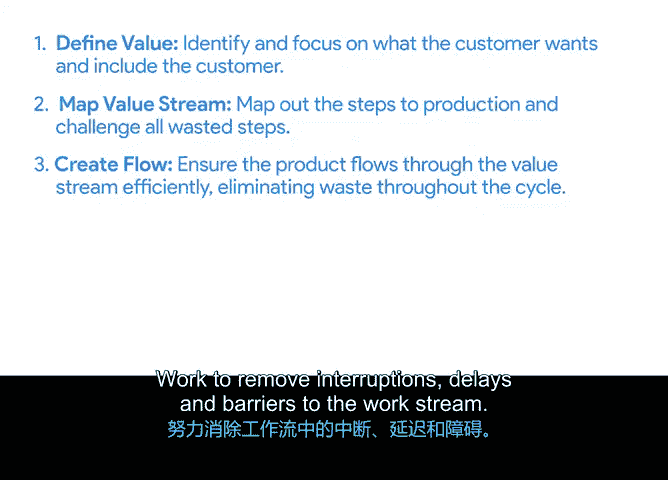

# 009：看板、极限编程和精益简介 🚀


在本节课中，我们将学习敏捷项目管理中除Scrum之外的几种流行方法论。我们将介绍看板、极限编程和精益方法的核心概念与实践，帮助你理解它们如何共享敏捷的价值观与原则，并应用于不同的项目环境。

---

上一节我们介绍了Scrum框架，本节中我们来看看其他几种同样重要的敏捷方法论。这些方法都源自敏捷宣言的价值观，但各自发展出了独特的具体实践和应用方式。

## 看板 📋

看板是一种既可以简单应用，也能驱动整个项目的方法论。其名称源自日语，意为“信号板”。你可能已经使用过看板板，因为它是大多数敏捷爱好者采用的最著名工具。

看板之所以流行，是因为它能向所有相关人员透明、可视化地展示进行中工作的状态。

以下是看板的核心要素：

*   **看板板**：通常以“待办”、“进行中”和“已完成”的列来展示项目进度。
*   **在制品限制**：团队设定一个可持续的进行中工作量上限，公式表示为 **WIP Limit**。这确保了团队只承担在规定时间内能实际处理的任务量。
*   **拉动式流程**：团队成员只有在完成当前任务且低于WIP限制时，才会从“待办”列中“拉动”新任务开始工作。这种方式意味着，一旦任务启动，整个团队会优先将其完成。
*   **核心目标**：通过限制并行工作数量来加快任务完成速度，这种追求效率最大化的目标称为 **流**。

## 极限编程 💻

极限编程是另一种敏捷方法论，它得名于它将传统的软件开发活动推向了“极致”。XP旨在提高产品质量和响应客户需求变化的能力，其方法是将开发过程中的最佳实践发挥到极致。

例如，一个最佳实践是“测试先行开发”，即在完整构建产品功能之前先测试其部分。XP将这种做法推向极致，力求测试更多、更小的产品功能以获得更多反馈。

XP方法论强调增强产品开发过程中的四项基本活动：

*   **设计**：在软件开发中，这指的是编写设计文档。XP强调从满足最基本、最重要需求的简单设计开始。代码示例如下，强调清晰简洁：
    ```python
    # 清晰、简洁的代码示例
    def calculate_total(items):
        """计算商品总价"""
        return sum(item.price for item in items)
    ```
*   **编码**：要求编写清晰、简洁的代码，以便他人轻松理解和维护。在非软件环境中，这类似于编写清晰、简明的流程或使用说明。
*   **测试**：在XP中，测试越多越好。目标是在构建功能前就测试并消除所有缺陷，同时确保功能满足客户要求。
*   **倾听**：倾听客户声音，确保需求被整合到产品中，这体现了敏捷重视客户协作和频繁沟通的价值观。

XP还包含一些被许多敏捷团队采用的创新实践，例如**结对编程**（两人共同完成一项任务）、**持续集成与重构**（每天多次合并代码变更以快速获取反馈）、**避免前期过度设计**以及**编写测试而非需求文档**。

## 精益方法 🏭

对于学过本课程前面内容的学员，你们已经在“精益六西格玛”的背景下接触过这种方法。精益方法论包含五项原则，是改善项目成果的“配方”。

这五项原则是：**定义价值、映射价值流、创造流动、建立拉动、追求尽善尽美**。

让我们逐一分解：

*   **定义价值**：识别并专注于客户想要的东西，并让客户参与过程。产品的价值是客户所有需求的总和。
*   **映射价值流**：绘制出为客户创造价值的全过程，包括所有步骤，并挑战任何可能被视为浪费或不必要的步骤。
*   **创造流动**：确保产品在价值流中高效流动，持续消除周期中的浪费，努力消除工作流中的中断、延迟和障碍。
*   **建立拉动**：想象让客户从货架上“拉动”产品。目标是让流程尽可能顺畅，以便客户可以随时“拉动”产品或提出功能请求。
*   **追求尽善尽美**：推动团队持续改进前四个步骤。



那么，这与敏捷有何关系？敏捷出现在精益之后，其发明者受到启发，将精益制造原则应用于软件开发。与敏捷一样，精益是一套原则和价值体系，许多差异实际上只是措辞上的不同。

---

本节课中我们一起学习了看板、极限编程和精益这三种重要的敏捷方法论。我们了解了看板如何通过可视化管理和在制品限制来优化工作流；探索了极限编程如何通过极致化的工程实践来提升质量和响应力；并回顾了精益的五项原则如何帮助消除浪费、创造价值。

现实情况是，许多团队会演变并混合这些方法，以创建最适合自己的工具和流程。在下一个视频中，我们将进一步讨论如何进行这种融合。