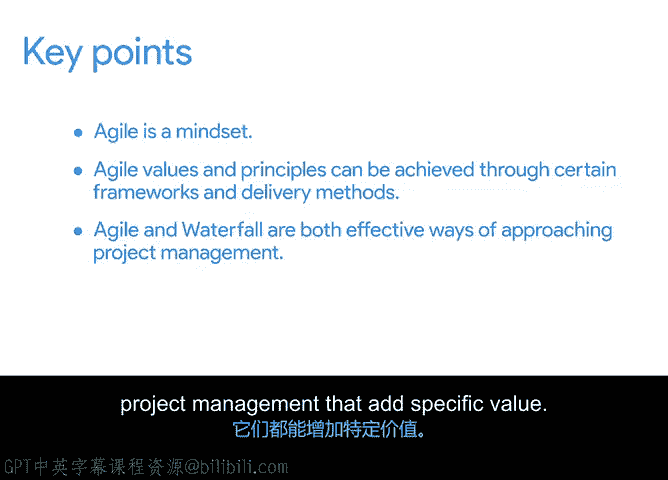

# 010：混合项目管理方法 🧩

在本节课中，我们将学习如何将敏捷和瀑布这两种不同的项目管理方法结合起来，以适应特定项目的需求。我们将回顾两种方法的核心特点，并探讨在何种情况下以及如何有效地混合使用它们。

在上一节视频中，我们回顾了几种应用敏捷价值观和原则的流行方法。我们探讨了专注于可视化和流程管理的**看板**、将产品开发最佳实践推向极致的**极限编程**，以及早于敏捷出现、旨在消除浪费并为客户创造价值的**精益**方法。我们还比较了敏捷与瀑布方法，以更好地理解每种方法所重视的目标、适用的项目类型以及各自的优势。

通过这些探讨，我们从两个角度理解了敏捷项目管理。首先，敏捷是一种思维方式，体现在《敏捷宣言》所概述的价值观和原则中。其次，敏捷通过不同的项目交付框架和方法来实现，例如看板、极限编程、精益，尤其是**Scrum**。这两种应用方式表明，敏捷的真正力量不仅在于采用特定的流程或策略，更在于采纳一种与传统瀑布模型截然不同的思维方式。这意味着，即使你需要使用瀑布式交付方法，通过敏捷的思维方式并应用《敏捷宣言》中的价值观和原则，你依然可以获得一些益处。

现在，让我们快速回顾一下传统瀑布项目管理的几个关键原则，然后探讨如何将你刚刚学到的方法和思路结合起来，以最好地满足特定项目的需求。

正如我们在之前的课程中学到的，一个瀑布项目的生命周期由以下几个阶段组成：启动、规划、执行任务、完成任务以及项目收尾。每个阶段内都包含诸如确定目标和范围、制定进度计划、预算和风险管理等任务。敏捷项目管理也包含大部分相同的阶段和任务，只是执行方式不同。因此，尽管这两种方法有明显差异，但根据你正在进行的项目类型或项目团队的情况，混合使用它们可能非常有意义。

以下是您可能希望混合使用敏捷和瀑布风格的一些原因：
*   您的利益相关者、客户或发起人更习惯传统方法，使用传统的工作流程或交付传统的工作成果对他们来说更容易理解和遵循。
*   但您的项目团队已经建立了Scrum工作方式，并且希望继续使用。
*   可能存在监管要求，强制要求某些传统工作流程，例如用于认证的大型需求文档。
*   或者，参与大型项目的某个供应商已经在遵循传统方法，团队之间的整合需要混合使用一些方法。

在这些情况下，项目经理可能会选择混合瀑布和敏捷的某些方面，以便项目的不同部分能够以满足项目要求的方式开展工作，同时不会对项目的其他部分或整个项目产生负面影响。

让我们探讨更多关于如何混合方法的例子。

假设您的项目是开发一个软件产品。在上一个冲刺的回顾会议上，一位团队成员说：“我需要实现某个功能，但我对构建该特定功能的经验不多。”团队中的另一位成员是该功能的专家。于是您决定将他们配对，以便在下一个冲刺中共同构建该功能。您刚刚混合了**极限编程**和**Scrum**。极限编程为结对工作（源于结对编程）提供了基础，而回顾会议是Scrum的一个关键组成部分。

以下是另一个极其常见的例子：我认识的大多数Scrum团队都使用**看板**来跟踪他们在冲刺中的进度。

不过需要提醒一句：要注意工作方式上不要有太多变化。当团队能够建立一定的一致性时，他们的工作效率最高。

让我们回到Office Green公司的案例。作为Virtual Verde项目的项目经理，您可能希望使用哪些类型的方法来启动项目？您会在哪些地方混合使用一些传统方法和敏捷方法？以下是一些需要考虑的因素：
*   现有的植物供应商习惯于与原来的Office Green办公室配送团队打交道。其中一些供应商可能愿意尝试敏捷方法，但并非全部。在这种情况下，您需要尽早将这些供应商纳入讨论，以获得他们的支持并解决任何疑虑。
*   Office Green公司也需要严格控制成本，因此您需要使用传统的预算管理控制措施，以确保项目不会超支。

本节课即将结束，让我们回顾一下我希望您记住的要点：
1.  **敏捷是一种思维方式**，一种通过《敏捷宣言》中概述的价值观和原则来思考项目交付过程的方式。
2.  **敏捷的价值观和原则**可以通过特定的框架和交付方法来实现，如Scrum、看板、极限编程和精益。
3.  最后，**敏捷和瀑布**都是有效的项目管理方法，各自能带来特定的价值。有时，混合使用这些风格会比只坚持一种方法带来更大的价值，所以不要害怕进行混合。只要项目的不同部分能够从某些流程中受益，且不会对整个项目产生负面影响，就大胆尝试吧。

接下来，我将向您详细介绍Scrum团队，以及如何将Scrum作为框架来成功运行项目。带您踏上这段旅程将会非常有趣。