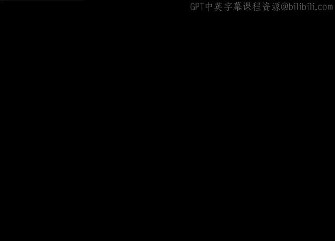

# 011：敏捷项目管理课程总结

## 概述

在本节课中，我们完成了一次关于敏捷项目管理的快速入门导览。我们将回顾所学的核心概念，并总结如何将这些知识应用于实际项目管理中。

## 课程内容回顾

我们首先追溯了敏捷方法的历史渊源，并深入探讨了其核心指导文件——**敏捷宣言**。该宣言定义了敏捷的**四个核心价值观**和**十二项原则**，这些是理解敏捷思维的基础。

上一节我们介绍了敏捷的核心理念，本节中我们来看看如何应用它。我们探讨了在何种情况下以及为何需要采用敏捷思维模式。你学习了**VCA（价值-复杂性-不确定性）** 分析框架，其核心公式可概括为：

**项目方法选择 = f(价值， 复杂性， 不确定性)**

这个框架帮助你评估项目特性，从而决定采用敏捷、瀑布式还是混合式方法。

以下是几种常见的敏捷友好型方法论：

*   **看板 (Kanban)**：一种通过可视化工作流来限制在制品、优化流程的方法。
*   **极限编程 (XP)**：强调工程实践，如**结对编程**和**测试驱动开发(TDD)**，以提升代码质量。
*   **精益 (Lean)**：专注于消除浪费、最大化客户价值，其核心原则之一是**持续改进**。

最后，我们学习了如何将这些敏捷方法与传统的瀑布式实践相结合，形成适合项目需求的混合方法论。

## 实践应用：Office Green 案例

随后，我们将所学知识应用于案例研究。你以项目经理的身份回归Office Green公司，负责一个新的敏捷项目“Virt Verde”，在实践中巩固了概念。

## 总结

本节课中，我们一起学习了敏捷项目管理的基础知识，包括其历史、价值观、原则、适用性评估框架（VCA）以及几种主流方法论（看板、XP、精益）。你还初步了解了如何融合敏捷与瀑布式方法，并通过案例进行了实践。恭喜你完成了敏捷之旅的第一部分，更多精彩内容将在后续课程中展开。