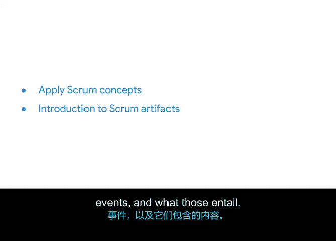

# 012：Scrum基础简介 🏃

在本节课中，我们将深入学习Scrum，这是最常用的敏捷框架。我们将探讨其理论基础、价值观、团队角色，并会结合一个具体的项目案例来帮助理解。

上一节我们介绍了敏捷思维模式，它基于敏捷宣言的四大价值观和十二项原则。本节中，我们将深入探讨Scrum这一最常用的敏捷框架。

Scrum指南是Scrum团队的主要参考依据，其中包含了关于Scrum的一切知识，可以在scrumguides.org免费获取。课程资源中也提供了链接。在讲解过程中，我会经常引用Scrum指南中的内容，建议你收藏该网站以便后续查阅。

我的大部分敏捷项目管理经验都来自Scrum。幸运的是，Scrum在谷歌也被广泛使用。Scrum如此普遍，以至于人们有时会交替使用“Scrum”和“敏捷”这两个术语。需要明确的是，**敏捷是基础的哲学和思维模式，而Scrum是将这一哲学具体化或付诸实践的框架**。事实上，Scrum的出现早于敏捷宣言，并为整个敏捷哲学提供了灵感。

在本课程的剩余部分，我们将专注于Scrum这个最流行的项目管理框架。我们在上一个模块中也提到了其他框架，你可以根据需要随时回顾。

接下来，让我们开始讨论Scrum。

我们将从探索Scrum的理论基础开始，它包含三大支柱。我们还将探讨Scrum的五大价值观。我会解释为什么团队拥有一致的使命很重要。此外，我将介绍Scrum团队中的角色：产品负责人、Scrum主管和开发团队。

最后，我将使用我们的新项目“Office Green”来向你介绍所有这些概念。你可能还记得，Office Green是一家为办公楼提供植物和绿化服务的公司。目前，Office Green有一个名为“Virtual Verde”的新项目正在进行中，我们稍后会详细讨论。

你还将了解到，在Scrum项目中，项目经理通常担任Scrum主管的角色。因此，在这个场景中，你将作为Scrum主管与Scrum团队合作，并学习Scrum工件、事件及其含义。

以下是本小节的核心内容概览：

*   **理论基础**：Scrum建立在三大支柱之上。
*   **团队价值观**：成功的Scrum团队遵循五大价值观。
*   **团队角色**：一个Scrum团队通常由产品负责人、Scrum主管和开发团队组成。
*   **项目案例**：我们将通过“Office Green”公司的“Virtual Verde”项目来应用这些概念。

接下来，我们将从Scrum理论的三大支柱开始。下个视频见。