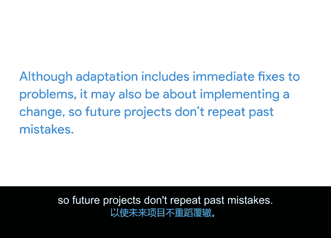

# 013：Scrum的三大支柱 🏛️

在本节课中，我们将学习Scrum框架的三大支柱。这些支柱是Scrum团队工作的基础，它们共同确保了项目在复杂和不确定的环境中能够有效推进并持续改进。

正如敏捷拥有其核心价值一样，Scrum也拥有自己的一套支柱，作为Scrum团队工作的基础。在本视频中，我将逐一介绍Scrum的三大支柱。

首先，让我们了解一下Scrum背后的理论，以便学习其各种方法并理解它们为何有效。

## 什么是Scrum？

Scrum指南将Scrum定义为一个用于开发、交付和维持复杂产品的框架。这意味着团队可以使用Scrum为其用户创造有价值的产品，即使他们所处的环境或行业难以预测且存在许多风险。

Scrum采用迭代和增量的方法。
*   **迭代** 指的是项目流程会重复进行。我们在上一个模块中讨论过这一点，但作为提醒，迭代意味着项目在时间盒或迭代周期内工作。
*   **增量** 指的是工作被分解成相互构建的较小部分。产品是通过每次迭代期间完成的工作逐步构建起来的。产品的每一个这样的实例都称为一个增量。

迭代和增量使我们能够在项目的整个生命周期中持续检查进度。这有助于我们提高可预测性并管理项目中的不确定性。

## 经验主义：Scrum的理论基础

Scrum建立在一种称为**经验主义**的科学理论之上。这是一个听起来复杂但概念简单的词：**真正的知识来源于实际的生活经验**。Scrum的创始人强调，在一个不确定的世界里，我们不应试图假设事情会完全按计划进行，或试图预测未来。相反，如果你使用Scrum，你就是在确保项目中的每一个决策都基于真实的经验和硬数据。因此，每一次迭代和增量都可以被理解为一个微型实验，我们可以从中学习到真正有价值的东西来帮助改进项目。

经验主义建立在三个基础支柱之上，这些支柱也是Scrum的三大支柱：**透明、检视和调整**。

## Scrum的三大支柱

上一节我们介绍了Scrum的理论基础，本节中我们来看看支撑Scrum实践的三大具体支柱。

### 支柱一：透明

透明意味着我们将工作中最重要的方面对负责结果的人员可见。每个人都必须保持透明，这包括从Scrum团队成员到高级发起人，甚至我们的用户在内的所有人。在小团队中更容易做到透明，幸运的是，Scrum团队被刻意设计得很小，通常在3到9人之间。这样，你可以避免信号混淆、沟通中断和不必要的复杂性。

以下是透明性的关键点：
*   **团队内部透明**：对Scrum团队内部的透明性对团队的生产力和项目的完成至关重要。
*   **团队外部透明**：对所有利益相关者（包括客户、发起人和管理层）保持透明，能在所有参与者之间建立信任。透明还能鼓励更多的协作和减少错误。

### 支柱二：检视

检视指的是及时检查冲刺目标的成果，以发现不理想的偏差。这意味着我们总是在检查我们的进度和交付成果，以便发现任何不良的变化。当团队以敏捷方式工作时，利益相关者对其工作的审查是成长和进步的必要机会。进行的检视越多，团队在工作中获得的改进就越多。

以下是检视的价值：
*   当你有机会改变和改进时，有意的检视能带来真正的价值。
*   检视也推动着我们的下一个支柱：调整。

### 支柱三：调整

调整意味着我们持续寻找方法来调整我们的项目、产品或流程，以尽量减少进一步的偏差或问题。在Scrum乃至整个敏捷中，我们拥抱变化，以便我们始终在改进。因此，当我们进行调整时，我们改变那些不起作用或可以变得更好的方面。

以下是调整的内涵：
*   透明和检视为Scrum团队提供了识别改进或变化所需的信息和机会。
*   虽然调整包括对问题的即时修复，但它也可能涉及实施一项变更，以便未来的项目不会重蹈覆辙。

## 总结

本节课中，我们一起学习了作为Scrum基础的三大支柱：**透明、检视和调整**。理解并实践这些支柱，能帮助团队在不确定的环境中有效协作，持续交付价值并不断改进。

在下一个视频中，我们将探讨所有Scrum团队都遵循的五大价值观。我们下节课见。