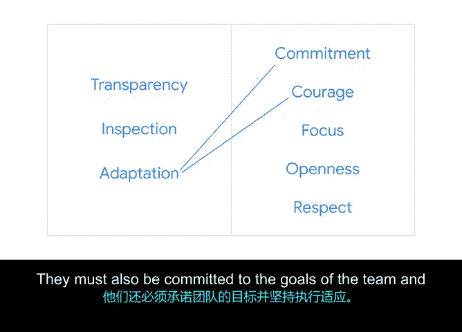

# 014：Scrum的五大价值观 🎯

在本节课中，我们将要学习Scrum框架的五大核心价值观。上一节我们介绍了Scrum的三大支柱，本节中我们来看看支撑这些支柱的具体行为准则——五大价值观。理解这些价值观对于构建一个高效、协作的Scrum团队至关重要。

Scrum团队依据五大核心价值开展工作与互动，它们分别是：承诺、勇气、专注、开放和尊重。这些价值观共同为团队的日常行为和决策提供了指导。

以下是Scrum五大价值观的详细说明：

*   **承诺**
    这意味着每个成员都个人承诺去实现Scrum团队的目标。例如，当一名团队成员在学习一项困难的新技术时，另一位熟悉该技术的成员可以暂时放下自己的工作，帮助队友克服障碍。

*   **勇气**
    Scrum团队成员必须有勇气去做正确的事，并处理棘手的问题。这可能意味着主动承担一项需要学习新技能的艰巨任务，或者坦诚地告诉团队自己遇到了困难需要帮助。在应对挑战时展现勇气，能够增强团队的韧性。

*   **专注**
    这指的是每个人都专注于Sprint内的必要工作以及Scrum团队的总体目标。例如，允许一名成员专注于解决方案中困难但关键的部分，而其他队友则协助其完成，因为从长远看，这种专注能加速团队的整体进展。Scrum Master（通常由项目经理担任）的职责之一，就是通过促进日常活动和事件，帮助团队专注于Sprint和产品目标。

*   **开放**
    为了使Scrum有效运作，团队及其利益相关者需对工作的各个方面及伴随的挑战保持开放态度。开放对于收集数据、进行有效检视至关重要。例如，如果一名成员遇到了不知如何解决的问题，他应该分享出来，其他成员可能拥有快速简单的解决方案或有价值的见解。

*   **尊重**
    团队成员应尊重彼此的意见、技能和独立性。当你尊重他人的独立性和贡献，并且自己也感受到被尊重时，你才更有可能倾听并接纳反馈。这对于实现产品或业务的最大成功至关重要。

为了将Scrum的三大支柱（透明、检视、适应）落到实处，团队必须遵循这五大价值观行事。例如：

*   如果团队旨在实现与利益相关者之间的**透明**，他们需要**开放**地分享信息，同时保持**专注**，分享最相关的信息。
*   为了有效地**检视**工作和流程，团队必须有**勇气**提出困难的反馈，并怀着相互**尊重**的心态认真倾听他人的意见。
*   为了根据检视结果进行**适应**，团队必须有**勇气**做出改变并从中学习，同时必须**承诺**于团队目标，并将调整贯彻到底。

---

本节课中我们一起学习了Scrum的五大核心价值观：承诺、勇气、专注、开放和尊重。我们探讨了每个价值观的具体含义，并理解了它们如何与Scrum的三大支柱相互作用，共同支撑起一个高效、自组织的敏捷团队。掌握这些价值观是实践Scrum方法论的重要基础。