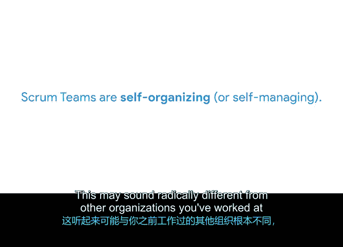
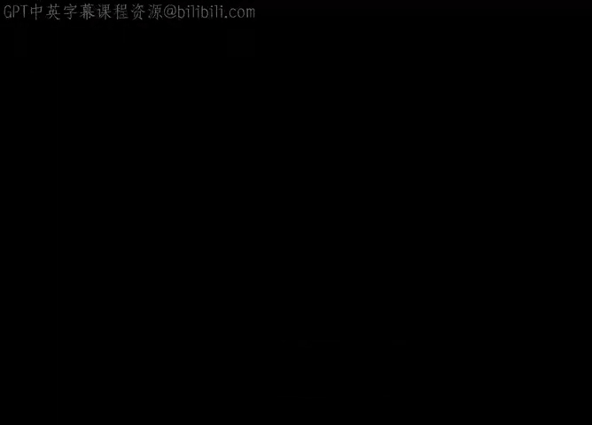

# 015：核心Scrum角色 🏉

在本节课中，我们将要学习构成Scrum团队的三个核心角色、他们各自的职责，以及Scrum团队的使命与愿景。理解这些角色是成功实践Scrum的基础。

上一节我们介绍了Scrum的理论基础，本节中我们来看看Scrum团队的具体构成。

## 团队的使命与愿景

Scrum是一种敏捷方法论，因此它体现了敏捷的价值观和原则。其中一项敏捷原则指出：**围绕被激励的个体构建项目，给予他们所需的环境和支持，并信任他们能完成工作**。激励团队成员的最佳方式，是赋予他们真正关心的使命和产品愿景。

在敏捷中，**使命**是一个简短的陈述，它在整个过程中为团队提供恒定不变的努力方向。除了使命，敏捷团队还会设定**产品愿景**，以明确团队负责的成果和工作的边界。

我们可以这样理解：使命告诉我们**为什么**要做这项工作，而产品愿景帮助我们想象工作**完成时**会是什么样子。

以Office Green公司的新项目“Virtual Verde”为例。该项目旨在为人们的家庭办公室配送植物。其使命是：“Virtual Verde通过为家庭工作空间注入生机，改善用户的健康和幸福感。”由Scrum团队创建的产品愿景可能是：“Virtual Verde是一个充满生机的市场，旨在改变家庭办公室。”

这两个陈述旨在激励团队，为用户提供愉悦的体验。

## Scrum团队角色

每个Scrum团队都由三个明确的角色组成：**Scrum Master**、**产品负责人**和**开发团队**。这些角色协同工作，以实现团队目标，并完成使命与愿景。

以下是每个角色的核心职责：

*   **产品负责人**：负责决定团队**构建什么**（What）。他们必须确保每个人都理解“为什么”要构建。其职责是**构建正确的东西**。
*   **开发团队**：负责决定团队**如何交付**产品（How）。其职责是**正确地构建东西**。
*   **Scrum Master**：负责确保团队**何时**向用户交付价值（When）。这个角色大致相当于传统项目中的项目经理。其职责是**快速构建东西**。

## Scrum团队的关键特质

尽管Scrum团队有明确的角色划分，但整个团队需要共同协作以实现目标。这意味着，虽然每个角色有特定期望，但开发团队仍可以为项目的“做什么”和“何时做”贡献想法，产品负责人也可以参与“如何做”的讨论。

作为一个整体，Scrum团队必须具备一些特定的技能。根据Scrum指南，这些技能包括：

*   **跨职能性**：Scrum团队是跨职能的。当团队交付成果时，这是整个团队的成就，无论他们来自哪个职能部门。一个团队中可能包含软件开发者、营销专家、质量保证和物流专家。就像足球队，每个球员各司其职，共同协作才能将球踢进球门。这些多元化的视角为项目和用户带来了巨大价值。
*   **自组织性**：Scrum团队是自组织的。这可能与你之前工作过的、由经理分配任务并要求频繁汇报的组织形式截然不同。因为Scrum团队依赖于**承诺、勇气、专注、开放和尊重**这五大价值观，团队能够在更有机、更灵活的环境中协作，交付出色的成果。

尽管团队是自组织的，但高绩效的Scrum团队之外，通常有一位经理提供战略领导和个人职业发展指导，同时不干扰团队的自组织性。根据经验，如果经理开始指挥团队做什么，干扰了这种自组织性，Scrum的益处就会开始瓦解。

本节课中，我们一起学习了Scrum团队的使命、愿景以及三个核心角色的定义与职责。我们还探讨了高效Scrum团队所具备的跨职能和自组织两大关键特质。在接下来的视频中，我们将深入探讨每个角色的具体特质，首先从高效的Scrum Master开始。