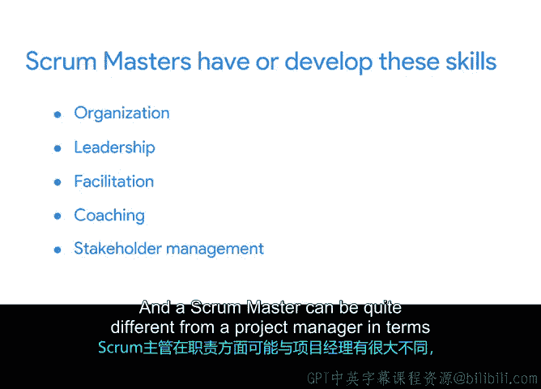

# 016：高效Scrum Master的特征 🧭

在本节课中，我们将要学习Scrum Master这一角色的具体职责、所需特质，以及它与传统项目经理的异同。理解这些内容将帮助你明确在敏捷项目中如何有效地扮演这一角色。

## 什么是Scrum Master？

上一节我们介绍了Scrum框架的基本构成，本节中我们来看看其中的关键角色——Scrum Master。

Scrum Master负责推广和支持Scrum流程，帮助团队中的每个人理解和实施Scrum，包括其实践、规则和价值观。描述Scrum Master角色的最佳方式是：他们负责帮助团队发挥最佳水平。

他们可以通过以下方式实现这一目标：指导团队成员应对外部压力，同时最大化团队的内部潜力。

例如，假设Virtual Verde公司不断收到关于其新网站页面购物车功能的错误报告。Scrum Master的作用是注意到这个模式，并帮助团队找到更好的解决方案，而不是一次只修复一个错误。也许需要一个特殊的测试计划，或者在发布更改之前对该功能进行额外的解决方案审查。

## Scrum Master的核心职责

以下是Scrum Master的主要职责：

*   **指导团队**：指导团队成员掌握敏捷和Scrum的实践、规则和价值观。
*   **管理产品待办事项列表**：帮助团队找到有效管理产品待办事项列表的方法。产品待办事项列表是团队工作内容的唯一权威来源，它包含所有产品功能、产品需求以及与实现项目目标相关的交付物活动。
*   **主持Scrum事件**：主持Scrum事件，例如在每个冲刺结束时进行的冲刺回顾会议。
*   **清除障碍**：帮助团队清除影响进度的障碍，例如信息缺失或无法获得培训或工具。
*   **保护团队**：防止来自团队外部的无益互动或干扰。

## 高效Scrum Master的特质

此时，你可能想知道如何才能胜任所有这些工作。实际上，你可能已经具备Scrum Master执行这些任务所需的许多特质。

Scrum Master需要有组织能力、支持性，他们同时也是引导者、教练和优秀的沟通者。让我们看看这些特质如何在Scrum Master的角色中发挥作用。

以下是高效Scrum Master所需的关键特质：

*   **组织能力**：Scrum Master必须具备良好的组织能力，这有助于他们有效地组织项目工件和管理Scrum事件。
*   **支持性领导力**：Scrum Master必须是支持性的领导者，将他人的需求和团队的需求置于个人需求之前。他们的目标不是成为发号施令的团队经理，而是始终在问：“我如何能提供帮助？”或“什么能帮助团队在这个项目上向前推进？”
*   **引导能力**：Scrum Master促进生产力和协作。这是一项关键技能，确保每个团队成员的声音都被听到，并且他们的意见得到处理。
*   **教练能力**：Scrum Master必须指导团队成员理解Scrum理论和应用。教练是一项鼓励对话和讨论的技能，而不是直接给出答案。
*   **沟通能力**：Scrum Master必须是优秀的沟通者，尤其是在与利益相关者打交道时。Scrum Master擅长与可能持有不同观点和风格的多样化利益相关者进行互动。一个能与多种不同类型的人建立联系的Scrum Master，是项目中强大且必不可少的队友。

## Scrum Master与项目经理的异同

你可能想知道Scrum Master的角色是否与传统项目经理不同。答案是肯定的，这两个角色可能相当不同，尽管它们可能由同一个人担任，并且需要相似的技能组合。

作为其主要职责，Scrum Master充当Scrum团队的引导者和教练，他们需要确保自己每天有足够的时间首先完成这项工作。

如果公司需要管理许多额外的项目管理活动，那么团队可能会聘请项目经理来负责那些更偏向传统项目管理的工作。这些工作可能包括预算管理、风险电子表格或甘特图。

但正如我所说，传统项目经理承担Scrum Master的角色是很常见的。他们严重依赖决策、沟通、灵活性、组织能力等技能，而Scrum Master的职位对我们许多项目经理来说是一个自然的契合。

## 总结

本节课中我们一起学习了Scrum Master的支柱作用和角色。总结来说，Scrum Master必须具备组织、领导、引导、教练和管理利益相关者等技能。Scrum Master在职责方面可能与项目经理有很大不同，但由于需要相似的技能组合，这两个角色可能由同一个人担任。

在下一个视频中，我们将学习产品负责人的职责，我们那里见。