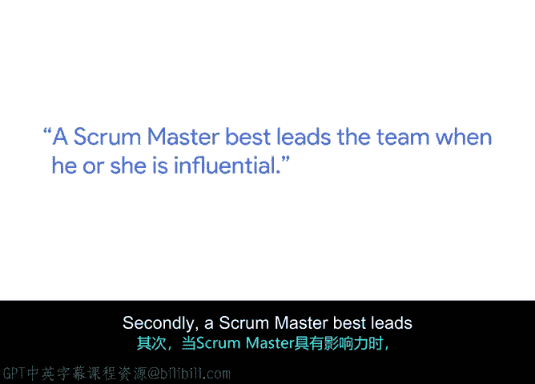

**谷歌项目管理专业证书：第5课：高效Scrum Master的关键要素** 🎯

在本节课程中，我们将跟随谷歌技术项目经理Pete，了解Scrum框架在谷歌的应用，并探讨成为一名高效Scrum Master所需具备的关键品质。

---

Pete是谷歌的一名技术项目经理。技术项目经理的职责是确保其负责的项目从始至终得到有效执行。在日常工作中，团队将敏捷框架作为交付工作的核心部分。敏捷框架使我们能够对流程进行迭代，并比传统模式更快地向用户交付产品。

Scrum框架是敏捷方法论的一种具体实现。Scrum的核心在于通过短周期内的迭代工作，快速为客户和用户交付价值。本质上，Scrum是一个自组织团队，这意味着我们需要将不同个体聚集在一起。

因此，当我们将这些个体聚集在一起时，明确每个人在团队中的角色和职责至关重要。这就需要一位领导者或Scrum Master来帮助确保团队始终朝着同一个目标努力。

那么，是什么造就了一名高效的Scrum Master呢？以下是几个关键品质。

首先，**优秀的教导者和沟通者**。这一点很重要，因为你需要向整个团队灌输Scrum的价值观。

其次，**具备影响力**。在大多数情况下，Scrum Master对团队其他成员并不具备管理职权。因此，领导团队必须依靠影响力。实现影响力的两个关键方法是：第一，确保团队高效运作；第二，确保团队内部存在积极的激励文化。

作为领导者，你还需要**为团队指明方向**，并确保我们持续朝着在冲刺阶段设定的目标努力。这里的“冲刺”是指团队为实现特定、明确的目标而集中精力进行的一段高强度工作期，就像一股推动团队前进的爆发性能量。

Pete表示，他非常喜欢与人合作、共同努力实现共同目标的过程。这并不总是容易的，但总能带给他巨大的满足感。😊

---

**本节总结**

本节课我们一起学习了Scrum框架在谷歌项目管理中的应用。我们了解到，Scrum Master是自组织团队中的关键角色，其核心职责是引导团队、确保目标一致。一名高效的Scrum Master需要具备三大品质：**优秀的教导与沟通能力**、**通过非职权影响力领导团队**，以及**为团队提供清晰的方向指引**。这些能力共同作用，能帮助团队在冲刺周期内高效协作，持续交付价值。