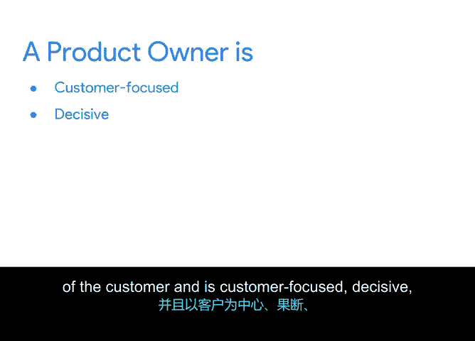

# 018：高效产品负责人的特征 🎯

在本节课中，我们将深入了解Scrum框架中产品负责人的角色、职责以及成为一名高效产品负责人所需具备的关键特质。产品负责人是确保团队构建正确产品的关键角色。

---

在上一节中，我们回顾了Scrum Master的角色。本节中，我们来看看产品负责人的职责。

产品负责人的核心任务是确保团队正在构建正确的产品或服务。如果团队创造的产品用户不想要，那么一个高效的Scrum团队对任何人都没有用处。产品负责人确保团队在做正确的事情。

具体来说，产品负责人负责持续最大化Scrum团队交付的产品价值。他们的关键活动是**在团队内部充当客户的声音**。他们通过拥有和管理产品待办事项列表来表达这一声音。

作为快速回顾，**产品待办事项列表**是Scrum团队为实现项目目标而需要处理的工作项的单一权威来源。其公式化表示为：
**产品待办事项列表 = { 所有待实现功能、需求、修复和增强的优先排序列表 }**

产品负责人的职责还包括帮助Scrum团队理解他们的工作在整个目标和使命中的重要性。他们需要优化产品待办事项列表的优先级，以高效达成目标并为客户交付价值。产品负责人需确保产品待办事项列表对所有相关方都是可见和透明的。最后，他们负责确保产品或服务满足客户需求。

这听起来职责繁多。那么，产品负责人如何完成所有这些任务呢？他们依赖于一系列关键的性格特质。

以下是高效产品负责人所需具备的核心特质：

*   **以客户为中心**：必须深刻理解客户需求及其所在行业。
*   **果断**：能够做出决策，并作为优秀的沟通者理解问题的两面，从而向团队捍卫自己的决定。
*   **灵活**：对可能为团队带来有利变化的新信息持开放态度。
*   **乐观积极**：向团队传达产品愿景，并激励团队相信他们的使命。
*   **随时待命**：Scrum的迭代性质意味着团队需要产品负责人定期帮助检查、调整和规划下一次迭代。
*   **善于协作**：必须与团队合作，确保满足客户需求，这需要与多个利益相关者会面并协同工作。

正如你可能注意到的，产品负责人和Scrum Master一样，对项目承担着大量责任。让我们通过一个虚拟案例来想象产品负责人是如何工作的。

例如，假设Virtual Verde公司的产品负责人告诉开发团队，他们需要按以下顺序处理以下功能：花艺布置、盆栽多肉植物、大型盆栽植物和香草花园。

当开发团队审查这个列表时，他们告诉产品负责人，香草花园最初听起来很难交付，因为它们被视为受监管的食品。但事实上，开发团队中的供应商专家知道，香草花园实际上比想象中容易得多，因为我们的供应商已经有很多香草花园库存。

因此，开发团队建议首先关注香草花园。一个灵活且以客户为中心的产品负责人会根据这一新信息调整优先级。

---

本节课中，我们一起学习了产品负责人的核心角色。我们了解到，产品负责人充当客户的声音，其职责是最大化产品价值并管理产品待办事项列表。成为一名高效的产品负责人需要具备以客户为中心、果断、灵活、乐观、随时待命和善于协作等关键特质。通过理解这些特征，你可以更好地把握这个角色在敏捷项目成功中的重要性。

接下来，我们将讨论开发团队的角色和特质。