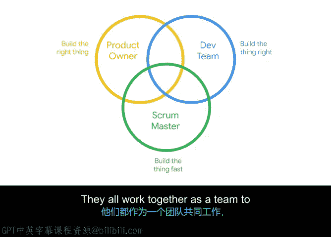

**谷歌项目管理专业证书：第5课：高效开发团队的特征** 🧑‍💻

在本节课程中，我们将深入探讨Scrum团队中的开发团队。我们将了解其规模、构成、工作方式以及在现代工作环境中的协作模式。

上一节我们介绍了产品负责人在Scrum团队中的角色。本节中，我们来看看负责实际产品构建工作的核心群体——开发团队。

开发团队由负责构建产品的人员组成。团队规模通常在**3到9人**之间。这个范围确保了团队足够小以保持敏捷，同时又足够大，能在每个冲刺周期内完成有意义的工作量。团队规模恰到好处非常重要：规模过小的团队可能在技能和想法多样性上有所欠缺；而规模过大的团队则可能因意见过多和沟通渠道复杂而遇到问题。

开发团队应该是跨职能的，这意味着他们具备在内部构建产品或服务所需的所有技能。此外，开发团队拥有其流程和结构的自主权，他们必须是自我组织的，不能依赖他人来告诉他们如何组织工作。团队持续以整体而非个体的形式运作，并相互支持以实现团队目标。最后，开发团队认同，最好的产品源于那些以客户为导向、在构建产品时聚焦用户的团队。

许多Scrum团队倾向于采用**同地办公**的模式，即成员在同一物理空间内并肩工作。许多人认为，同地办公有助于团队交付更高质量的工作并更快地改进。但这并非对所有团队都可行。

让我们看一个例子。假设虚拟Verde团队发现其一家植物供应商存在问题，由于一些产品质量问题，该供应商无法满足假日高峰期的需求。团队中的质量保证专家可以飞往全国各地去帮助供应商，但这意味着他们将无法完成自己分配的任务。如果团队是同地办公的，他们可以迅速在会议室里聚在一起，集思广益，要么完成工作，要么重新安排工作，从而不影响冲刺目标。如果他们不坐在一起或在不同的时区工作，这种协作就会困难一些，必须通过电话或电子邮件进行，或者需要协调会议时间，最终可能不得不采取一些变通方案，导致整体项目延误。

另一方面，我们生活在一个远程工作成为可能的世界。如果质量保证专家需要参加电话会议，他们可以通过Zoom或Skype等视频会议平台拨入或加入。同地办公和远程工作各有其优缺点，因此请确保使用最适合您团队的方法。

至此，我们已经介绍了Scrum团队中的每个角色。产品负责人负责满足客户需求，即**“构建正确的东西”**。开发团队负责创建产品，即**“正确地构建东西”**。Scrum主管负责提高效率，即**“快速构建东西”**。我们知道，每个角色对于实现Scrum项目的目标都至关重要，没有任何一个角色比其他角色更重要或更不重要，他们作为一个团队共同工作，为用户和客户创造价值。

在本节课中，我们一起学习了高效Scrum开发团队的关键特征，包括其理想的规模、跨职能与自我组织的性质，以及在不同工作环境（同地办公与远程）下的协作考量。理解这些特征有助于组建和维护一个能够高效交付价值的团队。