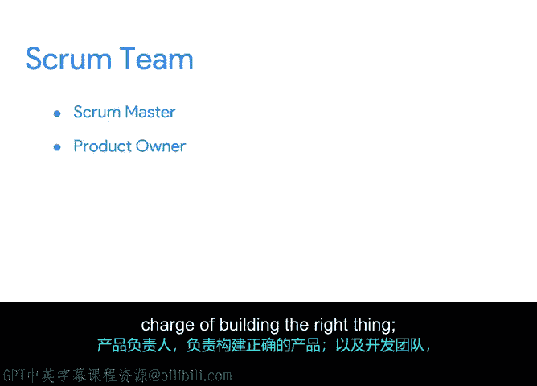

谷歌项目管理专业证书：第5课：敏捷项目管理课程总结

在本节课中，我们完成了敏捷项目管理框架中Scrum理论部分的学习。本节将对所学内容进行回顾与总结。

恭喜你完成了一个新章节的学习。你正在成为一名Scrum专家的道路上。

在之前的视频中，我们深入探讨了敏捷框架中的一个重要理论：Scrum。

作为回顾，Scrum是采用敏捷方法的最常见框架，但还存在其他框架，例如看板或精益。我们在之前的视频中讨论过这些方法。

我向你介绍了Scrum团队每个成员的“真理之源”——**《Scrum指南》**。你可以随时将其作为参考资源。

我们讨论了Scrum理论的三大支柱：**透明、检视和适应**。同时，我们也探讨了Scrum的五大价值观：**承诺、勇气、专注、开放和尊重**。

我们详细介绍了Scrum团队中的核心角色。你可能还记得，这些角色包括：
*   **Scrum主管**：确保团队快速构建产品。
*   **产品负责人**：负责确保构建正确的产品。
*   **开发团队**：其职责是确保团队正确地构建产品。

你能在课程中取得如此进展，是一项相当了不起的成就。希望你为自己感到自豪。

下一节中，我们将讨论如何实施Scrum。期待与你再次相见。

本节课中，我们一起学习了Scrum的基本理论、核心支柱、价值观以及团队的关键角色，为后续实践应用奠定了坚实的基础。