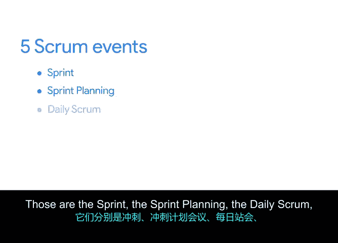

# 021：实施Scrum 🚀

在本节课中，我们将深入学习Scrum框架的具体实施方法。我们将从产品待办事项列表开始，探讨如何估算工作量，并详细介绍Scrum的五个关键事件。最后，我们会介绍一些实用的工具来帮助团队管理工作流程。

在上一节中，我们介绍了Scrum框架，学习了Scrum价值观，并解释了Scrum团队中必不可少的角色。本节中，我们将完成对Scrum的概述，并深入探讨Scrum团队的组建和日常执行工作。我们将超越官方Scrum指南的内容，分享与Scrum团队合作时最流行的工具、方法、技巧和窍门。

我将讨论如何管理你的产品待办事项列表，它包含了与实现项目目标相关的所有功能、需求和活动。一旦我们有了待办事项列表，Scrum中最棘手的部分之一就是估算。在讨论一种称为“相对工作量估算”的技术时，我们将了解T恤尺码和故事点与Scrum的关系。

接下来，你将了解Scrum的五个重要事件。它们分别是：冲刺、冲刺计划会、每日站会、冲刺评审会和冲刺回顾会。

我们将学习“速率”的含义，以及你的团队如何使用燃尽图等工具来管理进度。我将向你展示其他一些有用的工具，如Google Docs、JIRA、Asana、Trello、看板等，这些工具有助于你的工作流程保持有序和透明。

那么，让我们开始吧。我们将首先讨论对Scrum团队至关重要的工件——产品待办事项列表。下个视频见。