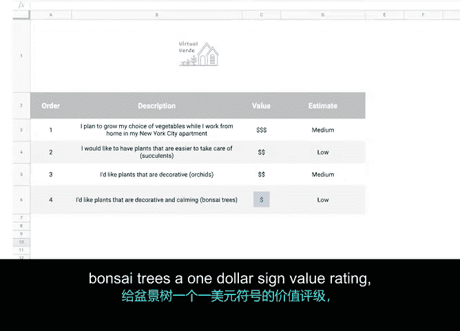

# 022：构建产品待办列表 📋

在本节课中，我们将学习敏捷项目管理框架Scrum中的一个核心工件——产品待办列表。我们将了解它的定义、关键特性以及如何构建一个有效的产品待办列表。

## 产品待办列表概述

在之前的课程中，我们介绍了多种项目管理工件，例如项目计划、工作说明书、RACI矩阵等。本节中，我们将重点回顾Scrum框架中的一个重要工件：产品待办列表。

在之前的视频中，我们将产品待办列表定义为团队工作的**单一权威来源**。它包含了与实现项目目标相关的所有功能、需求和活动。在传统的非敏捷项目管理中，与之对应的是一系列项目需求。

## 产品待办列表的关键特性

产品待办列表具有三个关键特性。

首先，产品待办列表是一个**活的工件**。这意味着项目项可以随时被添加到列表中。产品待办列表在项目的整个生命周期中不断演进，并作为团队接下来该做什么的核心指南。

其次，产品待办列表由**产品负责人**拥有和调整。

最后，产品待办列表始终是一个**按优先级排序的功能列表**。当出现新信息或新功能时，它们会按照重要程度被添加到列表中。列表顶部的项目非常具体且定义明确，而较为模糊的项目则位于列表底部。

请记住，产品待办列表是产品的指南和路线图。它是Scrum中的核心工件，所有可能的想法、可交付成果、功能或任务都被记录在此，供团队处理。

## 如何构建产品待办列表

由于待办列表如此核心，在处理产品待办列表时，有一些最佳实践和数据需要记录。主要包括：描述、价值、顺序和估算。

接下来，我们将按照这些最佳实践来构建一个示例待办列表。

### 项目描述

项目描述正如其名，它描述了一个项目项。在编写项目描述时，建议在添加产品待办项时保持清晰，鼓励提供细节。

例如，在Office Green公司的新项目“Vir Verde”中，一个项目描述示例如下：
> 作为Vir Verde的客户，我计划在纽约市公寓居家办公时，扩大我的蔬菜选择范围。

这个项目描述包含了从客户视角出发的基本细节，例如一个行动和一个地点。这确保了开发团队有足够的信息来满足用户需求。

### 价值字段

价值字段告诉我们该项目项为客户、团队或用户带来了多少商业价值。如何表示价值应由Scrum团队共同决定。

我喜欢使用美元符号来设定价值，范围从`$`（低价值）到`$$$$`（高附加商业价值）。

### 估算字段

估算是指Scrum团队认为完成一个项目项需要付出多少努力。我们稍后将探讨如何进行相对工作量估算。目前，重要的是要知道相对工作量估算会记录在每个待办项中。待办列表中的这个字段由开发团队负责。

### 顺序字段

如前所述，待办列表应始终按优先级排序。我们刚刚讨论的估算和价值字段有助于产品负责人确定一个项目项在待办列表层级顺序中的位置。产品负责人可能会自问：与其他所有项目项相比，这个待办项有多重要？

产品待办列表按优先级从高到低对项目项进行排序，这被称为**堆叠排序**。以这种方式排序项目项可以使团队更高效地运作。

例如，我们的Vir Verde市场调研团队了解到，居家办公的人更愿意选择易于照料的植物，而不是像兰花这样需要高度维护的植物。因此，团队将待办列表中简单易养的植物（如多肉植物）的优先级定得比兰花高。所以他们的产品待办列表会列出：1. 多肉植物，2. 兰花。

但是，假设他们收到一封用户邮件，说他们很想拥有盆景树，而盆景树也很难照料。我们应该把它放在顺序中的哪个位置？放在兰花之前还是之后？产品负责人做了一些研究，决定团队先处理兰花，因为他们发现请求兰花的用户比请求盆景树的用户多得多。产品负责人给兰花`$$`的价值评级，给盆景树`$`的价值评级，并将盆景树放在列表的最后。

## 构建待办项的注意事项

在创建待办项时，目标是尽可能包含更多信息，同时不必过于担心未知因素。

例如，Vir Verde的产品负责人还不知道盆景树与多肉植物相比成本如何。因此，他们不知道是服务于高端市场还是低端市场。他们可以在盆景树的描述中记录一个假设，然后继续推进。当它的优先级提高时，他们可以更详细地研究这个问题。

## 总结

本节课中，我们一起学习了如何定义产品待办列表以及谁拥有它。我们还讨论了不同角色如何与产品待办列表协作，并且能够识别和描述产品待办列表中的每个字段。

在下一个视频中，我们将学习如何管理在整个Scrum实践中不断变化的待办列表。