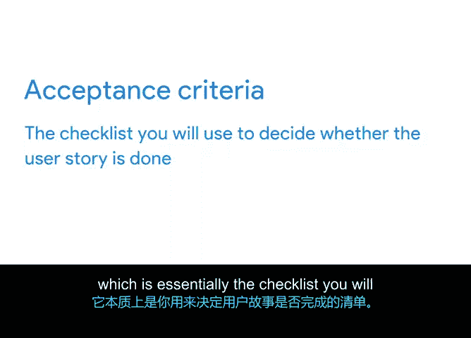

# 023：编写用户故事 📝

## 概述

在本节课中，我们将学习如何编写用户故事。用户故事是敏捷项目管理中用于捕获和管理产品待办事项列表项的一种流行方法。我们将了解用户故事的构成要素、编写标准，以及如何通过创建用户画像和验收标准来完善它们。

---

## 从产品待办事项到用户故事

上一节我们介绍了产品待办事项列表及其构成要素。为了正确构建待办事项列表，项目经理必须考虑描述、价值、排序和估算等因素。这能确保你作为项目经理，包含足够的信息来实现产品负责人对用户价值的构想。

现在你已经了解了待办事项列表中每个条目的各个字段，接下来我们来讨论一种捕获和管理这些待办事项条目的流行方法：用户故事。

---

## 什么是用户故事？ 👤

用户故事是从用户角度出发，对某个功能进行的简短、简单的描述。这有助于团队创造出始终以用户和用户体验为中心的解决方案。

用户故事最初可能比较宏大和宽泛，也可以被分解得尽可能小或具体。在本节中，我们将为你提供一些关于如何编写和分解用户故事的想法。

用户故事由三个不同的要素组成：**用户**、**他们将采取的行动**以及**他们能获得的收益**。这些要素可能有几种不同的格式，但最常见的是：**作为一个[用户角色]，我想要[这个行动]，以便我能获得[这个价值]**。

---

## 创建用户画像

在编写有效的用户故事时，团队必须心中有一个具体的用户形象，想象用户将如何与产品互动以实现特定目标。

在这个阶段，我非常喜欢做的事情是创建用户画像，即对我的不同用户进行详细描述。有时我甚至会给他们起名字。以虚拟绿植公司为例，我们可以为我们的用户起一些名字并添加一些信息。

以下是几个用户画像的构想：

*   **Leo**：我的植物供应商，负责采购植物、管理供应链和交付物流。
*   **Felicity**：我的园艺专家，帮助我的支持团队为客户提供关于如何照料植物的优质建议。
*   **Zach**：我的业余蔬菜园丁，希望用购买的植物来做晚餐。
*   **Na**：我的管理顾问，在家工作，希望为家庭办公室的视频会议设置一个专业的背景。
*   **Rina**：我的花卉爱好者，希望每周都有不同的插花来点亮家居。

通过为这些用户赋予名字和背景故事，我们可以在脑海中想象他们，从而为他们设计出更好的产品。

---

## 用户故事的 INVEST 标准

我非常喜欢编写用户故事，因为它能让我设身处地为用户着想。每个用户故事都应满足六个不同的标准，由首字母缩写 **INVEST** 代表。

以下是 INVEST 标准的详细说明：

*   **I 代表独立**：故事应该能够独立开始和完成，不依赖于另一个故事的完成。
*   **N 代表可协商**：关于这个条目有协商和讨论的空间。
*   **V 代表有价值**：这意味着完成用户故事必须交付价值。
*   **E 代表可估算**：我们的“完成定义”必须清晰，以便团队能为每个用户故事进行估算。
*   **S 代表小**：每个用户故事需要能够适配到一个计划好的冲刺中。如果用户故事太大，应将其分解为更小的故事。待办事项列表中优先级较低的故事可以保持较大，直到它们成为即将到来的冲刺的优先事项。
*   **T 代表可测试**：可以编写测试来检查并确保它满足验收标准。

虽然产品负责人是编写用户故事的主要责任人，但团队有责任在投入任何时间之前，就用户故事是否清晰并符合 INVEST 标准提供反馈。

---

## 史诗与用户故事示例

除了用户故事，你还需要了解术语 **史诗**，它简单地代表一组或一个集合的用户故事。

虚拟绿植公司的一些史诗可能是：**活体植物配送**、**办公室植物咨询服务**、**供应商管理**或**客户数据管理**。

让我们为虚拟绿植公司的客户在“活体植物配送”史诗下构思一个示例用户故事：
> **作为一个虚拟绿植公司的客户，我想要获得一棵盆景树，以便我能拥有一株美丽的植物，并能在修剪枝叶时进行冥想。**

我想到这个是因为去年我为我12岁的侄子买了一棵盆景树。他做了一些研究，了解到在日本，修剪盆景树是一种冥想练习，所以他正在学习如何去做。

---

## 定义验收标准

有了这个示例用户故事，产品负责人会创建一个叫做 **验收标准** 的东西，这本质上是一个清单，你将用它来决定用户故事是否完成。

要完成一个用户故事，你必须满足验收标准清单。

以下是盆景树用户故事的验收标准示例：

*   用户可以浏览三种不同类型的盆景树进行购买。
*   可以比较这三种树，了解哪种在他们家中最容易或最难种植（也许每株植物旁边都有一个初学者、中级或高级园丁的标注）。
*   可以购买特定的盆景树护理套餐，如肥料、修剪剪刀等。
*   可以访问在线的盆景树手册，同时随树附赠一本护理手册。
*   可以在虚拟绿植公司的常见问题页面上找到一个盆景树问题排查页面。

这听起来像一个很棒的故事，不是吗？它感觉像是一个用户可以与之互动并感到兴奋的真实事物。

---

## 总结

待办事项列表中的每个用户故事都应该以这种方式编写。优先级列表较高的条目自然会有更多细节和更少的模糊地带。通过让这些低优先级条目保持模糊，可以节省团队的时间，避免他们去处理那些最终可能被降低优先级的项目。

太棒了！现在你已经知道如何解释用户故事、评估用户故事是否可供团队处理的 INVEST 标准，并且能够解释史诗和用户故事验收标准。

在下一个视频中，我们将讨论待办事项列表的细化，并解释相对工作量估算、T恤尺码和故事点。我们下个视频见。