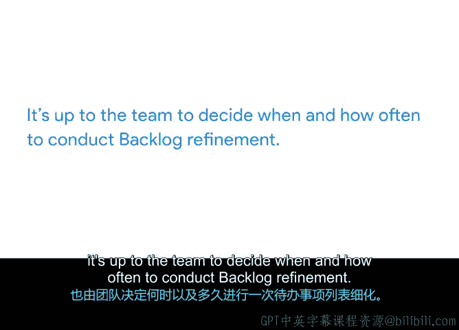

# 024：待办列表精化与工作量估算 📋

在本节课中，我们将要学习如何通过“待办列表精化”这一过程，与团队协作维护一份有效的产品待办列表。我们还将深入探讨两种核心的工作量估算方法：T恤尺码法和故事点法，帮助你理解如何为待办项进行相对估算，从而支持更有效的迭代规划。

## 待办列表精化概述

上一节我们介绍了产品待办列表的构成与所有权。尽管产品负责人拥有或负责待办列表中的数据，但整个团队必须共同协作，以保持这份“活的”文档处于最新状态。本节中，我们来看看如何通过一个称为“待办列表精化”的过程来实现这一目标。

待办列表精化指的是对列表进行描述、估算和优先级排序，以确保Scrum团队能够高效运作的一系列活动。

在产品负责人添加了带有描述和价值陈述的待办项之后，他们就需要进行待办列表精化。这个过程是产品负责人与部分或全部Scrum团队成员共同评审待办列表，以确保：
*   列表包含恰当的条目，无需新增或移除。
*   条目已由产品负责人排定优先级（这也称为设置“顺序”字段）。
*   位于列表顶部的条目已准备好交付，并具有清晰的验收标准。
*   待办项包含了估算，即对完成特定待办项所需工作量的知情评估。

## 工作量估算的重要性

让我们重点讨论估算，因为它在待办列表精化中至关重要。我们为待办项添加估算，是为了告知我们的规划实践：完成每个条目或用户故事需要付出多少努力。通过估算，我们可以了解未来有多少工作量。

准确估算完成任务所需的时间通常很困难。在涉及大型项目时，人类倾向于低估完成时间，这种效应会被放大许多倍，并可能成为项目延期和超支的根本原因。

因此，在Scrum中，我们尝试通过实践**相对估算**而非**绝对估算**来克服这个问题。绝对估算在传统项目管理中也称为时间和工作量估算。

**相对估算**意味着我们不去精确确定一项任务需要多长时间，而是将该任务的工作量与另一项任务的工作量进行比较，以此作为估算值。这种估算不使用传统的小时、天或周等单位，而是为每个待办项分配一个代表相对规模的价值单位。

## 两种常见的相对估算方法

以下是两种在估算用户故事时非常实用的常见相对估算方法：T恤尺码法和故事点法。让我们从两者中较简单的T恤尺码法开始。

### T恤尺码法 😊

要开始使用此方法，团队只需在待办列表中挑选一个看起来工作量中等规模的条目，并在估算字段中简单地将其标记为“中号”。之后，他们再选取列表中的另一个条目，与刚刚确定的“中号”条目进行比较，并回答这个问题：“如果第一个条目是中号，那么我会给这个条目什么尺码？”

团队将对待办列表上的每个额外条目或用户故事重复此过程，直到所有条目都处理完毕。

例如，我们从Virt Verde的产品待办列表中选取四个条目：
1.  将盆景树添加到目录
2.  创建移动应用
3.  发布新Logo
4.  创建新账户页面

团队决定将“发布新Logo”作为他们的“中号”基准。然后，团队共同将其他三个条目与该“中号”条目进行比较，从而得出它们的相对工作量估算。

### 故事点法

接下来是我最喜欢的估算用户故事、任务和待办项的方法：故事点法。故事点法比T恤尺码法稍微高级一些，但概念相似。第一步是相同的：团队选择一个条目作为他们的“锚定项”，并相对于该项进行估算。

与使用T恤尺码不同，这个过程使用所谓的“故事点”。大多数团队使用一个著名的数学数列，称为**斐波那契数列**：0, 1, 1, 2, 3, 5, 8, 13, 21……并无限延续。就故事点而言，我们跳过0和第一个1。

这些数字的特殊之处在于，它们开始时彼此接近，但随着数字变大，它们之间的间隔也越来越大。这很有帮助，因为当估算值变高时，不确定性和风险也随之增加。这个数字将工作量和风险结合为一个数值。换句话说，争论21点和25点之间的估算值没有太大意义，但在21点和34点之间做出选择则是一个真正的讨论。

这个概念起初可能有些棘手，实践是最好的学习方式。为了解释这个概念，我们使用以下例子：

假设你想估算完全吃掉不同种类水果所需的工作量。你面前有一个橙子、一颗草莓、一根香蕉、一个芒果、一个菠萝和一颗樱桃。影响估算的因素有哪些？需要处理籽吗？我需要用纸巾吗？我能一口吃掉吗？我需要剥皮吗？我需要任何工具来准备它吗？

好的，让我们试试看。如果我选择芒果作为我们的起始水果，并赋予它5个故事点，你可能会如何估算其他的水果？

我可能会这样评定：
*   **橙子：3点**，因为剥皮比切芒果容易。
*   **草莓：1点**，因为我不介意吃梗，工作量低。
*   **香蕉：3点**，因为我必须剥皮，类似于橙子。
*   **菠萝：13点**，它太大了，我无法一次吃完。
*   **樱桃：2点**，有梗，有籽，你懂的。

了解人们如何以不同方式切菠萝真的很有趣。但更重要的是，估算练习为团队所做的是：揭示如何完成某事的绝妙想法，并暴露项目中风险最高的部分。

## 方法应用与比较

为什么我更喜欢故事点法而不是T恤尺码法？让我们将它们应用到我们的Virt Verde待办列表中。

现在我们可以看到，“添加新用户”和“将盆景树添加到目录”的工作量并不完全相同，而T恤尺码法可能暗示它们是相同的。使用故事点法，“新用户”是8点，而“盆景树”是13点。我为什么这样标记它们？因为实现一个新用户页面是一个简单的软件更新，而添加盆景树不仅仅是软件工作，还包括寻找供应商、建立供应链等等。

## 精化的频率与方式

我之前提到过，包含添加估算和更新顺序字段的待办列表精化应该定期进行。正如由团队选择他们采用哪种估算方法一样，何时以及多久进行一次待办列表精化也由团队决定。

以下是团队常见的几种做法：
*   一些团队倾向于设立专门的会议来精化待办列表。
*   另一些团队则通过持续的对话或电子邮件来精化待办列表。
*   最后，一些团队会将待办列表精化作为预定事件（如他们的冲刺规划会议）的一部分来进行。

## 总结

本节课中，我们一起学习了如何定义待办列表精化，并能够解释相对工作量估算、T恤尺码法和故事点法。你现在知道了如何与团队协作维护一份清晰、有序且经过估算的待办列表，这是进行有效迭代规划的基础。在下一个视频中，我们将进一步学习关于冲刺规划的知识。