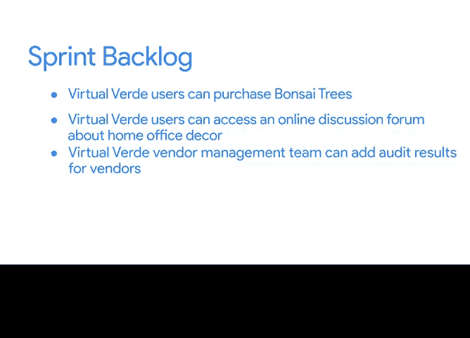

# 026：Sprint计划会议 🎯

在本节课中，我们将学习敏捷项目管理中一个核心的仪式——Sprint计划会议。我们将了解其目的、关键产出以及如何通过它来设定团队在接下来一到四周的工作方向。

上一节我们介绍了Sprint的基本参数，本节中我们来看看Sprint计划会议的具体内容。

Sprint计划会议是Sprint周期内的第一个事件。整个Scrum团队会聚集在一起开会，确认团队在当前Sprint中可用的**容量**（即时间和人力），并确定从产品待办事项列表中选取哪些项目在本Sprint内完成。会议的产出是Sprint待办事项列表和最终的Sprint目标。

在会议期间，Scrum Master负责引导团队沟通并回答以下问题：

以下是会议中需要明确的关键问题：
*   **人员可用性**：本次Sprint期间谁可用？是否有需要知晓的假期或时间冲突？
*   **团队速率**：我们过去的平均速率是多少？即我们过去在一个Sprint内能完成多少故事点或待办事项？
*   **工作范围**：团队在即将到来的Sprint中可以且应该完成什么？
*   **Sprint目标**：最终的Sprint目标是什么？
*   **任务分工**：工作将如何完成？在整个Sprint中，谁负责什么任务？

我们已经讨论了Sprint长度和用户故事规模，现在让我们探讨“完成的定义”的含义。

“完成的定义”是指一组经团队共同商定的、必须在用户故事或待办事项被视为完成前完成的事项。它确保交付成果的质量和一致性。

以下是“完成的定义”可能包含的内容示例：
*   代码或解决方案本身经过独立同行评审。
*   产品或单元通过所有测试要求（可能包括安全或性能测试）。
*   文档编写完成。
*   满足产品负责人指定的所有用户故事验收标准。
*   产品负责人最终接受该用户故事。

这个列表并非详尽无遗，团队应自行确定列表内容，并根据需要改进它。

Sprint计划会议的一个关键交付成果是**Sprint待办事项列表**。

Sprint待办事项列表是为在即将到来的Sprint内完成而确定的一组产品待办事项。换句话说，Sprint待办事项列表是产品待办事项列表的一个子集，团队的目标是在该特定Sprint内完成这些项目。

例如，假设Vi Verde公司的产品待办事项列表有50个项目。团队创建了为期四周、以月份命名的Sprint（五月Sprint、六月Sprint等）。对于五月Sprint，团队根据五月的团队容量和各项工作的规模，确定可以完成优先级最高的5个项目。这5个项目现在就构成了五月Sprint的待办事项列表。

**Sprint目标**是团队旨在实现的总体目标，它帮助团队理解Sprint的“原因”。这个目标应从Sprint待办事项列表中的项目进行宏观视角提炼。设定一个更宏观的Sprint目标的好处在于，它能帮助团队聚焦于一个更广泛的团队目标，而不是将成员分割到独立的工作流中。

例如，假设Vir Verde公司确定了以下5个项目作为五月的Sprint待办事项：
1.  Vir Verde用户可以购买盆景树。
2.  Vir Verde用户可以访问关于家庭办公室装饰的在线讨论论坛。
3.  Vir Verde供应商管理团队可以为供应商添加审计结果。
4.  Vir Verde用户可以使用优惠券购买家庭办公室配件。
5.  Vir Verde客户支持可以将产品关联到支持工单。

那么，Sprint目标可以是：**为希望在家庭办公室摆放盆景树的用户提供全面的体验**。所有这些待办事项都可以以某种方式与这个Sprint目标联系起来。例如，有针对盆景的新优惠券；供应商会接受盆景树质量审计等等。

本节课中我们一起学习了Sprint计划会议。我们了解到，成功的Sprint计划会议将产出一个定义清晰且经过估算的Sprint待办事项列表，以及一个能激励团队朝着最终成果努力的Sprint目标。

在下一个视频中，我们将继续介绍更多的Sprint事件。