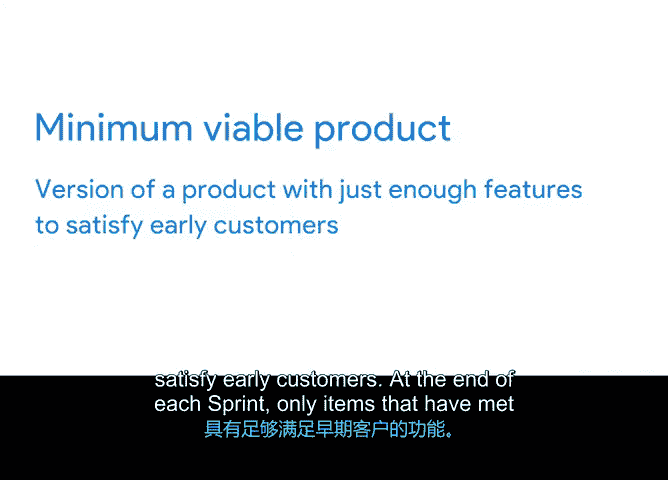

# 027：每日站会与Sprint评审会议 🗓️

在本节课中，我们将要学习敏捷项目管理中两个关键的面对面沟通活动：每日站会和Sprint评审会议。我们将了解它们的目的、流程以及如何有效执行，以确保团队保持专注并持续交付有价值的产品。

## 概述

敏捷宣言中的一项原则指出：**向开发团队传递信息以及团队内部沟通，最高效有效的方法是面对面的交谈**。因此，本节我们将重点讨论在Sprint期间和结束后发生的两种面对面活动：每日站会和Sprint评审会议。

## 每日站会

上一节我们介绍了Sprint的基本概念，本节中我们来看看如何通过每日站会来保持团队的同步。每日站会，有时也被称为“站立会议”，是Scrum团队用来同步当天工作并确定优先级的活动。

它通常在每天固定的时间和地点举行，时长不超过15分钟。在会议中，每位团队成员需要回答以下三个问题：

*   **昨天我做了什么来帮助开发团队达成Sprint目标？**
*   **今天我计划做什么来帮助开发团队达成Sprint目标？**
*   **我是否注意到任何阻碍我或开发团队达成目标的障碍？**

每日站会为Scrum Master提供了一个快速识别并解决团队障碍的机会，同时也能强化团队对Sprint待办列表和Sprint目标的关注。根据官方的Scrum指南，每日站会必须每天举行。不过，在实践中，一些成功的Scrum团队可能会根据自身情况调整频率。例如，作者当前所在的团队采用一周的Sprint周期，他们选择在一周内举行两次站会，这种方式对他们非常有效。团队可以尝试不同的节奏，找到最适合自己的方式。

## Sprint评审会议

在Sprint结束时，团队会进行另一个重要活动——Sprint评审会议。这个活动对于Scrum的“检视”与“适应”两大支柱至关重要，并体现了“开放”、“勇气”和“尊重”的价值观。

Sprint评审会议是整个Scrum团队参与的会议，目的是演示产品成果，以确定哪些部分已经完成，哪些尚未完成。在会议中，开发团队和产品负责人将主导这次检视和讨论。

以下是Sprint评审会议的核心活动：

*   **演示与检视产品**：团队展示在Sprint中完成的工作成果。
*   **审查产品待办列表**：探讨产品待办列表中哪些条目可以被视为“已完成”。
*   **收集反馈**：团队基于已完成的工作，实践开放和尊重的Scrum价值观，相互提供反馈。

Sprint评审会议应该是充满乐趣和鼓舞人心的时刻，团队可以借此机会展示在过去一到四周内完成的出色工作。这个会议是时间盒限定的，通常不应超过4小时。

### Sprint评审会议实例

让我们通过一个例子来理解。假设虚拟植物团队需要推出一个展示家庭办公室植物方案的新网站页面。

想象一下，Scrum团队中有一位市场营销专家（记住，Scrum团队是跨职能的）。在八月份的Sprint评审会议上，有一个Sprint待办事项是：创建一封发布邮件，发送给现有的企业客户，宣传他们的全新服务。

在评审会议中，团队会演示这封邮件。他们可以将邮件内容投屏，并在会议中直接向专家提供反馈，例如：“那个开头语很有吸引力”、“我们把开头的图片放大一些吧”、“能否让收件人更容易地将邮件转发给朋友？”、“这段文字可以缩短一点，有点长了”。

这种对团队工作产物的集体检视，其好处远不止于得到一封更好的营销邮件：
1.  **反馈即时**：无需等待他人单独审阅后再提交反馈，调整建议可以在会议中直接提出。
2.  **共同所有权**：每个人都有发言权，从而对产品发布的各个方面产生共同的归属感。
3.  **增进理解**：团队能更多地了解市场营销同事的工作方式，从而在成员间建立更大的信任和理解。

## 产品增量

Sprint评审会议不仅是团队展示成果的时刻，也是团队揭晓**产品增量**的时刻。

**产品增量**是在一个给定的Sprint结束后产出的、被认为**可发布**的成果。当团队开发出一个**最小可行产品**时，产品就被认为是可发布的。最小可行产品是指一个仅包含足够满足早期客户需求的功能的产品版本。

在每个Sprint结束时，只有那些符合“完成定义”的条目才会被视为产品增量的一部分。任何未完成的事项都将返回产品待办列表。

## 总结

本节课中我们一起学习了确保团队保持专注并构建有价值解决方案的两个关键Sprint活动：每日站会和Sprint评审会议。每日站会帮助团队每日同步和排除障碍，而Sprint评审会议则通过演示成果和收集反馈来推动产品的适应与改进。在下一个视频中，我们将讨论Scrum团队中的另一个重要会议：Sprint回顾会议。