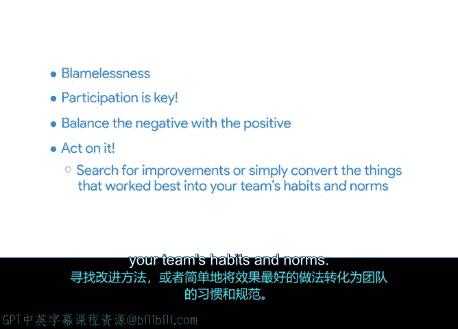

# 029：Sprint回顾会议 🧐

在本节课程中，我们将学习Scrum框架中的最后一个关键事件——Sprint回顾会议。我们将了解其目的、如何进行，以及确保会议成功的实用技巧。

如果你一直在学习本课程，你已经对回顾会议有了很多了解。回顾是项目管理的重要组成部分，无论你采用何种方法。在本视频中，我们将介绍Scrum五大事件中的最后一个：Sprint回顾会议。

Sprint回顾会议是一个至关重要的会议，时长最多三小时。Scrum团队借此机会退后一步，进行反思，并找出如何作为一个团队更好地协作的改进点。

## Sprint回顾会议的核心内容

在Sprint回顾会议中，Scrum团队将围绕人员、流程和工具三个方面，反思哪些做法对团队有效，哪些无效。团队将探讨以下问题：
*   在下一个Sprint中，有哪些改进值得探索？
*   在上一个Sprint中实施的改进措施效果如何？它们是否有帮助？原因是什么？

## 确保回顾会议成功的措施 🛡️

根据我的经验，采取一些关键措施可以确保Sprint回顾会议取得成功。以下是具体建议：

首先，重要的是要体现Scrum尊重的价值观，并始终确保团队能够无责地进行讨论。如果有任何团队成员担心提供反馈会带来负面后果，那么会议的成果将大打折扣。你需要通过承认潜在的尴尬，并在必要时为匿名或私下反馈创造空间，来建立一个坦诚的安全环境。

其次，参与是关键。只有当参与者觉得自己的意见很重要时，回顾会议才能发挥作用。如果你发现有人不愿意主动分享观点，可以尝试用以下问题来激发新想法：
*   在下一个Sprint中，我们可以尝试的一件事是什么？
*   是什么拖慢了我们的进度？
*   发生了什么我们意料之外的事情？

这些问题的答案可以帮助你理解如何改进。例如，就在最近，我的团队发现，依赖Scrum团队之外的利益相关者会拖慢我们的进度。在我们的回顾会议中，我们决定通过一些新的沟通渠道，提高这些外部利益相关者对我们优先事项的认识。

接下来，要平衡负面与正面反馈。不要只问哪里可以改进，也要问诸如“我们在哪里取得了成功？”这样的问题。你希望团队感受到成功，同时也希望重现这些成功的成果。

最后，确保采取行动。如果团队感觉他们的反馈不会带来任何改变，他们可能会对参与未来的回顾会议感到气馁。要积极寻找改进点，或者直接将那些最有效的做法转化为团队的习惯和规范。

## 总结与过渡

在Scrum团队中促进对话，无论是在回顾会议期间还是在日常工作中，都是Scrum Master和项目经理极其重要的职责。

在本节课中，我们一起学习了Sprint回顾会议的目的、核心讨论内容以及确保其成功的具体措施。下一节视频，我们将讨论如何通过使用必要的Scrum工具来保持工作流程的透明度，这些工具也将有助于促进团队内部的良好沟通。我们下节课见。