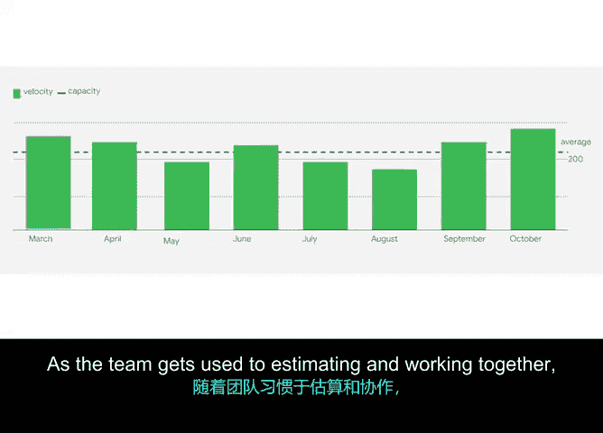

# 030：速度与燃尽图 📊

在本节课中，我们将学习敏捷项目管理中两个至关重要的概念：**燃尽图**和**速度**。这两个工具帮助Scrum团队在冲刺和整个产品待办事项列表的推进过程中，有效地管理工作进度。

## 燃尽图：追踪工作进度

上一节我们介绍了敏捷的基本框架，本节中我们来看看如何追踪每日进度。燃尽图用于衡量**时间**与**已完成工作量**及**剩余工作量**之间的关系。其核心目标是让团队清晰地了解当前进度与整体目标的对比情况。

在Scrum团队中，燃尽图直观反映了团队在冲刺期间完成用户故事的情况。Scrum主管通常会每日审查燃尽图，以判断团队是否能按时达成目标。

### 估算单位转换

计算中涉及简单的数学和数字。这里需要提及一点：如果你的团队使用T恤尺码（如XS, S, M, L）而非故事点来估算，只需将尺码映射为数字即可用于燃尽图和速度的计算。

以下是T恤尺码映射为故事点的一个示例：
*   XS = 1点
*   S = 2点
*   M = 5点
*   L = 8点

### 燃尽图实例分析

让我们通过一个虚拟团队“Verde”的例子来理解燃尽图。

假设Verde团队的冲刺周期为四周，即20个工作日。在七月份的冲刺中，冲刺待办事项列表的故事点总数为 **200点**。

如果理想情况下工作匀速完成，那么团队预计每天完成 `200点 / 20天 = 10点/天`。

*   **第5天**：团队完成了22点。此时冲刺进度为25%，看起来仍在正轨上。
*   **第10天**：团队完成了45点。此时冲刺已过半，本应完成约100点。根据燃尽图，团队进度已落后于冲刺目标。
    *   *注意：此时不应惊慌或给团队施加压力。作为Scrum主管，你应该已经开始与团队讨论，了解如何提供帮助并扫清障碍。*
*   **第15天**：燃尽点数为140点。团队已重回正轨，高效推进。
*   **第20天**：燃尽点数为188点。冲刺成功完成，值得在回顾会议上讨论发生的一切。

## 速度：衡量团队交付能力

了解了如何追踪单次冲刺的进度后，我们引入一个更宏观的指标。在Scrum中，**速度**指的是团队在单个冲刺中平均完成的点数。

其计算公式为：
`速度 = 过去若干冲刺中已完成故事点的平均值`

当团队进行冲刺计划时，他们会参考**至少过去三次冲刺的平均速度**，来决定本次冲刺可以安全地加入多少工作项。

关于速度计算，有几点需要注意：

1.  **速度无好坏之分**：速度仅仅是团队在固定时间盒内历史交付能力的反映。
2.  **团队间速度不可比**：每个团队都有自己的点数校准系统，因此比较不同团队的速度没有意义。
    *   *例如：一个3人团队的单周冲刺速度可能是70点，而一个5人团队的两周冲刺速度可能只有120点。这并不代表哪个团队更好或更差，仅仅是情况不同。*

## 稳定速度的威力 🚀

当团队拥有**稳定的速度**和一个经过**细化、排好优先级并估算过**的产品待办列表时，将获得一项极其宝贵的超能力：**预测能力**。

你可以向利益相关者和发起人 confidently 地说明两件事：
1.  完成整个产品待办列表大约需要多长时间。
2.  到某个特定时间点，可以完成多少待办事项。

这种 confidently 预测工作何时能完成的能力，是敏捷/Scrum中最强大的工具之一。

### 预测实例

假设我们的虚拟Verde团队在最近三个月的月度冲刺中，平均速度为 **200点/冲刺**。

*   **预测总耗时**：如果产品待办列表还剩1500点，团队可以预测完成全部工作大约需要 `1500点 / 200点/冲刺 = 7.5个冲刺`。
*   **预测特定时间点的交付范围**：如果现在是七月，团队想知道到次年一月一日能完成哪些功能。这之间有5个月（即5个冲刺）。只需从待办列表顶部开始向下累加，直到故事点总数达到 `5个冲刺 * 200点/冲刺 = 1000点` 时画一条线。这条线以下的内容就是基于团队历史表现得出的、相当可靠的交付范围预估。

这非常强大，不是吗？你可以利用这些信息来做出关键项目决策，例如：
*   为了缩短日期，考虑为团队增加人手以提高速度。
*   重新调整待办事项的优先级。

**请注意**：对于任何团队，通常需要经过多次冲刺才能达到稳定的速度，这是完全正常的。随着团队逐渐适应估算和协作，速度会开始趋于稳定。

---

## 总结

本节课中，我们一起学习了：
*   **燃尽图**的定义与用途，它帮助团队监控冲刺内的每日进度。
*   **速度**的定义与计算方法，它衡量团队的平均交付能力。
*   敏捷团队如何达到**稳定速度**，以及稳定速度所带来的强大**预测能力**。

运用这些工具对于任何高绩效的Scrum团队都至关重要，它们是实现执行可预测性的有力手段。在下一个视频中，我将演示另一个有用的可视化工具，我们那里见。