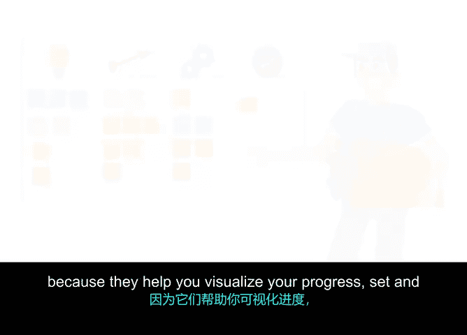

**谷歌项目管理专业证书：第5课：使用看板可视化工作流**

在本节课程中，我们将学习如何使用看板（或Scrum板）这一可视化工具来跟踪团队在冲刺期间的工作进度。我们将了解其核心功能以及它如何帮助团队提升效率。

---

在上一节视频中，我们学习了使用燃尽图来可视化进度的重要性。好消息是，还有其他可视化工具同样能帮助团队在整个冲刺中取得进展。

本节我们将介绍的工具你可能已经熟悉，因为我们在之前的视频中曾简要提及。它就是看板。有些团队将其称为Scrum板而非看板。虽然两者存在细微差别，但它们指的是同一种基本工具。

Scrum指南并未明确定义Scrum板是什么，但市场上一些Scrum工具提供的看板增加了一些特定功能，使其更适用于Scrum框架。无论是看板还是Scrum板，都具备三个主要特性，使其成为Scrum团队优秀的冲刺跟踪工具：**可视化**、**在制品限制**以及**工作流**。

### 可视化：一目了然的进度追踪

可视化是学习和跟踪的重要策略。看板能让我们一眼就掌握所有需要了解的信息。我们可以指着板上具体的工作项进行讨论，在检查工作时使用不同颜色、大小的图像来增加变化，并能轻松发现团队面临的挑战所在。如果没有这种可视化，找出改进点将变得困难得多。

### 在制品限制：聚焦团队精力

我们在课程早期学到，看板的在制品限制是对团队在任何给定时间内同时处理的工作项数量的约束。这为团队提供了专注力，这也是我们的Scrum价值观之一。你是否听过“在Scrum中没有真正的多任务处理”这种说法？这非常正确。工作越多，效率可能越低。

当使用看板或Scrum板时，每个团队可以根据自身配置和情境设定在制品限制。这样，当团队超出限制时，问题会变得非常明显。

### 工作流：感受工作的流动

最后，使用看板能让你更好地感知工作在整个团队执行流程中的流动。无论是实体的便利贴还是虚拟的看板/Scrum板，都能让团队体验到工作从一个阶段移动到另一个阶段的过程。

使用看板或Scrum板，团队会将工作项按以下阶段移动：**待办**、**进行中**和**已完成**。这个动作通常发生在每日站会期间，但团队可以随时移动项目。

例如，在我们的虚拟Verde团队中，假设我们的植物供应商Leo已经完成了“与计划用于初始发布的三家顶级植物供应商敲定合同”这项工作项。Leo会前往看板，将他的项目从“进行中”移动到“已完成”，并找出下一个要处理的工作。如果出于某种原因，这是他在本次冲刺中的最后一项任务，他可能会联系团队，看看可以在哪里帮助队友。

---

### 总结

总而言之，看板和Scrum板非常有用，因为它们能帮助你**可视化进度**、**设定并维护团队的工作负载和在制品限制**，并让你**感知整个团队执行过程中的工作流动**。

太棒了，我们下个视频再见，届时我们将回顾几款能帮助Scrum团队管理所有这些信息的软件产品。