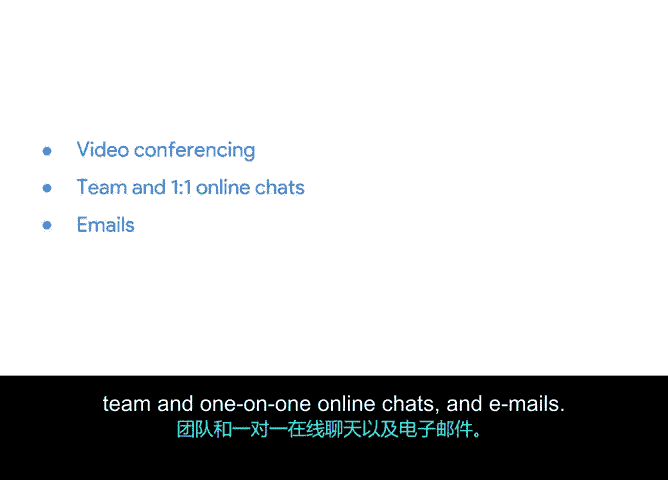

# 032：透明度与协作工具 🛠️

在本节课中，我们将学习如何利用各种工具来实施和促进Scrum与敏捷工作流。这些工具旨在提升团队协作效率，并确保工作流程的透明度，这对于Scrum团队的成功至关重要。

## 工具的重要性与Scrum支柱

上一节我们介绍了各种Scrum事件及其作用。本节中，我们来看看支持这些实践的实用工具。Scrum的支柱之一是**透明度**，因此团队的成功高度依赖于内部信息的透明。工具能帮助每位成员充分了解项目进展与更新。

这些工具将用于存储产品待办事项列表、冲刺待办事项列表以及其他关键文档。使用Scrum工具能帮助团队将所有进展组织起来，并集中存放在一个地方。

## 日程与工作管理工具

首先，我们来谈谈日程与工作管理工具。在传统项目管理中，像Microsoft Project这类应用提供了强大的日程和资源管理功能。然而，在Scrum团队中，最关键的工具有助于管理待办事项列表和冲刺。

以下是几种常用的工具：

*   **Jira (由Atlassian开发)**：这是一款流行的敏捷团队项目管理工具，支持团队和待办事项管理的所有方面。它可以为你的团队定制，并提供一个中心位置来查找与Scrum团队相关的所有内容，例如产品待办事项列表、冲刺定义、速率、燃尽图等。
*   **其他市场工具**：除了Jira，市场上还有其他提供类似功能的工具可供团队购买。有些团队也会在电子表格中构建自己的敏捷工具。
*   **Trello**：如果你在寻找简单有趣的工具进行尝试，Trello的看板功能是一个不错的选择，它甚至可用于规划个人项目。
*   **Asana**：这是本课程中提到的另一款工具，非常适用于冲刺规划和待办事项管理。Asana帮助团队从日常任务到战略计划进行规划与协调，让每个人都能查看、讨论和管理团队优先级。

## 文档、协作与生产力工具

上述应用专为帮助团队管理待办事项和冲刺而设计，但许多活动是这些产品无法完成的。这时就需要额外的文档、协作和生产力工具。

你需要使用某种形式的文档或文字处理工具，以确保能以较长的格式捕获项目的关键信息。该领域的许多产品都将文档和协作功能集成在一个工具中。

以下是几种实用的工具类型：

*   **文档工具**：例如Google Docs，它集文档撰写与协作为一体。
*   **电子表格**：例如Microsoft Excel或Google Sheets，对大多数团队都很有用。你可以用电子表格来记录待办事项列表、事项信息或项目的任何其他信息。
*   **演示工具**：例如Google Slides或Microsoft PowerPoint，用于向团队展示信息。
*   **协作与沟通工具**：由于敏捷重视个体与互动，因此拥有优秀的协作和沟通工具至关重要。Scrum团队中常见的协作类型包括视频会议、团队及一对一在线聊天以及电子邮件。

这些工具将为你的团队带来巨大的生产力提升，它们让团队成员能更有效地沟通、更快地获得答案，并在第二天的每日站会之前很久就能自行解决问题。

## 工具选择与团队自主权

市场上有许多有用的应用程序可以帮助Scrum团队维持成员之间所需的透明度。在Scrum中，团队将共同决定使用什么工具。

本节课中，我们一起学习了支持Scrum与敏捷工作流的关键工具类别，包括工作管理、文档处理和团队协作工具。理解并有效利用这些工具，是保持项目透明度、提升团队协作效率的重要一步。