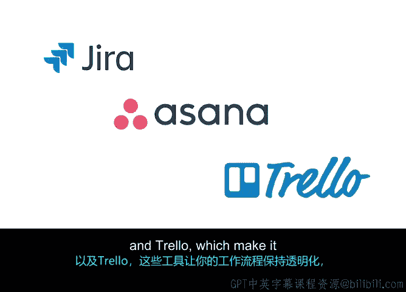

# 033：敏捷项目管理课程总结

在本节课中，我们系统性地学习了Scrum框架的核心组成部分，包括产品待办事项列表、关键事件以及实用的项目管理工具。通过掌握这些内容，你将能够更有效地在敏捷环境中规划、执行和监控项目。

## 🎯 产品待办事项列表

上一节我们介绍了Scrum的基础，本节中我们来看看其核心规划工具——产品待办事项列表。我们深入探讨了如何细化待办事项列表，并学习了使用**T恤尺码法**和**故事点**进行相对工作量估算的重要性。这些方法帮助团队在没有精确时间的情况下，评估任务的复杂性和规模。

## 📅 Scrum五大关键事件

我们识别了Scrum框架中的五个重要事件。以下是每个事件的简要说明：

*   **Sprint本身**：一个固定长度的迭代周期，用于完成一组预定的工作。
*   **Sprint计划会议**：团队在此会议上决定下一个Sprint要完成哪些待办事项。
*   **每日站会**：一个简短的每日会议，用于同步进度和计划当天工作。
*   **Sprint评审会议**：在Sprint结束时举行，展示完成的工作并收集反馈。
*   **Sprint回顾会议**：团队反思上一个Sprint的过程，并讨论改进措施。

我们学习了每个事件的发生时机及其主要目的，确保团队节奏一致并持续改进。

## 📊 可视化工具与项目管理软件

为了有效跟踪进度，我们讨论了通过燃尽图和看板等工具进行可视化学习。此外，我们还探索了如**Jira**、**Asana**和**Trello**等项目管理工具。这些工具使你的工作流程保持透明，并确保每位团队成员都能及时了解Sprint期间的整体进展。

## 🚀 总结与展望

本节课中，我们一起学习了Scrum的核心构件：从规划阶段的产品待办事项列表细化与估算，到执行与检视阶段的五大关键事件，再到辅助项目可视化和协作的实用工具。你已经掌握了在敏捷环境中推动项目前进的基本框架。

接下来，我们将学习如何在现实场景中应用敏捷和Scrum方法以适应各种变化。