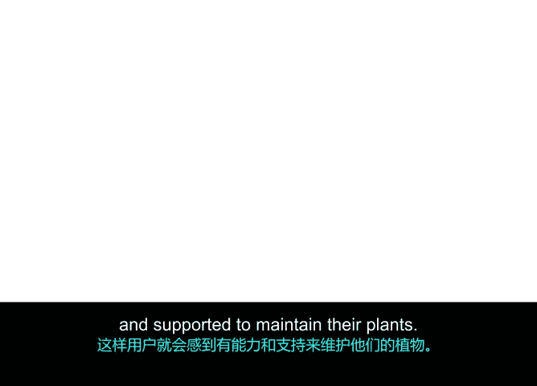

# 035：最大化价值驱动交付 🎯

## 概述

在本节课中，我们将学习敏捷项目管理的核心目标：**价值驱动交付**。我们将探讨“价值”在项目管理中的定义，并学习如何确保团队交付的产品对用户和客户真正具有价值。我们将通过一系列策略，帮助你聚焦于构建正确的东西、正确地构建它，并确保其长期有效运行。

---

## 什么是价值？

上一节我们介绍了如何有效实施Scrum。本节中，我们来看看项目的最终成果——交付给用户的产品，以及它如何为用户和客户创造价值。

在项目管理中，**价值**指的是产品能为用户带来的益处。这可能包括：
*   **财务收益**
*   **用户增长与参与度**
*   **合规性**

价值的具体含义因客户而异，取决于他们对产品的期望。敏捷的首要原则就是“通过尽早和持续交付有价值的软件来满足客户”。对于非软件项目，可以将“软件”一词替换为“产品”或“解决方案”。

尽可能快速高效地向用户交付价值，是敏捷方法诞生的主要原因。

---

## 价值驱动交付的含义

**价值驱动交付**意味着你和你的团队专注于交付高价值的产品。仅仅交付一个产品，并不代表它就有价值。

正如在敏捷历史概述中解释的，过去存在一个日益严重的问题：项目团队产出的产品价值不高。这是因为团队过于关注流程，而没有花时间评估产品的实用性，直到最终交付后才进行审视。

敏捷将团队的重心重新引导到产品本身，并确保生产产品的流程支持交付价值这一目标。

---

## 如何确保价值驱动交付？

那么，如何确保你的团队专注于价值驱动交付呢？以下是三个核心策略：
*   **构建正确的东西**
*   **正确地构建它**
*   **正确地运行它**

需要说明的是，敏捷和Scrum源于软件行业，因此“构建”和“运行”这些术语描述的是构建或运行软件程序、机器或其他技术的过程。对于非软件项目，你可以用“创建”、“生产”或“交付”等词来替换，以描述相同的概念。

让我们逐一分解：

### 1. 构建正确的东西

首先，为了交付价值，你必须**构建正确的东西**。你可以通过确保真正理解客户的需求来实现这一点。

你可能会问客户他们想要什么，他们可能会说想建一个网站来推广他们的新植物服务。但请更进一步，询问他们的**目标**：他们是想提高品牌知名度，还是想获得更多客户？

与客户进行以解决方案为导向的对话，将帮助你构建正确的东西。敏捷价值观中“个体和互动高于流程和工具”不仅适用于团队内部，也指与客户和用户进行这些重要的互动。

### 2. 正确地构建它

接下来，你必须**正确地构建它**。这是确保你的团队只构建请求或批准的功能的行话。开发不必要的功能可能导致产品变得复杂，却未给用户增加任何价值。此外，构建超出需求的东西会延迟交付或降低交付时的价值，也会增加未来出现缺陷或其他问题的风险。

### 3. 正确地运行它

最后，除了构建正确的东西和正确地构建它，你还必须确保**正确地运行它**。

“正确地运行它”意味着你的团队已经仔细思考过产品交付后用户将如何与之互动。确保你的团队考虑了一些产品“出门”后需要解决的操作性任务。

可以提出以下问题：
*   用户如何获得支持？
*   产品在用户最初获得后，如何长期为他们增加价值？
*   你如何确保新功能和能力能够触达现有用户？

**构建正确的东西、正确地构建它、正确地运行它**，这三者共同作用，确保团队在产品生命周期内持续稳定地为用户交付价值。

---

## 案例：Virtual Verde团队

让我们思考一下Virtual Verde团队如何确保他们专注于价值驱动交付。

**首先，Virtual Verde团队如何确保他们构建正确的东西？** 他们如何知道自己在创造客户真正想要的东西？

在这种情况下，团队需要确保他们提供的服务包含客户想要购买的植物类型。因此，他们可以创建一项调查，询问现有和潜在客户的植物偏好以及他们想要创建的家庭办公室设计类型。然后，他们将利用这些数据来更新产品待办列表中的用户故事。

**接下来，Virtual Verde团队如何确保他们正确地构建它？** 一旦团队知道了客户想要的植物和设计类型，他们如何确保有正确的流程来交付它们？

团队可以找到一个值得信赖的、拥有所需植物类型的供应商，并与设计师合作，制作客户喜欢的不同设计风格的花盆、花瓶和其他植物配件。团队还可以与市场部门沟通，确保客户想要的植物和设计类型在网站和目录中得到突出展示。

**最后，Virtual Verde团队如何确保正确地运行它？** 他们如何在客户注册服务后确保客户满意度？在植物交付很久之后，Virtual Verde团队如何留住他们的客户？

Virtual Verde团队可以发送后续的客户满意度调查，询问他们的植物和设计产品、交付时间、植物质量和其他见解。然后，团队可以利用这些数据持续评估他们的供应商、植物和设计产品以及营销策略。例如，团队可以通过提供喷水壶和自动植物健康系统，甚至免费的月度园艺技巧，来寻找提高服务质量的方法，从而使用户感到有能力并得到支持来维护他们的植物。

---

## 总结

本节课中，我们一起学习了**价值驱动交付**的核心概念。我们了解到，价值是产品为用户带来的益处，而确保价值交付需要聚焦于三个关键方面：**构建正确的东西**、**正确地构建它**和**正确地运行它**。通过结合使用这些策略，并与客户保持紧密互动，你的团队可以最大化地为用户交付持续、稳定的价值。

在下一个视频中，我将教你另一种经过验证的有效交付价值的方法，称为**价值路线图**。我们那里见。