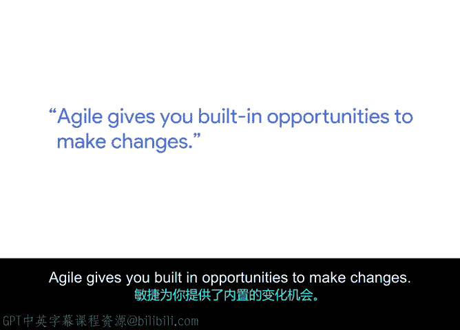

# 036：敏捷如何驱动价值 🚀

在本节课中，我们将跟随技术项目经理Camron，学习敏捷项目管理的核心思想——如何通过灵活性和增量交付来持续创造价值。我们将探讨敏捷与瀑布模型的区别，并理解为什么在项目中尽早交付价值至关重要。

## 自我介绍与技术项目经理角色

我叫Camron，是一名技术项目经理。

技术项目经理是具备技术背景的项目经理，这使他们能够与团队进行技术对话或参与技术决策。

## 敏捷的魅力：灵活性 🔄

上一节我们介绍了Camron的角色，本节中我们来看看他最喜欢的敏捷特质。

我最喜欢敏捷的地方，在于它的灵活性。

当你在项目初期，也就是了解最少的时候做出大部分决策，并非所有决策都是正确的。有些会正确，但很可能并非全部。而敏捷作为一种框架和思维方式，对变化持开放态度。它拥抱变化，并欢迎你在了解更多信息后进行调整。敏捷为你提供了内置的机会来进行改变。

## 核心概念：增量交付 📦

理解了敏捷的灵活性后，我们接下来探讨其实现价值的关键方式。

敏捷的一个重要方面是**增量交付**。

你在一段较长的时间内，持续交付一小部分、一小部分的产品。

为了对比，可以想想瀑布模型。在瀑布项目中，你需要在最后一次性将所有成果交付给客户。在一个瀑布式项目中，你必须等待、等待、再等待，直到最后才能获得一切。你可能需要等待数天、数月甚至数年。在此之前，你无法从中提取任何价值，直到产品最终交付。

我认为这对于建造房屋是合理的，对于制造汽车也是合理的。我不能把汽车零件交给某人，并期望他们开始从中获得价值。因为汽车有特定的安全要求，需要更长时间来解决更具挑战性的设计问题。

## 敏捷的价值驱动逻辑 💡

既然我们了解了增量交付，现在让我们看看它是如何驱动项目价值的。

你不必为了那最后一点功能而牺牲整个项目。

如果你已经完成了项目的90%，并且可以交付它，那就去做吧。敏捷让你能够提取那部分价值。

这样，当你在努力解决最后10%的问题时，人们可以使用那90%的功能。并且，希望你能建立一个生态系统，允许在未来部署或发布那最后的10%。

## 应对变化的成本考量 ⚖️

敏捷拥抱变化，但变化并非没有代价。本节我们来探讨这一点。

改变从来不是免费的，因为你已经沟通了计划，已经做出了估算，已经有了一些正在进行的工作。如果你要改变这些，你将会损失一些东西。关键在于，这个改变是否在你的承受阈值或预算之内，以便能够适应并使其正确或更好。

所以，目标并不总是追求完美，而是追求足够好。

---

本节课中我们一起学习了敏捷项目管理的核心价值驱动机制。我们了解到，敏捷通过其固有的灵活性，允许团队在项目进程中拥抱变化。其核心实践“增量交付”使我们能够尽早并持续地交付产品部分功能，从而让用户和利益相关者提前获得价值，而不必等待项目全部完成。同时，我们也认识到，虽然敏捷欢迎变化，但任何变更都需要考虑其成本，在“足够好”与“完美”之间找到平衡。