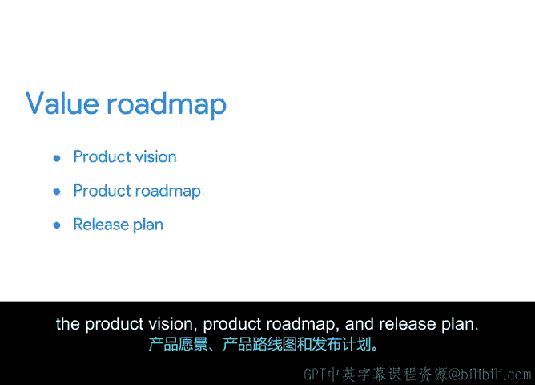

# 037：价值路线图的组成部分 🗺️

在本节课中，我们将要学习价值路线图的概念及其组成部分。价值路线图是敏捷项目管理中确保团队专注于交付客户价值的重要工具。我们将详细拆解其三个核心构成部分，并了解它们如何协同工作以指导项目成功。

上一节我们介绍了价值驱动交付，即团队专注于为客户交付具有最大价值的产品。本节中我们来看看如何通过遵循价值路线图来帮助团队保持这种专注。

## 什么是价值路线图？

价值路线图是一种以敏捷方式规划产品开发过程时间线和需求的工具，适用于各类业务。这份路线图是一个指南，它展示了为了最大化价值，团队应去向何方、如何到达以及沿途需要完成什么。它帮助描绘产品构想及交付该产品的策略。

当团队遵循其路线图时，他们会收集来自客户和利益相关者的意见，并将这些发现应用到产品的每一次迭代中。创建路线图有助于团队阐明产品的愿景，也可用于识别重要的里程碑。

## 价值路线图的三个组成部分

一个典型的价值路线图包含三个组成部分：产品愿景、产品路线图和发布计划。

### 1. 产品愿景

价值路线图的第一个组成部分是产品愿景。产品愿景是启动任何新Scrum项目的关键步骤。你的愿景基于用户访谈和市场分析，并成为团队的“北极星”。换句话说，它是指导团队前进的方向。

产品愿景定义了：
*   **产品是什么**
*   **它如何支持客户的业务战略**
*   **谁将使用它**

### 2. 产品路线图

接下来是产品路线图，由产品负责人负责创建和维护。它提供了对预期产品、其需求以及达成里程碑的预估时间表的高层次概览。这是确保团队正在构建正确产品的关键。

### 3. 发布计划

价值路线图的第三个组成部分是一系列发布计划。产品负责人和项目经理共同制定这些计划。当团队开发出某个特定功能或需求的基本可用版本时，就会进行产品发布。

发布计划包含：
*   **发布目标**：你计划在该版本中包含的功能所要实现的整体业务目标。
*   **待办事项列表**：为实现该发布目标所需的项目，例如史诗、用户故事或功能。
*   **预估发布日期**。
*   **任何其他影响发布的相关日期**，例如会议或重大节假日。

重要的是将所有发布计划都纳入价值路线图中，以帮助你专注于实现整体价值目标的路径。

## 各部分如何协同工作

总而言之，价值路线图包含三个关键组成部分：**产品愿景**、**产品路线图**和**发布计划**。这三者协同工作，通过多次迭代帮助敏捷团队达成目标。

价值路线图要发挥作用，前提是团队具有协作精神，并且所有利益相关者定期共同工作。这将确保项目取得符合敏捷价值观和原则的成果。

本节课中我们一起学习了价值路线图的定义及其三个核心组成部分。现在你知道了如何创建一个价值路线图。在下一个视频中，我将分享一些帮助你创建有效价值路线图的技巧。