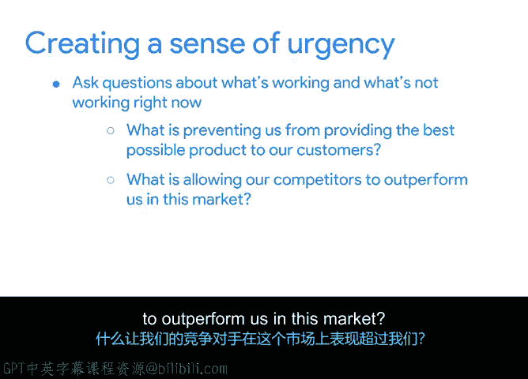
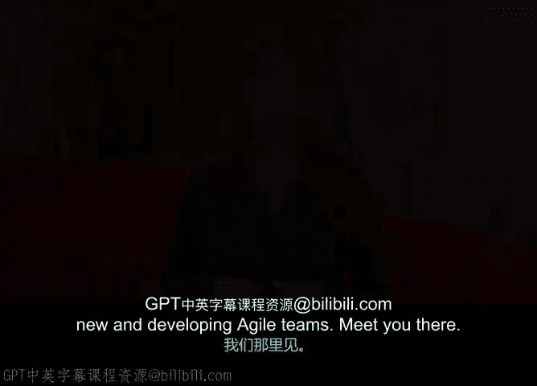

# 039：促进组织变革 🚀

在本视频中，我们将探讨项目经理在一个希望实施敏捷实践的组织中所扮演的角色。你将学习到如何支持或领导组织向敏捷转型，并掌握一些实用的技巧来应对这一过程中的挑战。

## 理解组织文化与变革管理

上一节我们介绍了项目经理在敏捷转型中的角色，本节中我们来看看组织文化与变革管理的重要性。当组织改变其业务运作方式时，通常也需要其文化随之改变。理解组织文化和变革管理过程对于引入新的工作方式至关重要。

组织文化基于共享的工作场所价值观，并体现在人们的行为、活动、沟通方式以及协作模式中。一项与现有文化不同步的变革会难以完成。事实上，有研究证明，不考虑敏捷文化层面的公司更有可能失败。

变革管理是促使人们采用新产品、新流程，或者在敏捷的案例中，采用新价值体系的过程。

## 引入敏捷或Scrum到新团队

现在，让我们进入如何帮助组织引入或继续采用敏捷或Scrum。除非组织已具备多年的敏捷行为和经验，否则你可能正面临组织文化的变革。这些变革需要时间，有时甚至需要数年才能完成。作为项目经理，你可能只实施少数几项变革，这也没关系。通过向团队或组织展示处理业务的新方法，你仍然在创造价值。

多年前我从一位同事那里听到一句至理名言：**变革需要耐心的坚持**。事情可能看起来进展太慢，但在许多情况下，微小的改变长期积累会带来巨大的变化。

那么，有哪些方法可以将敏捷或Scrum带给一个新团队呢？

### 建立主人翁意识和紧迫感

以下是建立主人翁意识和紧迫感的方法：

*   **寻找执行发起人**：寻找一位同样对你所推动的变革有主人翁感的执行发起人。尽可能指出你所做的变革与公司既定使命或价值观之间的联系。获得高层人士的支持会增加你成功推动任何组织文化变革的机会。理想情况下，你的发起人会向组织强调敏捷的好处，并为你提供所需的支持和资源。
*   **提出关键问题**：向团队、组织和利益相关者提问，了解当前哪些方面运作良好，哪些方面存在问题。然后确保变革直接针对这些机会。这不仅能帮助你确定工作的优先级，还能让团队思考如果变革成功他们将享受到的可能性。

你可以使用以下问题来收集变革过程中的反馈：

*   是什么阻碍了我们为客户提供最好的产品？
*   是什么让我们的竞争对手在这个市场上超越我们？
*   我们如何帮助团队在工作中提高效率并获得更多支持？

回到这些问题并展示增量改进，正是敏捷精神的真正体现。

## 案例回顾：Office Green的敏捷转型

让我们回顾一下Office Green的案例。当团队着手创建这个敏捷项目并向敏捷方法转型时，他们意识到公司的CEO希望确保他们能利用市场趋势，因为越来越多的人转向家庭办公室。他们通过强调家庭办公室装饰正在成为一个热门的在线趋势来营造紧迫感，并希望Office Green能参与其中。最后，团队从之前的Plant Palace项目中获得了丰富的经验，因此他们可以组建一个团队，该团队有动力应用所学知识，并对新的市场机会尝试不同的方法。

## 总结与个人经验分享

将敏捷或Scrum引入新团队可能具有挑战性，但非常值得付出努力。通过应用上述一些技巧，你将增加成功的机会。我发现，只要有一点耐心的坚持，你就能克服最初的怀疑，敏捷方法的好处将开始对团队变得显而易见。一旦发生这种情况，随着时间的推移，推动变革将变得更加容易。

我曾经在谷歌领导一个约200名开发人员的大型全球团队。我和我的总监希望将他们转变为一个敏捷组织。我和我的项目经理团队花了大约两年时间，并多次前往不同的工作地点，才交付了工具、流程和指导，使团队适应敏捷的工作方式。我处理那次转型的方法与这里描述的非常相似，并且它成功了。

在下一个视频中，我将分享一些关于指导新成立和发展中的敏捷团队的技巧，我们下个视频见。