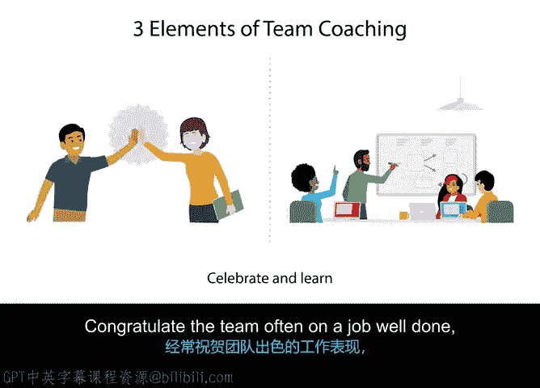

# 040：教练敏捷团队 🏆

在本节课中，我们将学习作为项目经理或Scrum Master，如何扮演教练角色来帮助团队持续改进。我们将把教练职责分解为三个核心步骤，并详细探讨每个步骤的具体做法。

---

上一节我们介绍了敏捷团队的基本运作模式，本节中我们来看看如何有效地教练团队，引导他们走向卓越。

作为项目经理或Scrum Master，你处于帮助团队改进的位置。换句话说，你是指定的敏捷教练。你的职责是帮助团队识别需要改进的领域，并协助他们实施解决方案。

我将把你的教练角色分解为三个步骤，类似于你担任一支运动队教练时可能采取的方法。

以下是教练敏捷团队的三个核心步骤：

1.  **与团队共同设计“战术”**：Scrum Master负责制定“战术手册”，但它应与整个团队共同创建。战术手册应包括团队如何运行冲刺评审、团队如何进行日常工作，以及团队在需要更新计划时如何向利益相关者发布信息。当需要对团队的“战术”进行更新时，让团队参与任何决策至关重要。带领他们一起经历新流程，思考团队中的所有角色，并确保每个人都注意到流程的变化。
    *   **个人示例**：我曾主持过一次团队头脑风暴会议，讨论我们流程中哪些部分运行不畅。我们使用便利贴来组织改进想法，然后对想法进行优先级排序以实施变更。

2.  **提供反馈**：你应该始终尽早并日常化地向你的团队和利益相关者提供反馈。就像教练在场边指导一样，Scrum Master需要持续提供指导。除了即时反馈，Scrum Master还应从宏观视角进行观察。这类似于教练观看比赛录像回放，以发现需要改进的模式或效果极佳、值得每场比赛都采用的战术。提供反馈不应只关注修复问题，还应发现那些运行良好的流程和活动，并鼓励团队继续使用有效的方法。

3.  **庆祝与学习**：经常祝贺团队工作出色、客户满意或重大解决方案成功发布。如果团队“输了”，即未能成功满足某项需求，应承认这次失败是帮助团队下次改进的关键数据。让团队在面对任何失望时仍保持积极心态，并将其视为学习机会，这一点很重要。
    *   **引述**：正如托马斯·爱迪生 famously said: `I have not failed. I've just found 10,000 ways that won't work.`

作为Scrum Master或敏捷项目经理，你在团队中扮演着至关重要的角色，你是Scrum和敏捷方法论能够成功运行的重要原因。你负责确保团队持续改进，并成为可能的最佳团队。

---

本节课中我们一起学习了教练敏捷团队的三个步骤：**与团队共同设计战术**、**向团队提供反馈**以及**与团队共同庆祝与学习**。掌握这些方法，你将能有效引导团队持续成长。

接下来，我们将学习如何预测和应对敏捷与Scrum实施过程中的现实风险。我们下一节见。