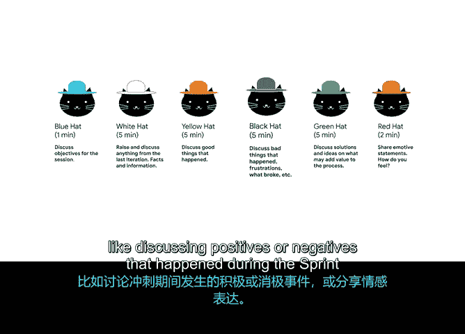

# 041：敏捷团队挑战 🧩


在本节课中，我们将探讨在变革过程中，敏捷团队可能遇到的一些特定挑战。作为项目经理或Scrum Master，你的职责是帮助团队改进工作方式，并指导他们有效采用Scrum实践。因此，预先了解并掌握应对常见挑战的方法至关重要。

## 概述：敏捷原则的挑战领域

回顾之前视频讨论的敏捷原则四大主题，它们分别是：**价值交付**、**业务协作**、**团队动态与文化**以及**回顾会议**。本节视频将聚焦于与前三个主题相关的敏捷团队挑战。

## 价值交付挑战 🎯

上一节我们介绍了敏捷原则的框架，本节中我们来看看与**价值交付**相关的挑战。价值交付的核心是确保团队频繁交付可工作的解决方案。

以下是你的团队可能遇到价值交付问题的迹象：
*   团队开始错过预期交付日期，完成任务所需时间远超平常。
*   团队似乎精疲力竭，长时间工作并表现出疲惫迹象。
*   团队在任何给定时间内有过多进行中的事项，导致任务无法真正“完成”。

如果你发现团队在这些方面遇到困难，可以尝试以下方法提供帮助：
*   **增加演示频率**：与团队一起对解决方案进行更多演示，确保他们按照价值路线图交付。当团队停下来从整体审视工作产品时，他们常能发现可以改进和加速的领域。
*   **利用回顾会议**：在回顾会议中询问团队是否有任何因素拖慢了进度，例如等待依赖项或沟通挑战。
*   **明确“完成”定义**：与团队快速回顾，确保每个人都理解“完成”的含义。
*   **聚焦少量用户故事**：确保每个冲刺只专注于少数几个用户故事。这能保证团队在继续前进之前，共同完成一项任务。

将这些付诸实践可能比想象中更难。例如，我的团队曾被要求在每次冲刺中覆盖大量内容，这很容易诱使我们试图一次处理太多任务，但这通常只会让所有事情耗时更长，实际上并无帮助。**公式：聚焦 > 贪多**。在一个冲刺中交付较少的待办事项，比在更多冲刺中交付大量事项更为可取。

## 业务协作挑战 🤝

接下来，我们转向**业务协作**主题的挑战。业务协作旨在确保开发人员与业务人员协作，共同构建正确的产品。

以下是团队可能遇到业务协作问题的常见迹象：
*   团队在业务人员审查工作解决方案后，收到大量关键反馈或变更请求，导致团队成员避免寻求反馈，或抱怨来自产品负责人或业务团队的变更请求。
*   在工作团队与管理层之间开始出现“我们对他们”的对立心态。例如，团队成员可能会发表负面评论：“哦，别给销售人员演示了，还没准备好呢，他们只会挑毛病。”

如果你注意到这些迹象，可以采取以下措施帮助重建开发人员与业务人员之间的信任与协作：
*   **通过演示管理反馈**：进行更多演示，以确保反馈以稳定的节奏进入，并且所有相关人员对“完成”的含义有共同理解。
*   **开展解决方案设计冲刺**：安排一个完整的冲刺，专门用于解决方案设计。当工作团队和业务人员实际坐在一起协作设计解决方案时，这种方法最有效。
*   **规范待办事项变更**：确保待办事项的变更仅在冲刺之间引入。这可以防止团队被可能的变更分散注意力，从而减轻压力并避免产生不满情绪。

例如，我曾在一个Scrum团队中，工程总监喜欢到工程师桌前要求快速制作一个数据仪表板。这完全打乱了团队的注意力，降低了团队的速度。我们最终决定请总监在有需求时直接联系Scrum Master，以便进行适当规划，而不中断团队当前的工作流程。

## 团队动态与文化挑战 👥

最后，我们来探讨**团队动态与文化**方面的挑战。人类是复杂的生物，拥有不同的动机和工作风格，因此你很可能至少会在这个领域遇到一些挑战。

以下是一些需要警惕的团队动态与文化问题迹象：
*   **团队士气低落**：如果人们非常暴躁、易怒或普遍情绪不佳，则可能存在需要解决的潜在团队动态问题。
*   **冲突频发**：如果人们争论很多且问题得不到解决，团队可能需要一些帮助。并非每个人都能如愿以偿，如果团队成员感到不满或心怀芥蒂，将对团队绩效产生负面影响。
*   **冲突过少**：这可能会让你惊讶，但冲突过少也可能是团队遇到问题的迹象。我们通常认为没有冲突是好事，但如果一个团队从未有过分歧，这可能表明他们担心引发冲突，因为他们感觉环境不够安全。开放和勇气是我们的Scrum价值观，但实践起来并不总是容易的。

作为项目经理，你的部分职责是帮助团队习惯于彼此坦诚，并共同解决冲突。如果你注意到这些或任何其他明显的团队困境迹象，可以尝试以下方法：
*   **组织团队头脑风暴**：关于如何更好地协作，让团队找出一些需要改进的领域。例如，可以请团队写下他们曾共事过的最差团队和最佳团队的故事，然后在会议中分享。接着，让团队根据大家分享的故事，共同制定一份协作的“该做”与“不该做”清单。
*   **改变工作流程**：尝试让两人结对完成一项困难任务，或者改变你主持某次常规会议的方式。
*   **共同学习**：一起参加培训课程，或观看关于团队动态的视频并进行小组讨论。
*   **尝试新的回顾技术**：网上有大量优秀资源。我最喜欢的回顾技术之一是“**六顶思考帽**”。在这项技术中，每位团队成员选择一顶不同的“帽子”来探讨回顾主题，每顶帽子代表不同的目标，例如讨论冲刺期间发生的积极或消极事件，或分享情感陈述。**代码示例（概念性描述）：**
  ```
  回顾会议流程：
  1. 分配“帽子”（白帽：事实；红帽：情感；黑帽：谨慎；黄帽：乐观；绿帽：创意；蓝帽：流程控制）。
  2. 团队成员按当前“帽子”角色发言。
  3. 轮流更换“帽子”，确保从多角度全面探讨议题。
  ```
  这有助于确保团队采取全面、均衡的方法进行回顾。

## 总结



本节课中，我们一起学习了敏捷团队在价值交付、业务协作以及团队动态与文化方面可能面临的常见挑战及其应对策略。记住，预见挑战并准备好应对方案，是帮助团队持续改进和成功采用敏捷实践的关键。接下来，我们将继续探讨作为项目经理或Scrum Master可能遇到的更多问题。