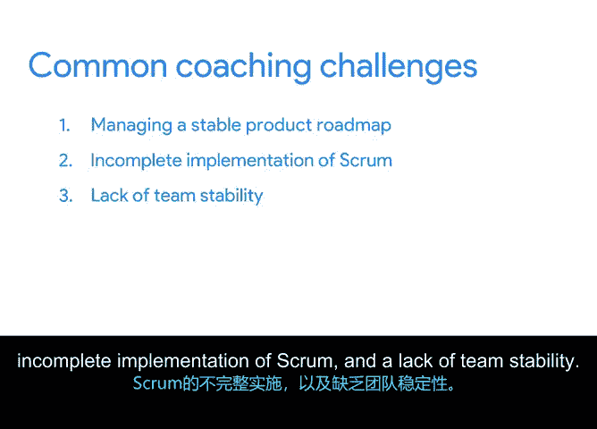

# 042：常见敏捷教练挑战 🧩

在本节课中，我们将探讨敏捷项目经理或Scrum Master在带领团队时可能遇到的三个常见挑战。我们将学习如何识别这些挑战，并掌握应对它们的实用策略。

在之前的课程中，我们讨论了敏捷项目经理或Scrum Master的角色如何类似于教练。我们也探讨了一些帮助敏捷团队提升绩效的方法。本节中，我们来看看在管理一个敏捷团队或项目时，无论是新团队还是成熟团队，你可能会遇到的更多常见教练挑战。我们将重点关注的三个挑战是：管理稳定的产品路线图、Scrum实施不完整以及团队内部缺乏稳定性。

## 管理稳定的产品路线图 🗺️

敏捷项目几乎总会经历产品路线图的变更，能够快速且富有成效地响应这些变化是敏捷的核心价值。然而，过多的变更影响项目也是可能的，这会导致产品路线图不稳定。产品路线图不稳定主要有两个原因：产品野心和产品假设。

首先，我们来谈谈产品野心。当产品领导层对团队实际能交付的内容过于雄心勃勃时，产品野心就会带来挑战。产品负责人负责向客户和高管代表项目，因为他们想让利益相关者满意，所以很容易过度承诺项目能交付的内容。

以下是三个帮助你与产品负责人维持健康路线图管理计划的想法。

*   **预先约定如何处理新机会**：定义何时审查和估算新机会，以及如何对客户或管理层做出承诺。
*   **与整个团队定期进行路线图评审**：至少每季度一次，确保每个人都知道未来的预期。
*   **促进产品负责人与开发团队之间的知识共享**：让产品负责人了解构建产品所需的工作量，并让团队尽早知晓变更。

导致产品路线图不稳定的第二个原因是做出过多产品假设。当项目中存在不确定性时，你可能需要做出一些假设来推动事情前进。但做出太多假设可能会危及团队的成功。

处理产品假设问题的方法是：记录假设并使其透明化。这允许你作为团队讨论这些假设，要么同意它们是安全的假设，要么决定质疑并再次核查它们。如果你决定再次核查，可以使用**无偏见的用户研究**。

**无偏见的用户研究**收集关于用户真实需求的信息，它允许你确认或拒绝假设，并帮助你充满信心地前进。用户研究可能涉及进行问卷调查、组织焦点小组或使用其他方法来收集关于用户的客观数据。

## Scrum实施不完整 ⚙️

接下来你可能遇到的大挑战与Scrum实施不完整有关。当Scrum实践仅被部分实施，或在没有适当支持和指导的情况下实施时，就会发生这种情况。Scrum的角色、工件和活动是设计成一套协同工作的。如果你只部分实施它们，可能会降低其效益。

Scrum实施不完整会导致很多问题。首先，它可能导致角色和职责不清。为了完全实施Scrum，你应该为团队定义角色，然后由特定人员担任这些角色。其次，你可能会为了节省时间而跳过某些事件或将它们合并。但缺乏明确的冲刺评审、冲刺回顾和冲刺计划界限，会导致透明度、检视和适应的减少，而这些对于充分体验Scrum的益处至关重要。最后，没有为团队提供所需的Scrum指导也意味着你没有履行好Scrum Master的职责。

所有这些挑战的解决方案是完全实施Scrum。担任Scrum Master是一个关键角色。你是教练，因此应该强化团队活动与Scrum及敏捷价值观之间的联系。例如，如果你的团队抱怨每日站会，提醒他们站会的目的是获取反馈、解除工作阻碍、寻求帮助，并强调专注于冲刺目标的重要性。

你还可以确保角色定义明确并得到妥善履行。例如，确保所有团队成员理解自己的角色，以及队友的角色和这些角色如何互动。

> 例如，产品负责人确保我们构建正确的东西，开发团队确保我们正确地构建它，而Scrum Master确保我们快速地构建它。

## 团队缺乏稳定性 🤝

最后，你在敏捷和Scrum团队中可能遇到的大挑战是团队缺乏稳定性。当团队人员频繁变动时，会使事情变得不可预测并扰乱工作流程。

你可以采取以下几项措施来解决团队的不稳定性问题。

*   **为新团队成员建立快速入职流程**：帮助他们了解团队其他成员并理解项目。
*   **采用结对编程风格**：让新团队成员与一位同事搭档，在工作中开始学习。如果有人离开团队，这也很有帮助，因为搭档应该能够接手他们未完成的工作。
*   **如果因成员不断离开而导致团队构成变化，尝试采用更短的冲刺周期**：这样，团队成员可以在离开前完成他们最后一个冲刺周期的工作。

## 总结 📝

本节课中我们一起学习了敏捷项目管理中的三个主要挑战：管理稳定的产品路线图、Scrum实施不完整以及团队缺乏稳定性。我们探讨了每个挑战的成因，并提供了具体的应对策略，例如通过透明化管理和用户研究来稳定路线图，通过完全实施和明确角色来贯彻Scrum，以及通过快速入职和调整工作节奏来增强团队稳定性。敏捷的魅力在于拥有一个庞大的社区乐于提供帮助。即使是经验丰富的敏捷实践者，也不时需要寻求帮助。在接下来的课程中，我们将探索敏捷如何不断演进并与时俱进。