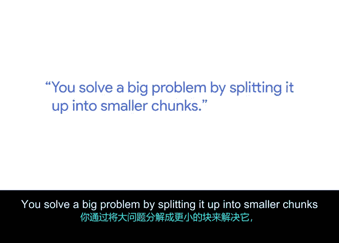

# 044：我对敏捷的思考 🧠

在本节课中，我们将跟随谷歌的SRE工程师Jez，探讨敏捷与DevOps的核心思想。我们将了解如何通过分解复杂问题、持续迭代并拥抱错误来高效工作。

---

我的名字是Jez，我是谷歌的一名站点可靠性工程师。我的工作是确保谷歌的系统保持在线且可靠。那么，对于刚接触敏捷和DevOps的人，我会告诉他们什么才是核心，以及如何做才能高效？

从根本上说，敏捷和DevOps是关于**解决复杂问题**的。

你通过将一个大问题分解成更小的部分来解决它。

然后，找出哪些部分可以优先交付，以便**最大化你获得的信息**，这将帮助你解决更大的问题。

接着，不断迭代并持续这样做。

你不仅会发现如何更好地解决问题，从而真正改善用户的生活，让他们在工作中更出色。

你还会发现如何做到这一点，比如什么样的流程最有效。我们的目标是解决用户的问题。😊

你去研究如何实现它。

在过去大约10年里，我观察到的是：将流程的前端（即规划过程）引入团队，将流程的后端（即发布和运维部分）也引入团队。

然后，让这一切都**非常虔诚地以用户为中心**。我们如何让一切都以用户为中心，并将这一点也融入团队？我认为，这是一次巨大的转变。

我们离完成这个转变还有很长的路要走。

关于敏捷成功的另一个关键点，我认为人们谈论得很多，但并未充分内化的是：**你将会犯很多错误**。😡

尤其是作为一个新人，你会犯很多错误。这没关系。如果你不犯错，就无法学习。

首先，不要期望你第一次、第二次甚至永远都能做对。我至今仍经常犯错。实际上，在我参与敏捷的15年里，我见证了它在全球各种不同类型组织中的大量演变。

你知道它是有效的。😊

---

## 总结

本节课中，我们一起学习了Jez对敏捷的深刻思考。核心在于将复杂问题**分解**为小块，通过**优先交付**来快速学习，并**持续迭代**。同时，成功的关键是拥抱**以用户为中心**的思维，并坦然接受**犯错是学习过程**中必不可少的一部分。敏捷是一个持续演进的过程，而非一蹴而就的终点。