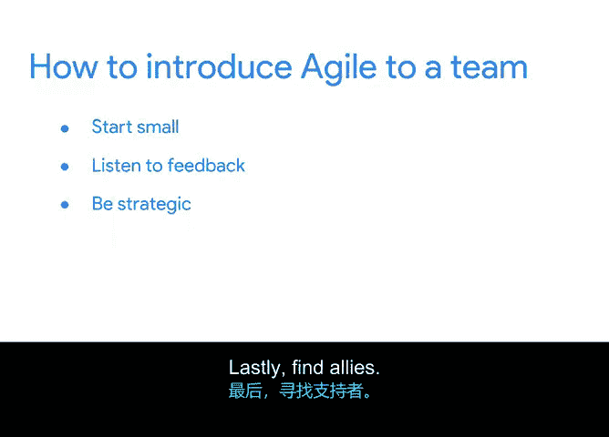

# 045：敏捷项目管理机遇 🚀

在本节课中，我们将探讨敏捷项目管理的职业机遇，并学习如何在求职面试中脱颖而出，以及如何将敏捷实践成功引入你现有的团队或组织。

上一节我们介绍了敏捷方法的演变及其在不同组织中的应用。本节中，我们来看看如何抓住敏捷项目管理的机遇，无论是寻找新职位还是改进现有工作方式。

## 寻找敏捷项目管理职位

敏捷项目管理相关的职位在招聘平台上可能以多种形式出现，例如：
*   **敏捷项目经理**
*   **Scrum Master**
*   **IT敏捷项目经理**
*   **DevOps项目经理**

完成本课程后，你将能很好地胜任这些职位。寻找职位时，应考虑以下几点：
*   寻找与你的经验水平相匹配的职位。
*   寻找能与你所在行业领域专长相辅相成的职位。
*   寻找能提供成长机会的职位。
*   寻找与你个人契合的公司文化。
*   至关重要的是，寻找支持你个人目标和成长的雇主。

## 面试技巧：如何脱颖而出

作为谷歌的招聘经理，我面试过许多项目经理。即使候选人简历上没有明确提及“敏捷”经验，我也会通过几个关键问题来评估他们的理解。

**首先，我会问：“敏捷项目管理和瀑布式项目管理有什么区别？”**

候选人的回答能立刻让我了解他们是否理解敏捷的核心。在回答中，我关注以下几点：
*   候选人是否知道敏捷不仅仅是Scrum、冲刺和站会，还包含其核心价值观，如**客户协作、价值交付和自组织团队**。
*   候选人是否将瀑布式方法贬低为最差的方案，还是理解所有项目都能从某些方法（包括瀑布式）中受益，例如**明确的需求、风险管理和利益相关者意识**。

**其次，我会问：“你如何判断一个项目何时适合采用敏捷方法或框架？”**

这个问题的答案能帮助我了解候选人是否理解敏捷或Scrum如何帮助项目经理应对特定挑战，以及这些挑战是什么。

**最后，我会问：“如果你的团队对遵循Scrum或敏捷实践有抵触情绪，你如何说服他们尝试？”**

这个问题的答案有助于我了解候选人如何运用沟通和影响力技巧，以及他们是否真正相信团队可以自组织。在谷歌，团队有时会抵触被命令做事，因为这可能抑制创新和创造力。因此，我希望招聘那些能与团队协作，而非强迫他们按特定方式行事的项目经理。

## 向面试官提问：评估公司文化

面试的重要环节是候选人向面试官提问。你可以询问关于职位、面试官的项目管理经验、公司文化以及工作期望的问题。作为敏捷项目经理，你现在知道文化对敏捷项目的成功至关重要。这是一个绝佳的机会，通过提问来判断你是否会喜欢这份工作。

以下是你应该考虑提问的一些问题：
*   管理层对于融合不同项目管理方法的支持度如何？
*   关于这里的文化，我最应该了解的第一件事是什么？
*   我多久能听到一次关于我们用户或客户的需求？
*   如果我担任这个职位，典型的一天会是怎样的？

## 将敏捷引入现有团队

也许你并非在寻找新工作，而是希望将本课程学到的知识带回现有团队。正如我们所讨论的，如果团队文化不支持，将敏捷或Scrum引入新团队通常具有挑战性。

以下是四个有助于你将敏捷引入团队的建议：

**首先，从小处着手。**
你可能对所学的一切感到兴奋，但你的团队可能安于现状。因此，应以“一口大小”的片段引入敏捷实践。
*   可以先使用**看板**来跟踪一个工作流。
*   可以在一个重要里程碑后设立一次**回顾会议**。

**其次，倾听反馈。**
项目经理最强大的工具是倾听团队并与他们站在一起的能力。当你引入变革时，询问团队的感受，获取他们关于如何改进的想法，并将他们纳入你的方法中。这将把你微小的改变放大为团队的巨大成果。

**第三，要有策略。**
将你的改进目标对准团队当前面临的挑战。引入能直接解决团队最大问题的新工作方式。
*   例如，如果你的团队难以可靠地估算工作量，总是陷入紧张赶工模式，也许**相对估算技术**会有所帮助。
*   或者，如果有太多人对产品应该是什么样子发表意见，可以引入一个**产品负责人**角色，以确保功能优先级的一致性。

**最后，寻找盟友。**
你可能会遇到挫折，或者需要依靠支持者将这些想法带回团队。在你的组织或网络中寻找敏捷盟友。这些盟友会在情况艰难时给你建议，并帮助你坚持敏捷的价值观和原则。我们在谷歌建立了一个约60人的志愿者敏捷教练网络，我们总是互相依靠，获取想法和解决方案。

## 总结

本节课中，我们一起学习了如何抓住敏捷项目管理的机遇。我们探讨了如何寻找合适的职位、在面试中展示对敏捷的深刻理解、通过提问评估公司文化，以及通过“从小处着手、倾听反馈、策略性改进、寻找盟友”四个步骤，成功地将敏捷实践引入你现有的团队或组织。现在，你已经掌握了在面试中表现出色并将敏捷成功带入团队所需的所有技巧。