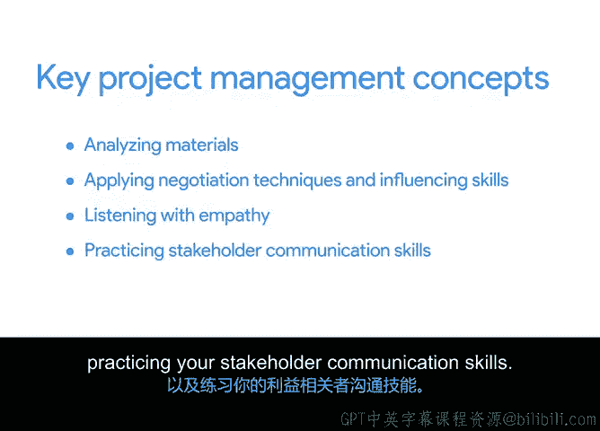

# 001：在现实世界中应用项目管理 🚀

## 概述

在本节课中，我们将学习如何将项目管理知识应用于一个模拟的现实世界场景。我们将跟随一位项目经理，共同规划并执行一个餐厅的平板菜单试点项目，并在此过程中创建一系列实用的项目管理文档。

---

## 课程介绍与背景

大家好，欢迎来到“在现实世界中应用项目管理”课程。

如果你已经完成了本专业证书项目的前续课程，那么你已经建立了坚实的项目管理知识与技能基础。前续课程涵盖了项目如何经历启动、规划、执行和收尾阶段，并教授了如何使用不同的方法论（如敏捷和Scrum）来管理项目。如果你尚未完成前续课程，我们建议你在开始本课程前先学习它们，以确保你已准备好完成所有即将到来的活动。

在本课程中，你将基于一个虚构的场景创建项目文档。你将通过对话、电子邮件和其他材料来了解项目细节，就像在真实场景中一样。到课程结束时，你将拥有一套项目管理文档作品集，用以展示你管理利益相关者和团队、组织计划以及沟通项目细节的能力。这些成果在申请工作或处理当前业务中的项目时都极具价值。

在深入课程之前，请允许我花几分钟介绍一下自己。我叫Dan，是谷歌的一名项目经理，也是本课程的讲师。在谷歌，我所在的团队致力于推动人工智能和机器学习在设计、构建和应用过程中的负责任实践。我支持团队采用工具和技术来评估他们的机器学习模型，并判断其性能是否公平。我热爱这份工作，因为它让我能够支持团队为用户打造有效的产品。

在此之前，我曾任职于谷歌AI驻留计划团队，这是一个面向对AI研究感兴趣但来自非传统背景人士的轮岗项目。这项工作对我很有吸引力，因为在我加入谷歌之前，我个人也完全没有AI或机器学习方面的经验。这恰恰说明，如果你拥有强大的项目管理技能，通常不需要成为特定领域的专家也能在该领域工作。

在加入谷歌之前，我在科技行业之外工作，先是担任数学老师，后来成为一支职业足球队的赞助协调员。在我的整个职业生涯中，我一直对教育充满热情，无论是在教室里教学生，还是教开发人员如何合乎道德地实施AI系统。因此，我非常高兴能带领大家完成这门课程，相信这会是一段有趣的旅程。

---

## 课程核心场景

现在，让我们直接进入将贯穿本课程所有活动的核心场景。

在这个虚构的场景中，一家名为“Sauce and Spoon”的小型连锁餐厅希望实现其年度增长和扩张目标。为实现这些目标，他们决定启动一个试点项目，测试安装新型桌面菜单平板电脑所带来的影响。

新的菜单平板电脑将使餐厅能够在更短的时间内服务更多客人，并提供宝贵的数据，帮助Sauce and Spoon实现其业务目标。公司刚刚聘请了Peter作为其首位内部项目经理，负责监督该平板电脑在连锁餐厅五个地点中的两个进行推广。

在整个课程中，你将观察Peter如何带领她的团队规划和执行项目交付成果。尽管Peter拥有五年的项目管理经验，但她此前从未管理过餐厅项目。你将跟随项目的生命周期，观察Peter了解餐饮行业、确定项目目标、与利益相关者谈判等过程。在此过程中，你将记录项目细节以用于课程活动，并评估Peter在努力按时、按预算、在范围内完成此项目时所展现的项目管理技能。你将学习哪些方法有效、哪些无效，以及如何在项目中解决问题。

---

## 核心概念与实践

随着课程的推进，我们将回顾并实践关键的项目管理概念。上一节我们介绍了课程的整体场景，本节中我们来看看我们将要学习和应用的具体技能。

这些核心概念包括：
*   **分析材料以识别项目需求、解决问题和管理利益相关者。**
*   **应用重要的谈判技巧和影响力技能。**
*   **在与团队合作时进行共情倾听。**
*   **练习你的利益相关者沟通技巧。**

我们将更深入地探讨这些概念，并解释每个概念如何应用于Sauce and Spoon项目。

每个活动都将包含引导性问题，帮助你创建常见的项目文档。这些文档你可以在工作面试中谈论，并在整个职业生涯中使用。在处理这些活动时，你可能需要对学到的一些信息做笔记。请随意使用你喜欢的任何工具，无论是Coursera的笔记系统还是其他方法。

在接下来的视频中，我将更详细地解释这个项目，并分享项目管理的最佳实践，以便你能够完成相关的课程活动。

你准备好了吗？我们开始吧。

---

## 总结

本节课中，我们一起学习了“在现实世界中应用项目管理”课程的概述、背景介绍以及核心实践场景。我们明确了将跟随一个具体的餐厅平板菜单项目，通过模拟真实的工作材料，来实践和巩固项目需求分析、利益相关者管理、谈判沟通等关键技能，并最终形成一套可展示的项目管理文档作品集。