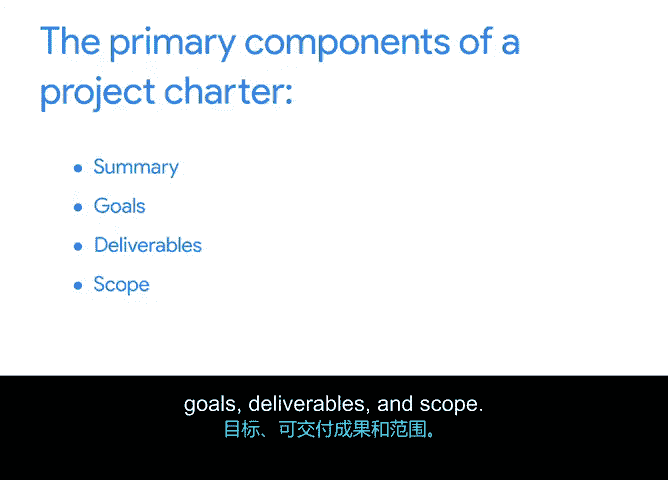

谷歌项目管理专业证书：第6课：项目章程的目的与构成要素 📋

在本节课中，我们将学习如何运用战略思维和有效的商业写作来启动一个项目。我们将分析项目文件和支持材料，以识别项目需求、评估相关方并解决问题。项目章程将作为一个关键工具，用于在相关方之间对齐项目范围与目标。我们还将学习如何运用有效的谈判技巧，与相关方共同确定项目目标的优先级。

---

### 项目章程的目的

项目章程是一份正式文件，它**明确定义项目**，并**概述实现项目目标所需的必要细节**。项目经理在项目生命周期的第一个阶段——启动阶段——创建这份章程。

项目章程能帮助你：
*   组织关键的项目信息。
*   为需要完成的工作创建框架。
*   将这些细节传达给必要的人员。

此外，它在整个项目生命周期中都很有用，因为它可以帮助相关方重新对齐项目的范围、目标和成本。

---

### 项目章程的核心构成要素

项目章程包含关于项目的关键信息，主要包括摘要、目标和可交付成果。

#### 项目摘要

摘要的目的是提供项目概述，并勾勒出你希望达成的目标。摘要应简洁明了，最多几句话，直击要点。

#### 项目目标与可交付成果

*   **项目目标** 指的是项目期望达成的结果。
*   **可交付成果** 指的是具体的任务和有形的产出，它们使团队能够达成项目目标。

通常，项目目标解决的是相关方旨在实现的整体结果，它们由相关方和项目经理的输入共同决定。

**例如**，Sauce & Spoon 餐厅年度增长和扩张目标的一部分，就是启动平板电脑推广项目。而该项目的一个**可交付成果**，是在两家餐厅成功安装可正常工作的平板电脑。

#### 项目范围

项目范围指的是项目的边界。除了范围，章程还包含关于**范围外工作**的信息。那些无助于实现项目目标的细节被视为范围外。

范围在之前的课程中已涉及，我将在后续视频中更详细地讨论它。

---

### 总结与后续

本节课我们一起学习了项目章程。项目章程是一份正式文件，它**明确定义项目**，并**概述实现项目目标所需的必要细节**。项目章程的主要构成要素包括**摘要**、**目标**、**可交付成果**和**范围**。

一份章程还可以包含其他部分，例如预算、成本和成功指标。我将在另一个视频中讨论这些部分。

在接下来的活动中，你将在一个项目章程中，识别并记录 Sauce & Spoon 平板电脑试点项目的项目名称、摘要、目标和可交付成果。完成后，我们将在下一个视频中继续学习关于项目的知识，并向章程中添加更多内容。