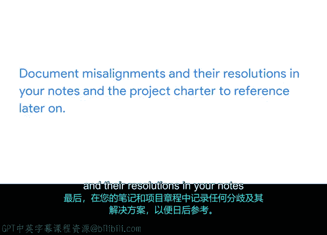

# 003：项目章程与利益相关方对齐 🎯

在本节课中，我们将学习如何利用项目章程作为工具，确保所有利益相关方对项目的范围和目标达成一致。我们将探讨如何识别关键细节、收集反馈、记录分歧及其解决方案，从而为项目的成功奠定坚实基础。

## 识别关键细节与利益相关方

上一节我们介绍了如何为项目章程添加名称、摘要、目标和交付成果。本节中，我们来看看如何识别对利益相关方至关重要的信息。

在沟通项目细节时，你需要考虑受众及其关注的重点。对于项目章程，你的受众是所有关键利益相关方。你需要思考以下问题：

*   **利益相关方是谁？**
*   **哪些细节对他们最重要？**
*   **是否存在他们可能不同意的项目细节？**

识别出你认为重要的细节后，请检查你的章程是否已全部包含。这样，你才能向利益相关方展示章程，并确认所有人对项目信息达成共识。

## 项目章程：定义文件与对齐工具

除了作为定义项目的正式文件，项目章程也是一个**对齐工具**。这里的“对齐”指两方或多方之间达成一致。

项目失败的常见原因之一是利益相关方之间对项目细节存在**分歧**。当你与利益相关方对项目的愿景不同时，也可能产生分歧。这就是为什么在工作开始前与利益相关方达成一致至关重要。

利益相关方通常不参与项目执行的日常任务，因此在启动阶段花时间创建一份清晰阐述项目关键细节的章程，有助于确保团队朝着所有利益相关方（而非部分）期望的结果努力。

## 在启动阶段解决分歧

启动阶段通常是调整项目最理想的时机。随着项目进入规划和执行阶段，实质性变更可能需要撤销已完成的工作。因此，在项目生命周期的早期阶段，你不应害怕进行调整。

以下是可能出现分歧的示例：假设你在讨论“Sauce and Spoon”项目的主要目标。一位利益相关方的愿景是最终能通过平板电脑完全自动化点餐体验。而另一位利益相关方的目标不同，他们不追求完全自动化，而是希望通过平板电脑推广项目来提高点餐准确性。

为了帮助解决这种情况，项目经理可以促进两位利益相关方之间的讨论，以达成共识，确认项目目标的对齐。

## 收集反馈与记录决议

当你向利益相关方展示项目章程时，收集反馈并识别分歧点非常重要。然后，你可以进行修改以解决这些分歧。如果你和利益相关方在早期花时间明确定义项目，那么在项目结束时，你更有可能交付利益相关方期望的成果。

作为项目经理，记录收到的反馈以及任何分歧及其解决方案至关重要。这让你和项目团队可以在以后参考这些决策。

记录分歧和解决方案的一种方法是创建一个带有**时间戳**的附录，用于记录新增或更新的信息。**附录**是文档末尾的附加内容部分。**时间戳**包括新内容创建或添加到文档的日期，有时还包括具体时间。

## 核心要点回顾

*   沟通项目细节时，始终需要考虑受众及其关注的重点信息。
*   对于项目章程，你的受众由利益相关方组成。
*   项目失败的常见原因是利益相关方之间对项目细节存在分歧。
*   在启动阶段花时间创建清晰阐述项目关键细节的章程，并在工作开始前与利益相关方达成一致，这至关重要。
*   最后，在你的笔记和项目章程中记录任何分歧及其解决方案，以备日后参考。

## 总结与下一步

本节课中，我们一起学习了如何利用项目章程确保利益相关方对齐，包括识别关键细节、理解章程作为对齐工具的作用、在启动阶段解决分歧，以及记录反馈和决议。

在接下来的活动中，你将审阅辅助材料，观察Peter如何引导利益相关方对话，以就项目章程细节达成一致。然后，你将根据学到的新信息，编辑你的项目章程摘要、目标和交付成果。这项活动将展示你从对话中选取与撰写完善项目章程相关关键细节的能力。你还将有机会观察和学习Peter如何引导对话达成共识。完成活动后，我们下一视频再见。