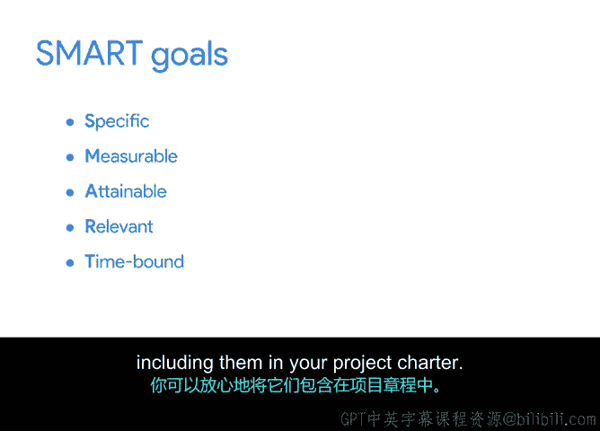

# 004：起草项目章程中的SMART目标 🎯

在本节课程中，我们将学习如何为项目章程中的目标增加具体性，并运用SMART方法来制定清晰、可衡量的项目目标。掌握这项技能对于确保项目成功至关重要。

## 概述：明确目标的重要性

在项目启动阶段，目标可能较为宽泛，因为并非所有细节都已确定。虽然宽泛的目标是可以接受的，但尽可能增加具体性会更有帮助。这是因为在早期澄清项目目标有助于避免误解，并更清晰地理解项目范围、预算和时间线。项目目标是项目的期望成果，勾勒清晰、具体的目标是创建有效项目章程的重要步骤，也是启动成功项目的关键。

## 从模糊目标到清晰目标

在项目经理的职业生涯中，你可能会遇到利益相关者仅模糊描述项目期望成果的情况。例如，利益相关者可能表示希望更多客户使用某项服务，或希望销售更多特定产品。这些是很好的目标，但不够具体。你不知道需要多少客户、何种客户或多少产品才能达成目标。

作为项目经理，你的职责是确保项目目标定义明确，以便你和团队拥有清晰的路线图。这不仅有助于集中精力，还能避免未来的时间浪费和沟通不畅。

## 引入SMART方法

你可以借助我们在本课程中讨论过的SMART方法来创建清晰的目标。SMART方法帮助你将项目目标转化为SMART目标。这意味着你的目标应是：
*   **具体的**
*   **可衡量的**
*   **可实现的**
*   **相关的**
*   **有时限的**

这些特性可以帮助你更准确地衡量成功，并允许你在过程中进行更精确的调整。

以下是确保你的项目目标同时也是SMART目标的一些最佳实践。

### 如何使目标更具体

为了使目标更具体，请确保它能回答诸如“我要实现什么”以及“此目标的要求和约束是什么”等问题。

一个增加目标具体性的技巧是：在你的目标中寻找可能具有主观性或基于意见的词语，例如“更大”、“更好”或“更快”。一旦识别出主观词语，就与利益相关者沟通，就“更大”、“更好”或“更快”的实际含义达成一致的定义。在实践中，“更大”或“更好”意味着什么？“更快”具体要快多少？

### 如何使目标可衡量

SMART方法通过使目标可衡量来帮助你使其更具体。例如，如果你的利益相关者希望增加公司利润，请问他们希望增加多少——5%还是30%？在你的目标中添加数字和数值，可以让你更容易知道何时实现了目标。

如果你在使目标可衡量方面遇到困难，可以研究你所在行业的其他人如何量化成功。这称为**基准测试**，指的是根据标准评估成功。例如，餐饮业有很多衡量成功的方法。你可以在线搜索诸如“餐厅如何衡量成功”或“如何评估员工培训课程”之类的信息。你可能会找到许多结果，一些常见的指标包括：
*   **翻台率**：客人平均在餐桌停留的时间。
*   **主要成本**：劳动力成本加上商品（如食物和饮料）的总成本。
*   **平均账单金额**：客人在一顿饭上平均花费的金额。

大多数行业，从酒店业到娱乐业再到建筑业，都有自己衡量成功的指标。科技行业也不例外，指标是我们在谷歌衡量成功的重要组成部分。

### 确保目标可实现且相关

SMART目标也应是**可实现的**，这意味着目标具有挑战性，但并非不可能完成。问问自己和团队：它能完成吗？你是否有时间、资源和人员在预算内按时完成目标？如果没有，你需要对目标进行一些调整。

所有项目目标都应该是**相关的**。问问自己：作为公司或项目团队，追求这个目标有意义吗？确定项目目标相关性的一个最佳实践是注意你的项目目标与公司或组织更广泛目标的契合程度。

在谷歌，我们使用一种称为**目标与关键成果**的工具进行组织范围内的目标设定。其他组织可能使用不同的术语来描述他们自己的目标设定。对我们来说，OKR结合了目标和指标来确定可衡量的结果。例如，Sauce and Spoon餐厅更广泛的目标之一是为其社区的工作家庭提供新鲜、快捷的食物。因此，Sauce and Spoon平板电脑推广项目的一个相关目标可能是在实施后的前六周内，将客户结账时间平均减少10%。这个项目目标有助于该连锁餐厅实现为客人提供快捷餐食的更大目标。

### 为目标设定时限

SMART框架的最后一部分是使你的目标**有时限**。你需要在目标中添加截止日期，以便知道它应该在何时完成。

## 总结与后续步骤

让我们回顾一下。SMART代表具体、可衡量、可实现、相关和有时限。如果你的目标是SMART的，你就可以自信地将它们纳入你的项目章程。

在接下来的活动中，你将从辅助材料中收集信息，以帮助你将起草的目标转化为SMART目标。你还将识别任何额外的目标，并将其添加到项目章程中。

准备好开始了吗？让我们开始活动吧。然后，在下一个视频中与我见面，讨论范围、收益和成本。