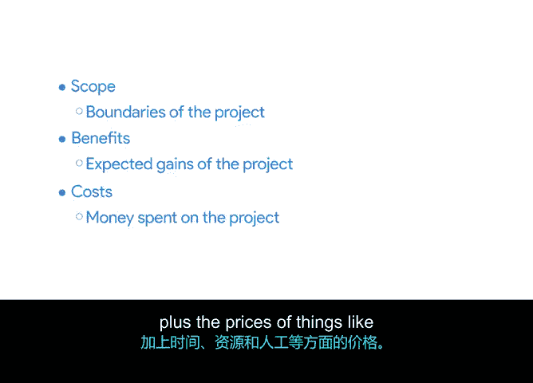

# 005：项目章程中的范围、效益与成本 📋

## 概述
在本节课程中，我们将学习如何为项目章程定义三个关键要素：**范围**、**效益**与**成本**。你将了解如何识别并记录这些信息，以确保与所有利益相关者达成共识，并为项目的成功奠定基础。

---

欢迎回来。在更新了项目章程并将部分项目目标优化为SMART目标后，现在该讨论范围、效益和成本了。

接下来，我们将探讨在项目章程中添加这些项目时需要考虑的事项。看完本视频后，你将审阅新的辅助材料，并运用所学知识来识别效益和成本，然后将它们添加到你的章程中。

现在，让我们开始吧。

### 考虑你的受众
在考虑项目章程应包含哪些信息时，始终需要思考其主要阅读对象。

由于创建项目章程的目标是与利益相关者沟通，因此他们就是你的主要受众。举个例子：如果你知道项目的某个效益对某位关键利益相关者特别有吸引力，你就需要在项目章程中强调这个效益。

阅读你章程的利益相关者后续可能不会看到更详细的项目计划或其他文件，因此在项目细节仍在最终确定时，现在就关键要素达成共识非常重要。

你已经识别并希望解决了关于项目愿景和目标的所有不一致之处。接下来，你需要与利益相关者就**范围**、**效益**和**成本**达成一致。

### 定义项目范围
我们之前讨论过范围，但快速回顾一下：**范围指的是项目的边界**。例如，参与试点的餐厅数量。

与项目目标无关的细节被视为**超出范围**。

要确定什么在范围内、什么在范围外，请思考实现项目目标需要什么。请牢记以下问题：
*   你的利益相关者对哪些项目细节已达成一致，可被视为在范围内？
*   你的利益相关者对任何要素存在分歧吗？
*   是否有任何细节应被指定为**本项目**的范围之外？

在思考这些问题时，请记录你的发现，并在接下来的活动中完成项目章程的范围部分时参考它们。

### 识别项目效益与成本
确定了项目范围后，你需要关注项目效益和成本。

*   **效益** 是项目的预期收益。这些可以是直接的货币收益，也可以是间接效益，例如客户参与度或满意度的提升。
*   **成本** 指的是花在项目任务上的资金，以及时间、资源和人力等事物的代价。成本可以通过**项目预算**来评估和管理。**预算是对分配给完成项目的资金数额的估算**。

在接下来的活动中，你需要审阅辅助材料，并记录有助于识别平板电脑推广项目的效益和成本的细节。

你将利用这些信息在项目章程中添加两个列表：**效益列表**和**成本列表**。通常，你可以在商业案例或项目提案中找到项目将带来的效益。

例如，你的平板电脑推广效益列表可能包括其**加快服务速度**和**预计将销售额提高X%** 的潜力。

另一个效益可能是：平板电脑将为餐厅提供清晰的客户点餐数据点，以及一个集成的销售点系统，以帮助指导未来的决策。

效益列表可以帮助你识别可能遗漏的潜在项目目标。

成本列表将包含组织为完成工作而必须支付的款项，例如**人力或材料的费用**。列出成本有助于你的利益相关者权衡效益与实现这些效益所需的资金。

你可以通过与利益相关者合作，获取对人力、材料以及项目期间可能让企业花钱的任何其他因素的估算，来构建成本列表。

之前我提到过，项目的效益应该大于成本。在项目启动或提议时，这几乎总是成立的。

当你将这些细节添加到章程中时，有助于将它们集中展示，并使成本和效益对利益相关者来说一目了然。这个部分经常被用来帮助确保利益相关者同意，值得投入资金来推进这个项目。

### 总结
好了，让我们回顾一下：
*   **范围** 指的是项目的边界。
*   **效益** 指的是项目的预期收益。
*   **成本** 指的是花在项目任务上的资金，加上时间、资源和人力等事物的代价。

---

准备好回到你的项目章程了吗？请前往活动环节，在那里你将审阅和分析辅助材料，为“Sauce & Spoon”平板电脑推广项目确定合适的范围、效益和成本。

然后，我们下一个视频见，我们将讨论与利益相关者谈判的技巧。

再见。