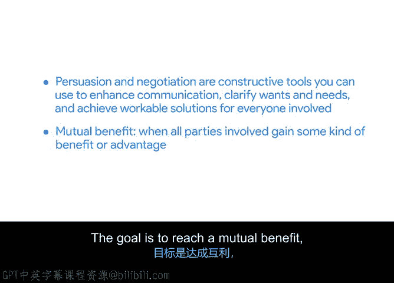

# 008：寻求互利解决方案 🎯

在本节课中，我们将学习如何在项目管理中运用说服与谈判技巧，以寻求对各方都有利的解决方案。我们将探讨如何将冲突转化为共识，并通过理解项目优先级来达成共赢。

## 概述

上一节我们介绍了利益相关者分析，并识别了谁对项目成果拥有最大的权力、影响力和兴趣。更好地理解那些将评估你项目成功与否的人，能让你更容易地制定最佳沟通策略并获得所需支持。本节中，我们来看看如何成功地与利益相关者进行谈判。

## 谈判与说服：建设性工具

作为项目经理，你掌握了许多有用的工具。但即使是最熟练的谈判者，也需要在实践中运用其技能，以满足项目目标并获得利益相关者的满意。

有时，你可能需要就项目目标或范围的敏感方面进行谈判，或者利益相关者之间可能存在分歧，又或者你可能不同意利益相关者的某些要求。这时，你需要运用谈判技巧，将分歧从僵局推向解决方案。

以下是谈判中需要牢记的几个关键点：
*   **视对方为合作伙伴**：将与你谈判的人视为同事和伙伴，而非对手。这正是进行利益相关者分析的目的——了解他们作为拥有自己工作和职责的个体，以及作为希望项目成功的合作伙伴。
*   **解决冲突**：当利益相关者之间出现冲突或分歧时，解决这些挑战、在利益相关者群体中建立共识并缓和冲突，符合你的最佳利益。
*   **寻求互利**：实现这一目标的一种方法是寻找互利的解决方案。

## 什么是互利？

**互利**是指所有相关方都能获得某种利益或优势。

例如，假设在为一个项目招聘多少人方面存在分歧。你想招聘5人，但一位利益相关者希望将人数限制在3人。一个能提供互利的解决方案可能是安装自动化软件来处理部分工作。或者，另一个解决方案可能是调整时间线或期望值，从而无需5人也能达到项目目标。这样，利益相关者得到了他们期望的较小团队规模，而你也能用更少的人完成任务。

此处的目标是达成一个**最大化利益、最小化损失且对所有人都公平**的解决方案。请集思广益，想出所有符合此标准的可能选项。这样，在谈判时，你就能提出多种替代方案，并选择一个在某种程度上对所有人都有利的方案。

## 明确优先级与权衡

尽管你希望满足利益相关者，但思考你愿意做出哪些**权衡**同样重要。要成功做到这一点，你需要清楚了解项目的优先级。你必须知道在范围、时间线和预算方面，什么是最重要的。

例如，如果有一个必须满足的特定截止日期，那么你需要就任何可能导致项目超过该期限的范围变更进行谈判。如果产品需要具备特定的外观或功能，那么需求就是最高优先级，你可以就预算或时间线的某些方面进行谈判，以遵守范围要求。

一个用于确定优先级的常用工具是**三重约束模型**或**铁三角**，我们在之前的课程中已经介绍过。三重约束将帮助你判断项目请求是否可接受，以及它将产生什么影响。

## 总结

本节课中，我们一起学习了如何将说服与谈判作为建设性工具，以加强沟通、澄清需求并为所有相关方达成可行的解决方案。我们的目标是实现**互利**，即所有相关方都能获得某种利益或优势。

## 下一步

接下来，你将准备就项目范围进行谈判。为此，你需要识别互利点，并评估在范围上妥协的影响。完成后，我们将在下一个视频中再见。