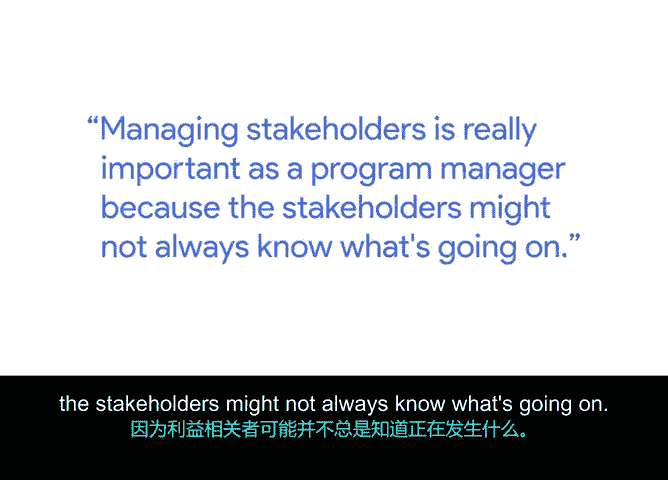

# 009：在现实世界中应用项目管理 🎯

## 概述
在本节课中，我们将通过一个真实案例，学习如何在项目执行过程中管理利益相关方提出的范围变更。我们将探讨变更发生的原因、应对策略以及如何通过有效沟通和优先级排序来平衡各方需求，确保项目成功。

---

## 09_01_06：斯坦顿谈管理利益相关方的范围变更

大家好，我是斯坦顿，目前是YouTube的一名项目经理。项目经理通常需要处理多个不同的项目，并将它们整合成一个完整的项目集，以便人们随时了解项目进展，无论是开发阶段、产品需求还是测试环节。所有这些环节都需要协同工作，项目才能顺利推进。

范围变更可能在任何时候发生。根据我的经验，变更常常在意想不到的时候出现，通常就在项目即将发布之前。接下来，我将分享一个在加入YouTube之前，我在一家初创公司工作时遇到的真实案例。

我们当时正在开发一款与**体脂率管理**相关的新应用程序。作为项目经理，管理利益相关方至关重要，因为他们可能并不总是清楚项目的具体进展。

在我们的案例中，公司的首席执行官非常关注产品发布，他已经在筹划相关的公关、市场宣传以及上线后的各项公告。然而，在发布前夕，他看到了应用中的图表展示部分，并强烈希望对此进行修改。这种情况在实际工作中很常见，你可能会在最后一刻接到变更需求。

面对这种情况，我们需要找到一些方法，确保客户或利益相关方对我们最终交付的成果感到满意。以下是我们的处理步骤。

### 应对范围变更的步骤
当面临利益相关方提出的紧急变更时，可以遵循以下流程来妥善处理。

1.  **评估变更影响**：我们首先回到开发团队，评估进行这项修改所需的时间。评估结果显示，完成修改所需的时间远远超出了我们原定的时间线。
2.  **制定备选方案**：由于发布日期已经确定，我们无法在发布前完成所有他想要的更改。因此，我们提出了几个不同的方案。
3.  **协商与达成共识**：我们最终通过协商达成一致：在发布时，产品将保持当前状态；但根据我们收到的时间评估，我们可以在发布后的两周内完成修改，并通过一次小版本来实现这个变更。这应该不会造成大问题，只是在初始发布后的一次更新。

### 管理优先级与资源
上一节我们介绍了如何通过协商处理紧急变更，本节中我们来看看如何系统性地管理项目任务的优先级。

当与利益相关方打交道时，他们总会对某些任务有更高的期望。因此，在管理项目范围时，尤其是面对临时的变更请求，你可以尝试在既定优先级框架内，对任务进行**重新排序**。

需要特别注意和警惕的一点是：**没有免费的资源**。如果项目范围发生变更，你必须回头审视整体的优先级，明确哪些原有任务会因为新任务的加入而被推迟。利益相关方之所以找你，是因为你作为项目经理或项目集经理，最了解项目的实际情况。我认为，这正是你在这个角色中所拥有的影响力和价值所在。

---

## 总结
本节课中，我们一起学习了如何处理利益相关方驱动的范围变更。关键要点包括：及时评估变更影响、主动提出备选方案、通过有效沟通进行协商，以及始终在资源有限的约束下对项目任务进行优先级排序。掌握这些技能，能帮助你在现实的项目管理工作中，更从容地应对变化，引导项目走向成功。