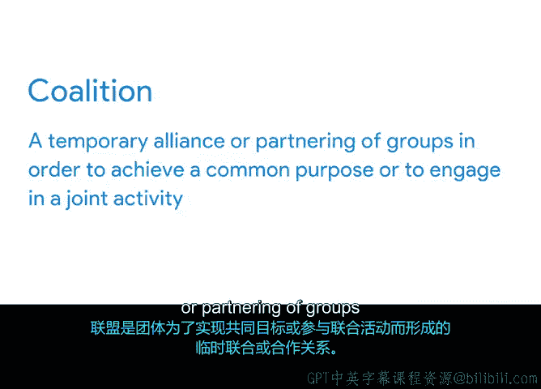

# 010：在谈判中运用影响力

## 概述
在本节课中，我们将学习如何在项目管理的现实场景中，特别是在与利益相关者谈判时，有效地运用影响力。我们将重点探讨如何通过建立联盟来增强你的谈判立场，并学习如何识别和邀请合适的利益相关者加入你的联盟。

## 谈判准备与影响力基础
上一节我们讨论了识别共同利益及其对项目范围、时间线和预算的影响。本节中，我们来看看如何在谈判中实际运用影响力和建设性的力量。

影响力是有效项目管理的核心要素。J. Conger博士提出了有效施加影响力的四个步骤：
1.  **建立可信度**
2.  **寻找共同立场**
3.  **提供证据**
4.  **建立情感连接**

## 建立联盟：一种关键的影响力策略
应用以上四个步骤的一个有效方法是组建一个**联盟**。

**联盟**是指个人或团体为实现共同目标或参与联合活动而建立的临时同盟或伙伴关系。

当两个或更多人共同倡导一个想法时，他们所能施加的影响力远大于单打独斗。与合适的群体组建联盟，是一种强大而有效的谈判技巧。

### 如何组建有效联盟
一个有效的联盟需要包含在权力和利益方面具有恰当组合的人员。换句话说，你需要识别那些能通过其在项目主题上的既得利益和专业知识来帮助你实现目标的人。同时，你也需要平衡联盟，纳入组织中拥有较高权力、能帮助影响和推动事务的人员。

**利益相关者分析**是指导联盟建设的一个有用工具。

以下是组建联盟时需要考虑的关键点：
*   **提升可信度**：通过让支持你目标的人参与进来。
*   **寻找共同立场**：联盟成员可以帮助你找到共同点。
*   **提供证据**：联盟可以汇集更多支持性证据。
*   **建立情感连接**：可以纳入那些与利益相关者有良好关系，或深刻理解利益相关者及其目标的人。

## 邀请加入联盟的实践步骤
一旦确定了适合加入联盟的人选，下一步就是联系他们并寻求支持。一个很好的方式是通过一封精心撰写的邮件，当然你也可以当面或通过电话提出请求，选择你认为最合适的方式。

当你提出请求时，需要清晰地说明以下几点：
1.  你试图解决的问题。
2.  正在谈判的是项目的哪个方面。
3.  询问他们是否考虑支持你的立场或解决方案，并阐明你的立场是什么。

同时，务必提及你识别出的该人员的权力来源或利益所在。例如，如果你正在谈判项目的时间安排，你可以这样说：“启动时间将影响营业时间，而您全年管理餐厅项目的经验，对于解释为何需要重新考虑这个因素会非常有帮助。”

这能让对方知道你重视他们，理解此事对他们的影响，以及你认为他们能为你提供哪些具体的帮助。

## 总结
本节课中我们一起学习了：
*   **影响力**是项目管理的重要组成部分。
*   有效施加影响力的四个步骤：**建立可信度**、**寻找共同立场**、**提供证据**、**建立情感连接**。
*   获得影响力的一种方法是**组建联盟**，即为实现共同目标而建立的临时伙伴关系。
*   一个有效的联盟需要包含权力和利益组合恰当的人员。在组建联盟和影响联盟成员时，需要发挥这些优势。

很好，现在你已经为未来的谈判做好了准备。接下来，你将运用所学的联盟建设知识，撰写一封有说服力的邮件，来影响这些利益相关者加入联盟。完成后，我们下一个视频见。😊