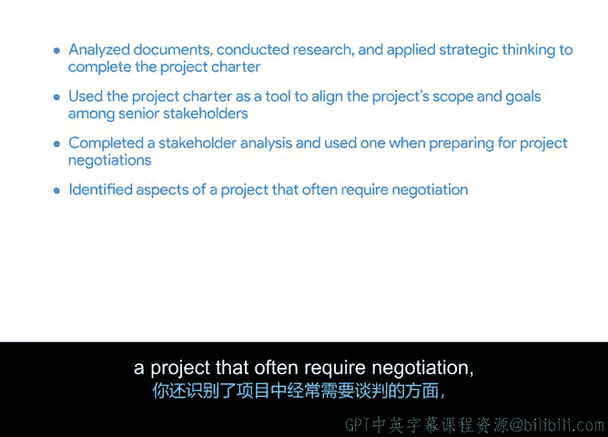

# 011：总结与回顾

在本节课中，我们一起学习了项目启动阶段的核心技能。现在，让我们回顾一下你在此部分所完成的学习内容。

你首先通过分析文档、进行研究和应用战略思维，完成了So和Sp公司平板电脑推广项目的**项目章程**。

接下来，你将项目章程作为工具，用于在关键相关方之间就项目的**范围**和**目标**达成一致。

然后，你完成了自己的**相关方分析**，并学习了如何在准备项目谈判时使用它。

你还识别了项目中通常需要谈判的方面，以及那些能够提供利益、从而支持达成对所有相关方都有利的**互利协议**的方面。

最后，你应用了对**权力**和**利益**的理解，识别出可以组成**联盟**的人员，旨在说服相关方接受特定观点。

在任何项目中，**定义细节并使相关方达成一致**、**谈判项目范围和目标**以及**能够有效影响他人**，对于成功启动项目至关重要。

正是在项目开始阶段，你需要明确项目旨在实现的目标。这样，你才能准确跟踪项目进展，并确信自己在允许的**时间框架**和**预算**内开展工作。

练习这些概念、创建项目文档并应用这些知识，将帮助你为求职面试做好准备，并成为一名优秀的项目经理。

在接下来的课程中，你将跟随项目经理PE，继续学习她在Sa和Spod公司的项目管理经验。

在即将进行的活动中，你将基于此处完成的工作，进入项目的**规划阶段**，构建包含任务和里程碑的**项目计划**。

我们下一阶段再见。