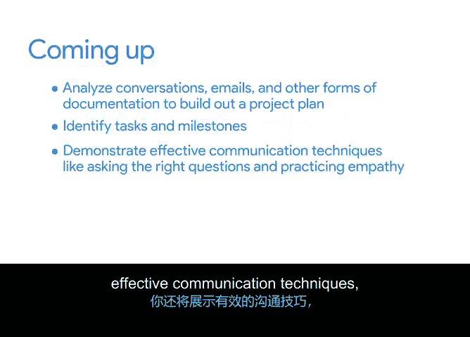

# 012：构建项目计划引言

欢迎回来。到目前为止，你应该已经为“Sauce and Spoons”餐厅的平板电脑推广项目完成了项目章程。

项目章程能帮助你组织关键的项目信息，为需要完成的工作创建框架，并将这些细节传达给必要的人员。

项目章程创建并确认后，你将用它来启动项目规划阶段。在接下来的活动中，我们将从项目生命周期的启动阶段进入规划阶段。

在这里，你将运用你的知识和技能来制定项目计划。项目计划是项目经理在规划阶段构建的核心产出物。

大多数项目都会在这个产出物中捕获需求。因此，你为“Sauce and Spoon”构建的项目计划将成为你项目管理作品集的关键部分。

它将展示你将一个大型项目分解为一组可实现的、较小任务的能力。

在我们开始之前，让我们回顾一下项目背景。

“Sauce and Spoon”是一个规模不大但正在发展的连锁餐厅，拥有五家分店。他们聘请了Peter作为首位内部项目经理，负责在两家分店试点推出桌面平板电脑菜单。

在整个课程中，你将观察Peter如何努力在范围、时间和预算内完成这个项目。你将根据这个场景创建项目管理文档，就像你是项目经理一样。

在处理这些材料时，你可能需要记录项目细节，以便完成一些活动。你创建的项目管理文档将通过将其应用于真实场景来帮助你练习技能。

这些文档也将为你提供一个作品集，供你在未来的工作面试中展示。

在接下来的系列活动中，你将分析对话、电子邮件和其他形式的文档，以构建项目计划。

随着课程的继续，你将识别“Sauce and Spoon”平板电脑推广项目中的任务和里程碑。

你还将展示有效的沟通技巧，例如提出正确的问题和练习同理心。

这将帮助你为每项任务做出准确的时间估算。准备好开始了吗？我们下一个视频见。