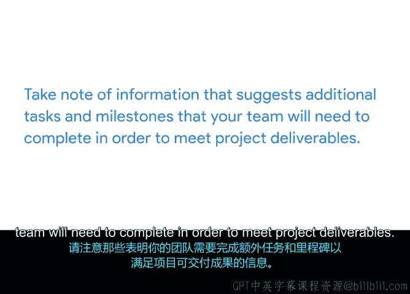

# 013：识别项目任务分析文档 📋

在本视频中，我们将学习如何分析项目文档，包括来自过往项目的文件，以识别新项目的任务。这些文档可能包括项目章程、电子邮件和旧的项目计划，这些在你加入新组织或切换到新项目时，企业可能已经具备。在接下来的活动中，你将开始为“Sauce and Spoon”餐厅的平板电脑推广项目构建项目计划，通过将项目任务添加到一个电子表格中，该表格将作为你的项目计划。建议你使用提供的项目计划模板来开始你的文档，但也可以创建自己的电子表格或使用你偏好的项目管理软件。

## 项目计划的目的与功能

首先，我们来回顾项目计划的目的和功能。项目计划对任何项目，无论大小，都非常有用，因为它帮助你记录**范围、任务、里程碑、预算和整体活动**，以确保项目保持在正轨上。

项目计划的核心是**项目进度表**。进度表是你估算项目任务时间、确定里程碑以及监控项目整体进展的指南。

作为项目经理，你的主要工作之一是识别所有项目任务，估算每项任务所需的时间，并跟踪每项任务的进展。

## 如何首次向计划中添加任务和里程碑

那么，你如何首次向计划中添加任务和里程碑呢？我做的第一件事是审查项目章程中的目标和可交付成果。然后，我列出所有与任务或里程碑相关的项目。

作为提醒，**里程碑**是进度表中指示进展的重要节点。它们通常标志着可交付成果或项目阶段的完成。而**项目任务**指的是需要在规定时间内完成的活动。它们根据每个团队成员的职责和技能分配给不同的人。

为了达到一个里程碑，你和你的团队必须完成某些任务。例如，“Sauce and Spoon”项目的一个可交付成果是通过桌牌和电子邮件群发来推广新的平板电脑菜单。在这种情况下，一个里程碑可能是这个可交付成果的完成，包括获得营销材料最终版本的批准以及确认电子邮件群发日期所需的所有任务。其中一些任务可能包括撰写不同营销材料的多个草稿、生成电子邮件列表，以及编程在正确日期发送电子邮件。

对于每个可交付成果，问自己：**我们需要采取哪些步骤来实现它？** 这些步骤将成为需要完成的独立任务。

## 识别任务的具体方法

让我们将注意力转向“Sauce and Spoon”的另一个可交付成果：实施餐后调查以评估客户满意度。你需要采取哪些步骤来实现这个可交付成果？你可能需要指派一名团队成员来开发调查。你还需要确定如何交付调查并创建执行流程。这些只是为实现该可交付成果需要完成的众多任务中的几个例子。你的工作是帮助发现其余的任务。

那么，如何发现更多任务呢？除了项目章程，还有其他常见的文档形式可以帮助你识别任务。例如，你可以请利益相关者或同事分享类似项目的电子邮件或旧项目计划。我们来讨论一下这些在你构建任务列表时如何发挥作用。

与项目相关的电子邮件可以提供大量有用的信息供你提取任务。由于工作场所的许多沟通都是通过电子邮件进行的，可以请人将包含项目细节讨论的相关邮件转发给你。这些电子邮件可以帮助你发现任务，也可以帮助你识别需要进一步联系的团队成员，如果你有额外问题的话。

审查类似计划的旧项目计划也很有帮助，可以了解包含了哪些类型的任务。例如，如果你是一名负责推出新产品的项目经理，你可以请一位在同一公司有推出其他产品经验的同事分享他们的项目计划作为示例。或者，如果你的项目包含一些建设工作，你可以向同事询问其他也包含建设组件的无关项目。过往的项目计划可以在你创建自己的任务列表时提供有益的灵感。它们还可以帮助你识别可能的任务持续时间、主题专家，甚至可能对你的项目有帮助的供应商。

## 审查文档时的关键思考

在审查项目文档时，请注意那些暗示你的团队需要完成其他任务以执行项目可交付成果的信息。在这个过程中，问自己一些问题，例如：**是否有一个由许多人共同处理的大任务，可以分解为分配给个人的较小任务？是否有信号暗示需要先完成前置任务？** 例如，“安装平板电脑”这样的可交付成果可能暗示“选择平板电脑供应商”是一个前置任务。

## 总结

很好，我们在这个视频中涵盖了很多内容。让我们来总结一下。项目计划有助于记录**范围、任务、里程碑、预算和整体活动**，以确保项目保持在正轨上。要向你的计划中添加任务，请从现有的项目文档中寻找有用的信息，例如项目章程、电子邮件线程和类似项目的旧项目计划。在审查项目文档时，请注意那些暗示你的团队需要完成额外任务和里程碑以实现项目可交付成果的信息。

在下一个活动中，你将审查支持材料，开始构建“Sauce and Spoon”的项目计划。完成后，我们下一个视频见。