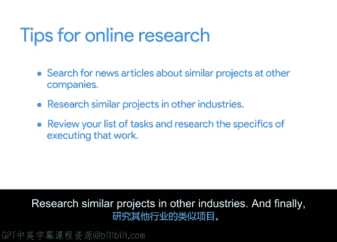

# 014：识别项目任务开展在线调研

在本节课程中，我们将学习如何通过在线调研来识别项目任务，这对于获取特定领域的知识至关重要。在线调研能帮助你熟悉行业术语、技术和流程，从而更有效地规划和管理项目。

## 在线调研的重要性

上一节我们分析了现有项目文档来识别任务。本节中，我们来看看如何利用在线调研来补充和深化你的领域知识。

领域知识指的是对特定行业、主题或活动的了解。如果你对一个新项目的领域不熟悉，分析项目支持文档和进行在线调研将帮助你拓宽知识面。

在你的职业生涯中，可能会遇到不熟悉的组织或行业。你可能会被分配到一个与你以往经验完全不同的项目。这很正常，新的挑战是工作中令人兴奋的一部分。

那么，如何为一个你不熟悉的项目或行业识别任务并监控进度呢？成功的关键之一在于知道去哪里寻找有用的信息来增加你的领域知识。

## 如何开展有效的在线调研

以下是开展在线调研的几个实用技巧，可以帮助你入门。

首先，尝试在线搜索其他公司类似项目的新闻报道。例如，你可以搜索那些在餐厅中增加了平板电脑点餐功能的餐饮集团的新闻文章。

你可以尝试使用“菜单平板新闻”或“餐厅平板新闻”等搜索词来查找相关文章。阅读时，请记录下有趣的发现。该公司在推出产品后是否经历了意想不到的结果？他们是否遇到了任何未预见的障碍？如果是，请记下这些，并决定是否需要在你的项目中添加任务，以实现类似的结果或避免类似的障碍。

识别类似成功或错误在你自己的项目中可能如何发生，可以帮助你发现那些可能被忽视的任务。

其次，在线搜索与你项目主题相关的研究也很有帮助。例如，你可以搜索“餐厅平板研究”或“数字菜单点餐”等短语。

添加“最佳实践”或“关键要点”等搜索标签可以帮助精简搜索结果。然后，你可以查阅相关研究，寻找可能有助于你项目规划的信息。

你还可以尝试研究其他行业的类似项目。这对于刚接触一个新项目或行业时尤其有帮助。例如，即使你的项目核心是餐厅环境中的平板使用，你也可以从零售店或咖啡店等类似环境中平板使用的研究中了解安装过程。

细节会有所不同，但其他行业的类似项目可以成为有用的灵感来源。

## 深化调研与任务细化

一旦完成初步的在线调研，请回顾你目前识别出的任务列表，并研究执行这些工作的具体细节。

例如，也许你列表上的一项任务是“选择最终将在餐厅安装的平板型号”。你的团队是否需要完成一些更小的子任务来决定平板型号？在线搜索可以帮助你发现任何需要额外考虑的任务。

## 总结

本节课中，我们一起学习了如何通过在线调研来增强领域知识，从而更有效地识别项目任务。

在线调研可以帮助你增加对行业术语、技术、流程等方面的了解。进行在线调研时，请记住以下要点：
*   搜索其他公司类似项目的新闻报道。
*   研究其他行业的类似项目。
*   回顾你的任务列表，并研究执行这些工作的具体细节。

准备好开始了吗？请进入下一个活动，在那里你将通过在线调研，为 Sauce and Spoon 的平板推广项目识别更多任务和里程碑。我们下一个视频见。