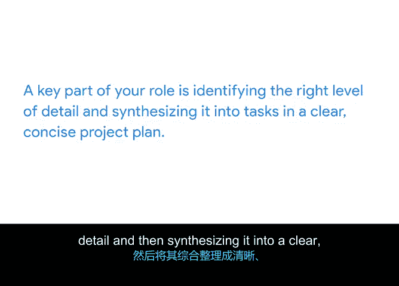

# 015：分析关键对话 🗣️

在本节课中，我们将学习如何通过分析与项目相关的关键对话，来识别并补充项目计划中的任务。上一节我们介绍了如何通过在线研究来发现任务，本节中我们来看看如何利用团队和利益相关者的沟通来完善任务清单。

与项目团队成员、其他专家以及利益相关者进行讨论，可以帮助你发现遗漏的任务或澄清较小的子任务。以下是几种通过对话识别任务的方法。

## 与团队成员进行小组头脑风暴 💡

一种发现更多任务的方法是，与可能负责这些任务的团队成员举行小组头脑风暴会议。例如，项目经理Peter可以与Sauce and Spoon项目团队会面，共同讨论服务员和客人使用平板电脑时可能遇到的潜在挑战。通过小组讨论，可以识别出可能被忽视的任务想法。

## 与团队成员进行一对一沟通 👥

另一种发现任务的方法是，与团队成员就他们可能负责完成的任务进行一对一的对话。例如，你可以与专门培训餐厅员工的供应商讨论如何为培训做准备，或者联系平面设计师讨论创建新的营销材料。你的团队成员、外部供应商和公司高管拥有特定的专业知识和工作经验，这使他们更深入地理解完成任务或达到里程碑所需的工作。

## 咨询组织内的其他专家 🧠

除了与团队成员沟通以发现项目任务外，咨询组织内在特定任务方面是专家的其他人也可能有所帮助。尽管这些人可能不直接参与你的项目，但他们或许能提供宝贵的专业知识，帮助你识别流程并填补空白。

## 与关键利益相关者对话 🎯

在与项目团队成员和组织内其他专家沟通后，检查你的任务清单。如果仍有需要更多信息的领域，与你的关键利益相关者进行对话以填补任何空白会很有帮助。正如我们之前讨论的，高级利益相关者通常忙于工作的其他方面，因此你应该策略性地选择与谁进行对话。对项目有高或中等兴趣或影响力的利益相关者最有可能提供你需要的信息。

在与利益相关者对话前，确保做好准备，尽可能多地收集信息，并列出你仍需答案的明确、未解决的问题。在对话中，展示你的研究和当前任务清单，并准确解释他们如何能帮助你推进工作。充分的准备有助于确保你在尊重利益相关者有限时间的同时，获得所需信息。

## 把握任务描述的详细程度 ⚖️

请记住，关于项目任务的对话通常包含比创建完整清单所需的更多细节和信息，但你可能会想记录一些额外信息，因为它们可能在项目后期有用。清单上的每个任务都应足够详细，以便你能检查进度并及早发现问题，但又不能过于详细，以至于你需要不断修订项目计划，并让团队因需要不断向你更新工作进展而负担过重。任务清单中包含的详细程度会因项目和团队而异。找到适当的平衡点是你将在职业生涯中培养的一项技能。

## 总结 📝

本节课中我们一起学习了如何通过分析关键对话来识别项目任务。我们探讨了与团队成员进行小组头脑风暴和一对一沟通、咨询组织内其他专家以及与利益相关者对话等方法。同时，我们强调了根据项目和团队的具体情况，把握任务描述详细程度的重要性。作为项目经理，你的一个关键角色就是识别适当的详细程度，并将其综合成项目计划中清晰、简洁的任务清单。

在接下来的活动中，你将通过审阅支持材料来发现更多任务细节，并将它们添加到Sauce and Spoon项目计划中。请前往活动开始练习，我们下一个视频再见。