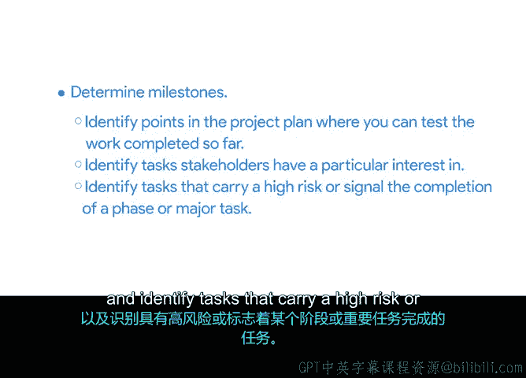

# 016：任务排序与里程碑识别 🗂️

在本节课中，我们将学习如何为项目计划中的任务进行排序，并掌握几种识别项目里程碑的有效技巧。这些步骤对于制定清晰、可行的项目时间表至关重要。

## 任务排序 📝

上一节我们介绍了如何识别和收集项目任务。现在，你已经拥有了一份详细的任务清单。本节中，我们来看看如何为这些任务确定合理的执行顺序。

首先，你需要审查当前的任务列表，确保所有较大的任务都已分解为足够小的、可管理的子任务。当你确认所有必要的任务都已列出后，下一步就是按照它们需要完成的顺序进行排列。确定正确的任务顺序将帮助你为每项任务分配开始和结束日期。

在确定优先级时，首先要考虑基本的操作顺序。换句话说，就是任务的自然序列。是否存在任何依赖关系或先决条件？例如，在平板电脑安装和测试完成之前，你无法对员工进行使用培训。

为了帮助你排序，可以采取以下方法：

*   **团队沟通**：与负责每项任务的团队成员交谈，以发现依赖关系或先决条件。你可以询问每个人，在他们开始工作之前需要完成哪些事情。
*   **网络研究**：使用“新硬件启动的先决条件”等关键词在互联网上搜索相关信息。

思考清楚顺序后，调整项目计划中的任务以反映这个顺序。例如，在“与菜单平板供应商签订合同”这项任务之前，必须先完成“研究不同型号的菜单平板”这项任务。这很合理，因为你不会希望在研究完所有可能选项之前就与供应商签约。

## 识别里程碑 🎯

一旦任务排序完成，接下来就需要识别里程碑。里程碑是项目时间表中指示进展的重要节点，通常标志着可交付成果或项目阶段的完成。

要确定任务列表中的里程碑，可以关注项目计划中那些你和团队可以评估已完成工作的节点。例如，如果有多项与菜单平板安装相关的任务，那么“平板点餐功能的首次内部测试运行”就可能是一个里程碑。这类里程碑可能与你之前列出的一些可交付成果相同。

以下是几种识别里程碑的技巧：

*   **评估工作节点**：识别项目计划中可用于评估已完成工作的关键点。
*   **关注利益相关者兴趣**：回顾之前与利益相关者沟通的记录，找出他们特别感兴趣或希望完成后进行审查的任务。如果利益相关者对某项任务或项目节点有高度兴趣，就将其标记为里程碑。例如，Sauce & Spoon 的一位利益相关者可能非常想知道何时选定了平板供应商，因为这项决定会影响预算。
*   **识别高风险或阶段完成信号**：找出那些风险较高，或标志着某个阶段或主要任务完成的任务。这些任务通常被视为里程碑，因为它们对项目的整体进展有重大影响。例如，“菜单平板点餐功能的首次成功测试运行”就可能被视为一个里程碑。

## 总结与下一步 🔄

本节课中，我们一起学习了如何为项目任务排序以及识别关键里程碑。核心步骤包括：**审查并完善任务列表 -> 确定任务依赖关系和自然顺序 -> 重新排列任务 -> 识别评估节点、利益相关者关注点及高风险/阶段完成点作为里程碑**。

现在，你已经准备好回到你的项目计划中了。请前往接下来的练习活动，重新排序你的项目任务列表并识别项目里程碑。完成后，我们将在下一个视频中见面，我将带你学习如何为每项任务添加时间估算。