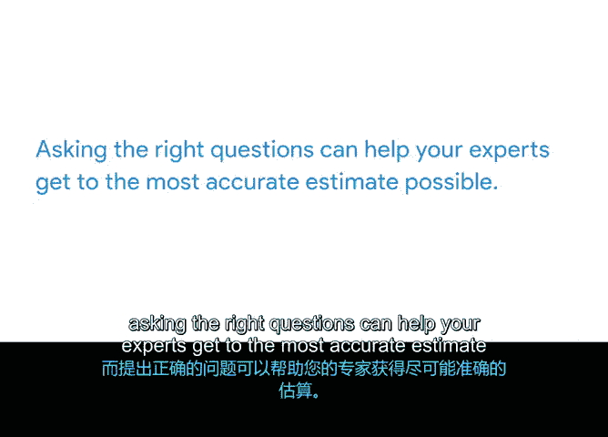

# 017：在现实世界中应用项目管理课程

## 概述
在本节课中，我们将学习如何为项目任务和里程碑获取准确的时间估算。我们将探讨几种有效的提问策略，帮助您从团队成员和主题专家那里获得可靠的估算数据，从而更好地规划和控制项目时间线。

---

## 时间估算：提出正确的问题

在之前的视频中，我们学习了如何通过分析项目文档、进行在线研究以及与团队成员、利益相关者和主题专家沟通，来识别项目任务和里程碑。

本节中，我们将探讨一些策略，用于为您的任务和里程碑获取准确的时间估算。在接下来的活动中，您将分析支持材料，并运用策略性思维为“Sauce and Spoon”平板项目获取估算。

让我们开始吧。

**时间估算**是对完成一项任务所需总时间的预测。为每项任务提供时间估算，能让您更好地把握整体项目时间线与单个截止日期和里程碑之间的关系。了解任务的预计持续时间，也便于您轻松跟踪其进度，从而识别任务是否可能超出预计时间。这样，您就能更好地预测时间线，并迅速做出必要的调整。

正如之前提到的，您最初管理的项目未必是您所擅长的领域。除了审查项目文档和做一些研究外，您还需要团队和其他主题专家的帮助来补充细节并提供意见。提出正确的问题可以帮助您的专家获得尽可能准确的时间估算。

以下是几种从任务专家那里获取准确时间估算的策略。

### 获取准确时间估算的策略

首先，**检查他们对任务的理解**。请专家解释任务涉及的所有详细步骤。您不会将每个细节都纳入项目计划，但通过让专家这样做，您能促使他们在提供估算之前，彻底思考所涉及的工作。

接下来，**请求对子步骤进行估算并记录下来**。然后将它们全部加起来，并将该总和与专家对完成任务所需总时间的估算进行比较。

另一种策略是**讨论专家在给出估算时可能做出的假设**。例如，他们假设会拥有什么设备？需要什么样的物资？他们假设有多少人参与这项任务？他们对共同参与任务的人员的技能和经验水平有何假设？然后，请任务专家考虑所有这些或部分假设无法实现的可能性有多大，以及这可能如何影响他们的估算。

这里需要澄清的一个重要细节是**工作量估算**与**总持续时间估算**之间的区别。

*   **工作量估算**仅考虑完成任务实际花费的时间。
*   **总持续时间估算**则考虑了工作量估算以及任何其他因素，例如获取批准、准备工作、测试等。

例如，假设您的一项任务是设计和启动平板电脑的结账页面。设计页面的**工作量估算**可能是 **8 小时**，这是制作模型和实施设计所需的时间。但任务的**总持续时间**包括启动所需的测试、反馈和批准。这意味着结账页面的**总时间估算**实际上超过八小时。

最后，获取准确估算的另一个策略是**将专家的估算与以往工作中类似任务实际花费的时间进行比较**。请专家回想他们参与过的一个类似项目，并描述其异同点。询问那个项目花了多长时间，以及思考那个项目是否会改变他们当前的估算。

---

## 总结

本节课中，我们一起学习了如何为项目任务获取准确的时间估算。**时间估算**是对完成一项任务所需总时间的预测。为每项任务提供估算，能让您从宏观上把握项目时间线与单个截止日期和里程碑的关系。而提出正确的问题可以帮助您的专家获得尽可能准确的估算。

您可以尝试检查他们对任务的理解，或请求对子步骤进行估算。讨论他们的假设，并将专家的估算与以往类似任务的实际耗时进行比较。

在下一个视频中，我将分享另一种获取准确时间估算的策略，称为“三点估算法”。然后在接下来的活动中，您将为“Sauce and Spoon”项目计划添加时间估算。我们稍后见。