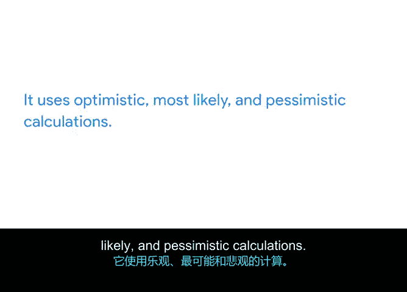

# 018：时间估算三点估算法 📊

在本节课中，我们将学习一种称为“三点估算法”的技术，它可以帮助我们为任务制定出更准确、更现实的时间估算。

上一节我们介绍了估算任务时间的基本概念，本节中我们来看看一种更精细的估算方法。三点估算法通过考虑最佳、最可能和最差三种情况，来得出一个更全面的时间预测。这种方法不仅能提升估算的准确性，还能帮助我们识别可能影响项目进度、预算和资源的潜在风险。

## 什么是三点估算法？ 🤔

顾名思义，三点估算法要求我们为每个任务审视三个部分的估算。

以下是它的工作原理：每个任务会获得三个时间估算值：**乐观估算**、**最可能估算**和**悲观估算**。每个估算值都代表了在该类别下任务预计需要的时间，并反映了潜在风险发生的可能性。

*   **乐观估算** 假设的是最佳情况。不会出现问题，任务将在预计时间内完成。换句话说，这是在假设一切按计划进行时，你希望任务花费的时间。
*   **最可能估算** 假设可能会出现一些问题。另一种理解方式是，它基于任务在正常情况下通常所需的时间。
*   **悲观估算** 假设问题一定会发生。这是所有可能出错的事情都出错的情况。

## 如何应用三点估算？ 🛠️

使用此技术确定估算时，你需要向任务专家提问或进行研究，以帮助你理解最佳和最差情况。然后将这些记录添加到每个任务的计划中。

让我们通过“Sauce and Spoon”项目中的一个例子来尝试三点估算：**培训员工使用平板电脑**。

你要求负责安排员工培训的人员给出每个类别的时间估算，并描述每种情况的条件。

任务专家告诉你：

*   **乐观估算条件**：聘请的培训供应商资质良好，拥有所需的所有材料，并准时到场进行培训。所有员工准时出席，并在预定时间内成功完成培训。所有设备运行正常，可供员工练习。在这种最佳情况下，任务专家估计需要 **4小时**（2小时进行培训，1小时准备，1小时进行培训后复盘）。
*   **最可能估算条件**：供应商合格，但可能没有所有必要材料，因此需要修改内容或餐厅员工需要寻找一些用品。或者供应商可能是新手，需要额外时间准备或更长时间进行培训。通常会有几名员工无法参加或准时到场，因此需要安排额外的培训时间。设备也可能出现一些小故障，培训可能需要改期到本周晚些时候的另一天。这种情况下的时间估算接近 **6小时**，日期很可能比原计划推迟两到三天。
*   **悲观估算条件**：最初的培训供应商退出，必须聘请新供应商。培训前可能出现多名员工意外缺席或离职。或者设备可能未按时交付或无法工作，培训必须等到新设备到达才能进行。在这种情况下，实际培训时间仍约为 **6小时**，但日期必须重新安排，可能比原计划推迟整整一周。

## 关键注意事项 ⚠️

在进行自己的研究或与任务专家交谈时，请注意这三个点，以便确定乐观、最可能和悲观情况下的结果。如果有人给你一个时间估算，不要在不了解他们估算背景的情况下就完全相信。

可以这样想：如果某人持乐观态度，他可能估计一个任务只需两天就能完成。如果你采用这个估算，而最终花费了一整周，你的进度计划就会出问题。但如果某人持悲观态度，报出一个月的估算，而任务只花了一周，那么你的时间表中就多出了本可用于其他任务或促成产品更早发布的额外时间。

总是考虑最坏情况看似是件好事，但如果你大部分估算都这样计算，实际上是一种浪费。因此，你需要审视最佳和最差情况的时间，并将其与最可能的情况进行比较。在此基础上，你可以建立一个缓冲，以应对可能发生的风险，同时仍能保持项目以高效的速率推进。

## 总结与回顾 📝

本节课中我们一起学习了三点估算法。这是一种帮助确定任务最现实时间估算的技术。它使用**乐观**、**最可能**和**悲观**三种计算。虽然三点估算需要更多的工作量，但它能让你更清楚地了解每个任务的可能性，从而做出更现实、更准确的估算。

在课程阅读材料中，甚至有一些公式可以帮助你量化这些估算，我们在此不深入讨论，但鼓励你去查阅。

在接下来的活动中，你将审阅支持材料，其中记录了Peter与一些Sauce and Spoon项目任务专家的对话。然后，你将为他们讨论的任务提出时间估算，并将其添加到你的项目计划中。