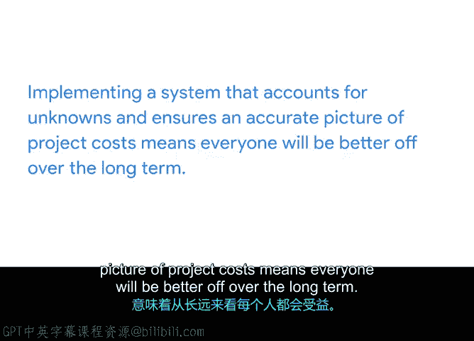

# 019：19_02_04_时间估算应用置信度评级

## 概述 📋

在本节课程中，我们将学习如何为项目任务的时间估算确定一个**置信度评级**。这个评级能帮助你和管理者沟通时间估算的可靠性，并有效应对项目中的不确定性。

上一节我们讨论了如何从专家那里获得准确的时间估算。本节中，我们来看看如何评估这些估算的可靠程度。

## 什么是置信度评级？🤔

**置信度评级**表示你对某个时间估算准确性的信心程度。与项目相关方分享这些评级很有帮助，因为它们能表明任务在估算时间内完成的可能性有多大。

估算并非一门精确的科学。因此，为任务添加置信度评级可以让你应对任何不确定性。

在接下来的实践活动中，你将完成“Sauce and Sp”项目计划中的时间估算计算，并为各项任务添加置信度评级。

## 置信度评级范围 📊

置信度评级范围从**高**到**低**。

*   **高**：表示你对估算非常有信心。
*   **低**：表示你对估算不太有信心。

了解估算的置信度，并添加可能影响估算的风险或问题的备注，可以帮助你判断是否应该征求项目团队的意见。他们或许能指出哪些估算或任务需要更密切地跟踪。

此外，如果你发现大部分任务估算的置信度都较低，你可能需要向相关方传达你对项目时间线的不确定性。

## 如何确定置信度评级？🔍

以下是确定置信度评级的几种方法。

### 方法一：三点估算技术

使用我们刚刚讨论过的**三点估算技术**是获得估算信心的一种方式。如果你能证明已经考虑了任务的最佳和最坏情况，那么你对任务时间估算的置信度评级就会很高，因为你对该任务有透彻的理解。

### 方法二：团队共识与百分比

另一种确定置信度评级的方法是，就团队分配的任务征求他们的意见，并就集体的信心程度达成共识。

为此，你可以将他们的信心水平计算为百分比。这意味着收集每个人对其估算的信心度，然后计算平均置信水平。

例如，你可能会发现他们有90%的信心，这意味着你的总体置信度评级为**高**；或者他们只有60%的信心，这意味着你的总体置信度评级为**中**。

### 方法三：定义经验类别

或者，你可以为团队定义经验类别。例如：

*   我们以前从未做过类似的项目。
*   我们以前做过一次。
*   我们做过几次。
*   我们已经做过很多次了。

每个类别都与你的置信度水平相关。如果他们以前从未做过这个项目或只做过一次，那么时间估算的置信度评级可能就**低**。

## 总结与回顾 ✅

本节课中我们一起学习了置信度评级的概念与应用。

*   **置信度评级**表示你对估算准确性的信心程度。
*   你可以通过几种方式确定置信度评级，包括征求团队意见或定义经验类别。
*   请记住，估算远非一门精确的科学，尤其是在项目管理中存在许多未知数的情况下。
*   建立一个能解释这些未知数并确保项目时间线准确性的系统，从长远来看对每个人都有益。

在接下来的实践活动中，你将审阅辅助材料，并为你的每个时间估算添加置信度评级。

接下来，我们将讨论有效的谈判技巧，以获得更准确的时间估算。