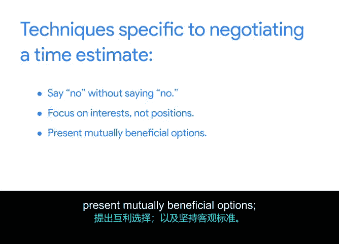

# 020：有效的时间估算谈判 🕒

在本节课中，我们将学习如何运用特定的谈判技巧，与任务专家进行有效沟通，以获得更准确的时间和精力估算。这对于确保项目成功至关重要。

上一节我们介绍了如何将任务、时间估算和信心评级添加到项目计划中。本节中，我们来看看如何为即将到来的时间估算谈判做好准备。

在任何项目中，你都需要与那些倾向于高估或低估时间、成本或资源的人合作。人们通常并非有意为之，他们可能只是过于乐观，或试图通过提供他们认为你想听到的、而非现实的信息来取悦你。有时，他们也可能过于谨慎，以防计划有变而给出极端的估算。在某些情况下，运用谈判技巧来获取准确的时间估算，可能对项目的成功至关重要。

以下是几种专门用于时间估算谈判的技巧。

## 谈判技巧详解

### 1. 不直接说“不”
这种技巧的核心是引导对方与你共同探讨替代方案。直接说“这行不通”、“不可能”或“我做不到”会让对方产生防御心理并终止对话。相反，应该提出开放式问题，例如：
*   **“你希望我如何推进？”**
*   **“我们如何能解决这个问题？”**
*   **“我能做些什么来提供帮助？”**

这类问题能邀请对方与你协作，将对话重点放在寻找对双方都可行的解决方案上。

### 2. 关注利益，而非立场
此处的目标不是“赢”，而是识别对方的**利益**——即他们完成任务背后的基本需求、愿望和动机。例如，一位任务专家可能非常注重高质量地完成任务，而你则担心如果错过截止日期，工作质量将无关紧要。你可以询问对方，是否愿意在某些质量方面做出妥协，以缩短时间估算，同时仍能完成任务到可接受的程度。

### 3. 提出互利共赢的方案
当你和任务专家都希望尽快完成任务，但专家的时间估算仍比你期望的要长时，可以运用此技巧。通过提出前面提到的开放式问题，可以帮助你找到满足双方目标的解决方案。也许专家缺少某些信息，或者你可以承诺寻找并提供某些资源，从而降低时间估算。

### 4. 坚持使用客观标准
客观标准基于中立信息，如**市场价值、研究发现、先前记录的经验或法律法规**。使用客观标准意味着将协议建立在已知或共享的原则之上。关键在于提前商定参考哪些客观标准，然后利用这些信息来确定估算。例如，如果一位专家坚持凭直觉估算时间，你可以提前要求他们提供支持其直觉的清晰、客观的数据，从而引导他们得出更准确的估算。

## 总结

本节课中我们一起学习了在项目时间估算谈判中至关重要的几种技巧：**不直接说“不”**、**关注利益而非立场**、**提出互利共赢的方案**以及**坚持使用客观标准**。掌握这些技巧将帮助你更有效地与任务专家协作，获得更可靠的项目时间估算。

现在，你的项目管理工具箱里又增添了几项新的谈判技巧。在接下来的活动中，你将把所学知识应用到Tablet设备推广项目的时间估算谈判中。